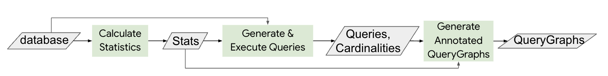

## CardBench: A Benchmark for Learned Cardinality Estimation in Relational Databases

This repository contains CardBench, a benchmark for learned cardinality estimation.
There are two parts in CardBench: a) the training datasets and b) the code to produce training datasets.
The training datasets can be found in the ``training_datasets`` directory. The code to produce new
 training datasets or re-produce the existing ones is in this directory.

### CardBench paper

 You can find more details about CardBench in our [paper](https://arxiv.org/abs/2408.16170).

## CardBench Code

The CardBench code can be used to produce training datasets for
cardinality estimation. This is a multi-step process:

* Create down sampled versions of databases, if needed
* Calculate table (collect table/column information, calculate statistics table/column statistics)
* Generate training sql queries
* Run queries to collect actual cardinalities
* Create training datasets (querygraps)

As the cost of running this pipeline is significant we plan to release the final
product (the training dataset) in addition to the code that performs all the steps.

We are releasing the code to create the CardBench training datasets incrementally.

### General Information & Setup

Any statistic and information that is collected or calculated is stored in a set of database tables. The ``statistics_sql_tables_definition.sql`` script generates all the necessary tables. After the tables are created 
please update the ``configuration.py`` file with the ids of the tables and valid file paths. Also please update the files in ``calculate_statistics_library/pre_calculated_statistics`` with the table ids (if the precalculated statistics are used).

The code queries the tables of the "data" database (these are the tables for which we collect cardinalities) and the "metadata" (or statistics) database (these tables store the statistics we calculate). These two databases can be stored in separate systems.

The code was initially designed to work with Big Query as the database backend for both the data and metadata databases. In ``database_connector.py`` we provide an extensible database connector that can be extended to work with 
any database. Changes in the rest of the code will be needed to support the functionality needed to calculate some statistics (for example percentiles requires a percientile SQL function or discovering the schema of a table requires calling the database specific API that returns the column names and types of a table.)

#### Calculate Statistics

The first step is to calculate statistics and collect information about the databases. 
The ``calculate_statistics_and_save_to_database.py`` file runs this step. The ``calculate_statistics_library.py`` contains the relevant code.

##### Precaluclated Statistics

As this step requires some effort to replicate, we will also release the collected statistics in this repository in the ``calculate_statistics_library/pre_calculated_statistics`` directory. If the pre-calculated statistics are used you can skip the calculate statistics step.

``calculate_statistics_library/pre_calculated_statistics/pk_fk.sql`` inserts primary key and foreign information to the configuration.PK_FK_TABLE table. 

#### Generate Queries
To generate queries we use [this previously released generator](https://github.com/DataManagementLab/zero-shot-cost-estimation/tree/main). The code is slightly modified to accommodate our needs (see ``generate_queries_library/query_generator.py``)

The ``generate_queries_and_save_to_file.py`` generate queries and writes the queries in a file one at each line. The parameters of the generator are defined in ``generate_queries_and_save_to_file.py``. We call a file of queries a workload, each workload is identified by an integer workload id. The worload id and the parameters used to generate a workload are stored in the configuration.WORKLOAD_DEFINITION_TABLE.

The query generator takes as input a set of json files that contain the schema, column and string column statistics of the database for which queries will be generated. The jsons can be created from the collected statistics calculated by ``calculate_statistics_and_save_to_database.py``. To generate the jsons please use ``save_dataset_statistics_to_json_files.py``. To ease experimentation we include the generated jsons in ``generate_queries_library/dataset_statistics_jsons``. If the existing json files are used the calculate statistics and save dataset statistics to json files can be skipped.

The json files are stored in a directory specified by configuration.DIRECTORY_PATH_JSON_FILES and the workload query files are stored in a directory specified by configuration.DIRECTORY_PATH_QUERY_FILES.

#### Execute Queries
``run_queries.py`` takes in as argument a workload id, the integer identifier of workload (a file of queries) that was generated by the Generate Queries code. The queries of the workload are read and executed. The result of the query execution is stored in the configuration.QUERY_RUN_INFORMATION_TABLE database table. The result stores for each query the sql string and the cardinality. Further to identify each query the workload id as well as the query run id are stored in the table. The query run id is a integer identifier of the run. A new run is created every time a workload is run. Therefore a workload that is run multiple times will have create multiple query runs.

#### Generate Annotated Query Graphs
``geneate_training_querygraphs_and_save_to_file.py`` is the final step of the process. After queries are run the SQL query is translated into a graph and annotated with dataset statistics. The sql string is first converted into relational operators, then a query plan and finally a graph. The produces graphs are saved in the sparse_deferred format in a .npz file.

