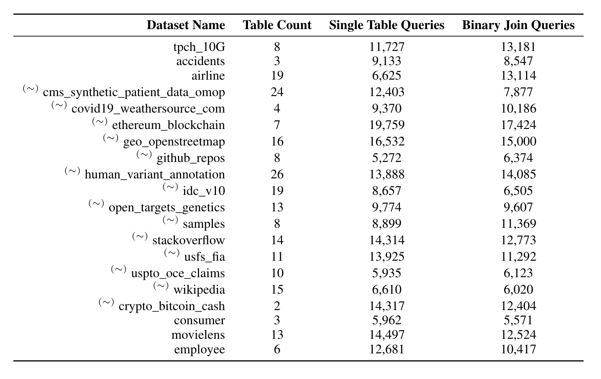
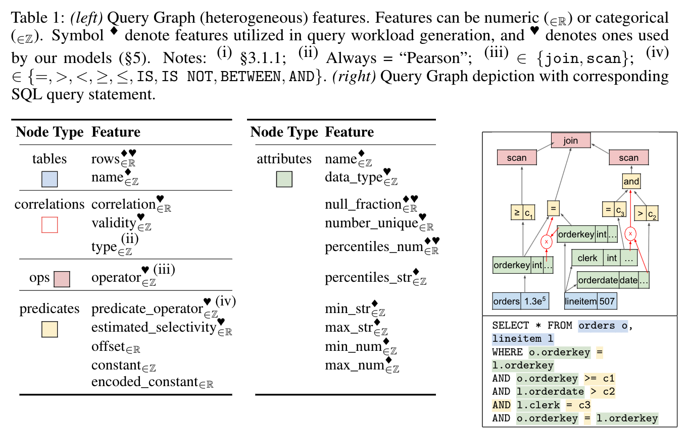

## Training Datasets

This directory contains the training datasets of CardBench, Single Table and Binary Join.
Each training instance is a SQL query represented as an annotated graph. By running the queries on Google Big Query we obtained the query cardinality and execution time that are included as context in the graph.

CardBench includes two training datasets, Single Table and Binary Join. The two datasets differ in the operations their queries include. Single Table contains queries that apply 1-4 filter predicates on one table, Binary Join contains queries that join two tables and apply 1-3 filter predicates per table.

Example Single Table Query:

```
SELECT count(*) FROM tpch_10G.nation as nation  WHERE nation.n_nationkey <= 6 AND nation.n_comment IS NULL AND nation.n_regionkey >= 1;
```

Example Binary Join Query:

```
SELECT count(*) FROM tpch_10G.region as region JOIN tpch_10G.nation as nation ON region.r_regionkey = nation.n_regionkey  WHERE nation.n_comment IS NOT NULL AND nation.n_nationkey != 5;
```

The training datasets are stored in the single_table and binary_join directories. The query graphs of each database are saved in separate files. For example, the query graphs of single tables queries for the consumer database are stored in the files:
```
consumer_single_table.npz-0-to-800
consumer_single_table.npz-800-to-1600
...
consumer_single_table.npz-5600-to-5961
```
The naming scheme for the files is: database_name_\<single_table/binary_join\>.npz-X-to-Y. The figure below lists the database names, table count for each database and the number of queries graphs. A ~ in the database name marks databases that we have down sampled.




### Training Data Schema

The picture below illustrates the graph structure. On the right of the figure we visualize the graph for the example query shown under it. On the left of the figure we list the node features and their data type per graph node.



### Notes

* Depending on the type of an attribute the corresponding feature is populated. For example percentiles_str are populated for an attributes with type string and percentiles_num are populated for numeric attributes. The empty feature is filled with the value -1.
* To download the training datasets please follow the [instructions here](https://github.com/google-research/google-research/tree/master?tab=readme-ov-file#google-research)

### How to read the training data

The training data are encoded using the Graph Struct defined by the [Sparse Deferred](https://github.com/google-research/google-research/tree/master/sparse_deferred). Sparse Deferred provides an easy way to write, read and store the training data and also serialized them in a TF/JAX friendly format.

The following code provides an example on how to read the npz files and how to access nodes, node featured and top level information (cardinality, query, etc). 
To run the code you need python >= 3.10, tqdm, sparse-deferred, glob and numpy.
You can install all dependencies through pip.

Import packages and create the InMemoryDB object for a training dataset:

```py
import glob
import tqdm

from sparse_deferred.structs import graph_struct

GraphStruct = graph_struct.GraphStruct
InMemoryDB = graph_struct.InMemoryDB

# The training datasets are stored sharded (namely split into multiple files)
# to find all the shards of a training dataset we use glob. The following lines
# load the consumer_single_table dataset.
filename = "single_table/consumer_single_table.npz"
filenames = glob.glob(filename + '-*')
filenames.sort(key=lambda f: int(f.split('-')[-1]))
db = InMemoryDB()

for file in tqdm.tqdm(filenames):
  db_temp = InMemoryDB.from_file(file)
  for i in range(db_temp.size):
    db.add(db_temp.get_item(i))
db.finalize()
```


```py
# Print the number of training instances
print("Number of training instances:", db.size)
```
Number of training instances: 5571


```py
# Print the schema of the training instances
print("Schema:", db.schema)
```
Schema: {'table_to_attr': ('tables', 'attributes'), 'attr_to_pred': ('attributes', 'predicates'), 'pred_to_pred': ('predicates', 'predicates'), 'attr_to_op': ('attributes', 'ops'), 'op_to_op': ('ops', 'ops'), 'pred_to_op': ('predicates', 'ops'), 'attr_to_corr': ('attributes', 'correlations'), 'corr_to_pred': ('correlations', 'predicates')}


```py
# Print node types
print("Node types:", first_training_example.nodes.keys())

# Print table nodes features
print("Table node features:", db.get_item(0).nodes["tables"].keys())
```
Node types: dict_keys(['g', 'tables', 'attributes', 'predicates', 'ops', 'correlations'])

Table node features: dict_keys(['rows', 'name'])

```py
# Print edge types
print("Edge types:", first_training_example.edges.keys())
```

```py
# Print number of rows and name of the first table node
print(
    "First table number of rows:", db.get_item(0).nodes["tables"]["rows"][0]
)
print("First table name:", db.get_item(0).nodes["tables"]["name"][0])
```
First table number of rows: 340872
First table name: b'bq-cost-models-exp.consumer.HOUSEHOLDS'


```py
# Print query cardinality, query, query_id, execution_time
# These are graph level features
print(
    "Query cardinality:",
    first_training_example.nodes["g"]["cardinality"][0],
)
print("Execution time:", first_training_example.nodes["g"]["exec_time"][0])
print("Query id:", first_training_example.nodes["g"]["query_id"][0])
print("Query:", first_training_example.nodes["g"]["query"][0])
```

Query cardinality: 824130
Execution time: 2390.0
Query id: 14211
Query: b'SELECT count(*) as rwcnt FROM `bq-cost-models-exp.consumer.HOUSEHOLDS` as HOUSEHOLDS JOIN `bq-cost-models-exp.consumer.HOUSEHOLD_MEMBERS` as HOUSEHOLD_MEMBERS ON HOUSEHOLDS.HOUSEHOLD_ID = HOUSEHOLD_MEMBERS.HOUSEHOLD_ID;\n'

```py
# Print the first training example
first_training_example = db.get_item(0)
print("First training example:", first_training_example)
```
First training example: GraphStruct(edges={'table_to_attr': ((array([0, 1], dtype=int32), array([0, 1], dtype=int32)), {}), 'attr_to_pred': ((array([0, 1], dtype=int32), array([0, 0], dtype=int32)), {}), 'pred_to_pred': ((array([], dtype=int32), array([], dtype=int32)), {}), 'attr_to_op': ((array([0, 1], dtype=int32), array([1, 2], dtype=int32)), {}), 'op_to_op': ((array([1, 2], dtype=int32), array([0, 0], dtype=int32)), {}), 'pred_to_op': ((array([0], dtype=int32), array([0], dtype=int32)), {}), 'attr_to_corr': ((array([], dtype=int32), array([], dtype=int32)), {}), 'corr_to_pred': ((array([], dtype=int32), array([], dtype=int32)), {})}, nodes=defaultdict(<class 'dict'>, {'g': {'cardinality': array([824130]), 'exec_time': array([2390.], dtype=float32), 'query_id': array([14211], dtype=int32), 'query': array([b'SELECT count(*) as rwcnt FROM `bq-cost-models-exp.consumer.HOUSEHOLDS` as HOUSEHOLDS JOIN `bq-cost-models-exp.consumer.HOUSEHOLD_MEMBERS` as HOUSEHOLD_MEMBERS ON HOUSEHOLDS.HOUSEHOLD_ID = HOUSEHOLD_MEMBERS.HOUSEHOLD_ID;\n'],
      dtype=object)}, 'tables': {'rows': array([340872, 824130]), 'name': array([b'bq-cost-models-exp.consumer.HOUSEHOLDS',
       b'bq-cost-models-exp.consumer.HOUSEHOLD_MEMBERS'], dtype=object)}, 'attributes': {'null_frac': array([0., 0.], dtype=float32), 'num_unique': array([340872, 340872]), 'data_type': array([b'STRING', b'STRING'], dtype=object), 'name': array([b'HOUSEHOLD_ID', b'HOUSEHOLD_ID'], dtype=object), 'percentiles_100_numeric': array([[-1., -1., -1., -1., -1., -1., -1., -1., -1., -1., -1., -1., -1.,
        -1., -1., -1., -1., -1., -1., -1., -1., -1., -1., -1., -1., -1.,
        -1., -1., -1., -1., -1., -1., -1., -1., -1., -1., -1., -1., -1.,
        -1., -1., -1., -1., -1., -1., -1., -1., -1., -1., -1., -1., -1.,
        -1., -1., -1., -1., -1., -1., -1., -1., -1., -1., -1., -1., -1.,
        -1., -1., -1., -1., -1., -1., -1., -1., -1., -1., -1., -1., -1.,
        -1., -1., -1., -1., -1., -1., -1., -1., -1., -1., -1., -1., -1.,
        -1., -1., -1., -1., -1., -1., -1., -1., -1., -1.],
       [-1., -1., -1., -1., -1., -1., -1., -1., -1., -1., -1., -1., -1.,
        -1., -1., -1., -1., -1., -1., -1., -1., -1., -1., -1., -1., -1.,
        -1., -1., -1., -1., -1., -1., -1., -1., -1., -1., -1., -1., -1.,
        -1., -1., -1., -1., -1., -1., -1., -1., -1., -1., -1., -1., -1.,
        -1., -1., -1., -1., -1., -1., -1., -1., -1., -1., -1., -1., -1.,
        -1., -1., -1., -1., -1., -1., -1., -1., -1., -1., -1., -1., -1.,
        -1., -1., -1., -1., -1., -1., -1., -1., -1., -1., -1., -1., -1.,
        -1., -1., -1., -1., -1., -1., -1., -1., -1., -1.]], dtype=float32), 'percentiles_100_string': array([[b'03111041', b'03157881', b'03225592', b'03306241', b'03375612',
        b'03453991', b'03521382', b'03613932', b'03681481', b'03749922',
        b'03817851', b'03885642', b'03976922', b'04056211', b'04127862',
        b'04167221', b'04301312', b'11848937', b'11904618', b'11973828',
        b'12043368', b'12111898', b'12200777', b'12270297', b'12351178',
        b'12428467', b'12497518', b'12564967', b'12645117', b'12724568',
        b'12806687', b'12866258', b'12937697', b'13061577', b'16223261',
        b'16290331', b'16370680', b'16451290', b'16518030', b'16575061',
        b'16668010', b'16725311', b'16814321', b'16881991', b'16961610',
        b'17030931', b'17110540', b'17203840', b'17241371', b'17344851',
        b'20561814', b'20608083', b'20676154', b'20756493', b'20826083',
        b'20904174', b'20972194', b'21064483', b'21131853', b'21200474',
        b'21267684', b'21336544', b'21427543', b'21506554', b'21578814',
        b'21617574', b'21752363', b'24936277', b'24993457', b'25060866',
        b'25133146', b'25199667', b'25288666', b'25358486', b'25438927',
        b'25517107', b'25585536', b'25652846', b'25734296', b'25812496',
        b'25882736', b'25955447', b'26025017', b'26149597', b'7498134',
        b'7565345', b'7645345', b'7726934', b'7792865', b'7850504',
        b'7942665', b'8000174', b'8088704', b'8157514', b'8236584',
        b'8306015', b'8385564', b'8478214', b'8516464', b'8619835',
        b'8725345'],
       [b'03111041', b'03157881', b'03225592', b'03306241', b'03375612',
        b'03453991', b'03521382', b'03613932', b'03681481', b'03749922',
        b'03817851', b'03885642', b'03976922', b'04056211', b'04127862',
        b'04167221', b'04301312', b'11848937', b'11904618', b'11973828',
        b'12043368', b'12111898', b'12200777', b'12270297', b'12351178',
        b'12428467', b'12497518', b'12564967', b'12645117', b'12724568',
        b'12806687', b'12866258', b'12937697', b'13061577', b'16223261',
        b'16290331', b'16370680', b'16451290', b'16518030', b'16575061',
        b'16668010', b'16725311', b'16814321', b'16881991', b'16961610',
        b'17030931', b'17110540', b'17203840', b'17241371', b'17344851',
        b'20561814', b'20608083', b'20676154', b'20756493', b'20826083',
        b'20904174', b'20972194', b'21064483', b'21131853', b'21200474',
        b'21267684', b'21336544', b'21427543', b'21506554', b'21578814',
        b'21617574', b'21752363', b'24936277', b'24993457', b'25060866',
        b'25133146', b'25199667', b'25288666', b'25358486', b'25438927',
        b'25517107', b'25585536', b'25652846', b'25734296', b'25812496',
        b'25882736', b'25955447', b'26025017', b'26149597', b'7498134',
        b'7565345', b'7645345', b'7726934', b'7792865', b'7850504',
        b'7942665', b'8000174', b'8088704', b'8157514', b'8236584',
        b'8306015', b'8385564', b'8478214', b'8516464', b'8619835',
        b'8725345']], dtype=object), 'min_numeric': array([-1., -1.], dtype=float32), 'max_numeric': array([-1., -1.], dtype=float32), 'min_string': array([b'8725345', b'8725345'], dtype=object), 'max_string': array([b'03111041', b'03111041'], dtype=object)}, 'predicates': {'predicate_operator': array([5], dtype=int32), 'estimated_selectivity': array([-1.], dtype=float32), 'offset': array([[-1., -1., -1., -1., -1., -1.]], dtype=float32), 'constant': array([b''], dtype=object), 'encoded_constant': array([-1])}, 'ops': {'operator': array([b'join', b'scan', b'scan'], dtype=object)}, 'correlations': {'type': array([], dtype=object), 'correlation': array([], dtype=float32), 'validity': array([], dtype=object)}}), schema_={'table_to_attr': ({'tables': 0}, {'attributes': 0}), 'attr_to_pred': ({'attributes': 0}, {'predicates': 0}), 'pred_to_pred': ({'predicates': 0}, {'predicates': 0}), 'attr_to_op': ({'attributes': 0}, {'ops': 0}), 'op_to_op': ({'ops': 0}, {'ops': 0}), 'pred_to_op': ({'predicates': 0}, {'ops': 0}), 'attr_to_corr': ({'attributes': 0}, {'correlations': 0}), 'corr_to_pred': ({'correlations': 0}, {'predicates': 0})})
