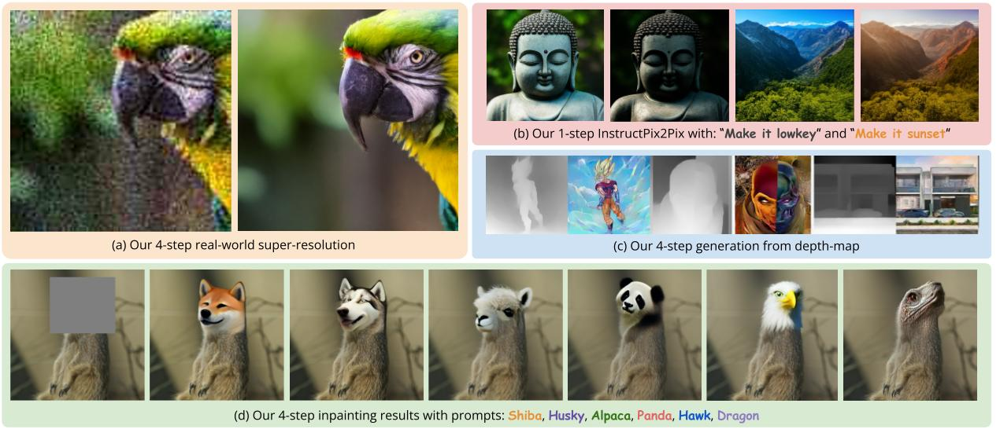
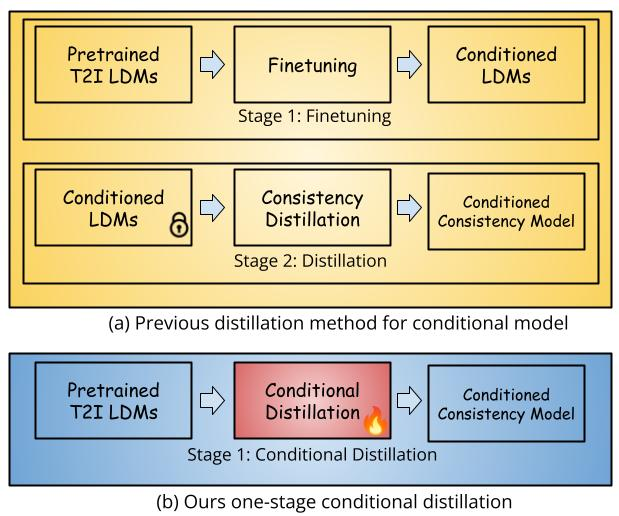
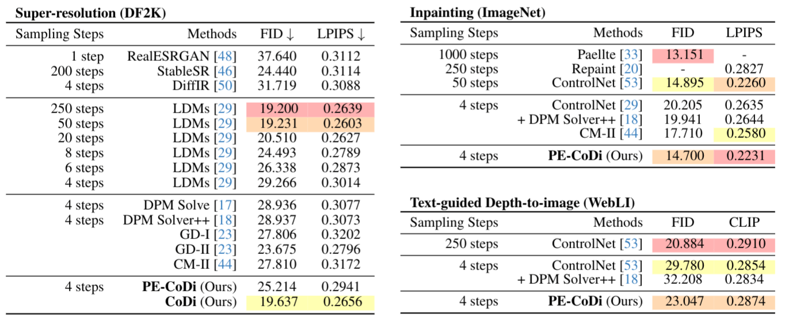

#  CoDi: Conditional Diffusion Distillation

This repository contains the official implementation of the following paper:

> CoDi: Conditional Diffusion Distillation for Higher-Fidelity and Faster Image Generation <br>
> Kangfu Mei <sup>1, 2</sup>, Mauricio Delbracio <sup>2</sup>, Hossein Talebi <sup>2</sup>, Zhengzhong Tu <sup>2</sup>, Vishal M. Patel <sup>1</sup>, Peyman Milanfar <sup>2</sup> <br>
> <sup>1</sup>Johns Hopkins University <br>
> <sup>2</sup>Google Research <br>

[\[Paper\]](https://arxiv.org/abs/2310.01407)

## Introduction

CoDi can efficiently distill the sampling steps of a conditional diffusion model
from an unconditional one (e.g. StableDiffsusion), enabling rapid generation of
high-quality images (i.e. 1-4 steps) under various conditional settings (e.g.
Inpainting, InstructPix2Pix, etc.).



Compared with previous (two-stage) distillation methods---either distillation-first or fine-tuning-first, our CoDi presents the first *single-stage* distillation strategy that directly distills a diffusion model from a text-to-image pretraining with new conditions, yiedling a fully distilled conditional diffusion model.



On the standard real-world image super-resolution benchmark, we show that CoDi
is capable of achieving 50 steps sampling performance in terms of FID and LPIPS
with 4 steps only. It largely outperforms previous guided-distillation and
consistency model. On the less challenge tasks such text-guided inpainting, we
show that a new parameter-efficient distillation first proposed by us can even
beat the original 50 steps sampling in the FID and LPIPS metrics.



## News

-   Dec-02-2023 We relase the training script of CoDi. 🏁

## Detail Contents

1.  [Training CoDi on HuggingFace Data](#training-codi-on-huggingface-data)
2.  [Training CoDi on Your Own Data](#training-codi-on-your-own-data)
3.  [Citations](#citations)
4.  [Acknowledgement](#acknowledgement)

> Note: The following instructions are modified from
> https://github.com/huggingface/community-events/blob/main/jax-controlnet-sprint/README.md

## Training CoDi on HuggingFace Data

All you need to do is to update the `DATASET_NAME` from the HuggingFace hub to
train on (could be your own, possibly private, dataset). A good choice is to
check the datasets under
https://huggingface.co/spaces/jax-diffusers-event/leaderboard.

```bash
export HF_HOME="/data/huggingface/"
export DISK_DIR="/data/huggingface/cache"
export MODEL_DIR="runwayml/stable-diffusion-v1-5"
export OUTPUT_DIR="/data/canny_model"
export DATASET_NAME="jax-diffusers-event/canny_diffusiondb"

python3 training_scripts/train_codi_flax.py \
 --pretrained_model_name_or_path=$MODEL_DIR \
 --output_dir=$OUTPUT_DIR \
 --dataset_name=$DATASET_NAME \
 --load_from_disk \
 --cache_dir=$DISK_DIR \
 --resolution=512 \
 --learning_rate=1e-5 \
 --train_batch_size=2 \
 --revision="non-ema" \
 --from_pt \
 --max_train_steps=500000 \
 --checkpointing_steps=10000 \
 --dataloader_num_workers=16 \
 --distill_learning_steps 50 \
 --onestepode control \
 --onestepode_control_params target \
 --onestepode_sample_eps v_prediction \
 --distill_loss consistency_x \
```

Note that you may need to change the `--image_column`, `--caption_column`, and
`--conditioning_image` according to your selected dataset. For example, you need
to add these options for the `jax-diffusers-event/canny_diffusiondb`
dataset according to this https://huggingface.co/datasets/jax-diffusers-event/canny_diffusiondb.

```bash
--image_column original_image --caption_column prompt --conditioning_image transformed_image
```

## Training CoDi on Your Own Data

### Data preprocessing

Here we demonstrate how to prepare a large dataset to train a ControlNet model
that generates images conditioned on an image representation that only has edge information (using canny edge detection)

More specifically, we use an example script defined in https://github.com/huggingface/community-events/blob/main/jax-controlnet-sprint/dataset_tools/coyo_1m_dataset_preprocess.py:

-   Selects 1 million image-text pairs from an existing dataset COYO-700M.
    Downloads each image and use Canny edge detector to generate the
    conditioning image. Create a metafile that links all the images and
    processed images to their text captions.

-   Use the following command to run the example data preprocessing script. If
    you've mounted a disk to your TPU, you should place your train_data_dir and
    cache_dir on the mounted disk

```bash
python3 coyo_1m_dataset_preprocess.py \
 --train_data_dir="/data/dataset" \
 --cache_dir="/data" \
 --max_train_samples=1000000 \
 --num_proc=32
```

Once the script finishes running, you can find a data folder at the specified
`train_data_dir` with the below folder structure:

```
data
├── images
│   ├── image_1.png
│   ├── .......
│   └── image_1000000.jpeg
├── processed_images
│   ├── image_1.png
│   ├── .......
│   └── image_1000000.jpeg
└── meta.jsonl
```

### Training

All you need to do is to update the `DATASET_DIR` with the correct path to your
data folder.

Here is an example to run a training script that will load the dataset from the
disk

```bash
export HF_HOME="/data/huggingface/"
export DISK_DIR="/data/huggingface/cache"
export MODEL_DIR="runwayml/stable-diffusion-v1-5"
export OUTPUT_DIR="/data/canny_model"
export DATASET_DIR="/data/dataset"

python3 training_scripts/train_codi_flax.py \
 --pretrained_model_name_or_path=$MODEL_DIR \
 --output_dir=$OUTPUT_DIR \
 --train_data_dir=$DATASET_DIR \
 --load_from_disk \
 --cache_dir=$DISK_DIR \
 --resolution=512 \
 --learning_rate=1e-5 \
 --train_batch_size=2 \
 --revision="non-ema" \
 --from_pt \
 --max_train_steps=500000 \
 --checkpointing_steps=10000 \
 --dataloader_num_workers=16 \
 --distill_learning_steps 50 \
 --onestepode control \
 --onestepode_control_params target \
 --onestepode_sample_eps v_prediction \
 --distill_loss consistency_x \
```

## Citations

You may want to cite:

```
@article{mei2023conditional,
  title={CoDi: Conditional Diffusion Distillation for Higher-Fidelity and Faster Image Generation},
  author={Mei, Kangfu and Delbracio, Mauricio and Talebi, Hossein and Tu, Zhengzhong and Patel, Vishal M and Milanfar, Peyman},
  journal={arXiv preprint arXiv:2310.01407},
  year={2023}
}
```

## Acknowledgement

The codes are based on [Diffusers](https://github.com/huggingface/diffusers) and
[HuggingFace](https://github.com/huggingface/community-events/tree/main/jax-controlnet-sprint).
Please also follow their licenses. Thanks for their awesome works.
