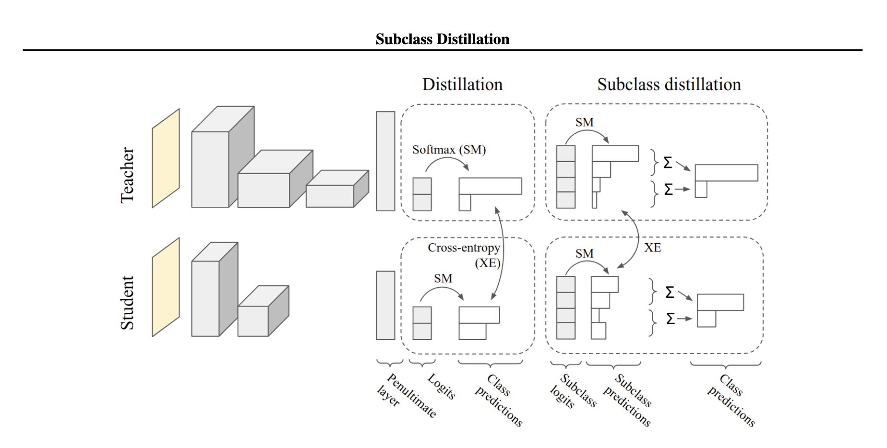

# Subclass distillation demo
This is a fork of Google Research [repo](https://github.com/google-research/google-research) keeping only the `subclass_distillation` folder.

This is the minimal/demo implementation of:

Müller, R., Kornblith, S., & Hinton, G. (2020).
[Subclass distillation](https://arxiv.org/abs/2002.03936). arXiv preprint
arXiv:2002.03936.

The idea is to jointly classify and learn subclasses (clusters per class). An auxiliary loss is used to load balance the use of each subclass. These subclasses logits are then used as teacher targets to train a smaller student.



# Original README (google-research)

This repository contains code released by
[Google Research](https://research.google).

All datasets in this repository are released under the CC BY 4.0 International
license, which can be found here:
https://creativecommons.org/licenses/by/4.0/legalcode.  All source files in this
repository are released under the Apache 2.0 license, the text of which can be
found in the LICENSE file.

---

Because the repo is large, we recommend you download only the subdirectory of
interest:

* Use GitHub editor to open the project. To open the editor change the url from
github.com to github.dev in the address bar.
* In the left navigation panel, right-click on the folder of interest and select
download.

If you'd like to submit a pull request, you'll need to clone the repository;
we recommend making a shallow clone (without history).

```
git clone git@github.com:google-research/google-research.git --depth=1
```

---

*Disclaimer: This is not an official Google product.*

Updated in 2023.