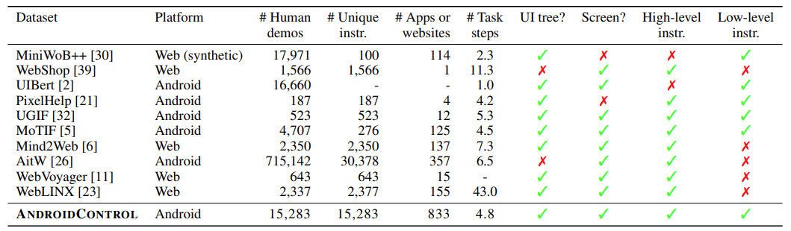
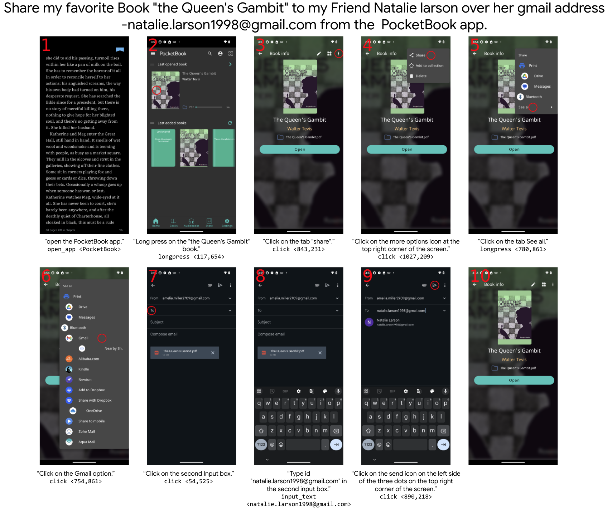
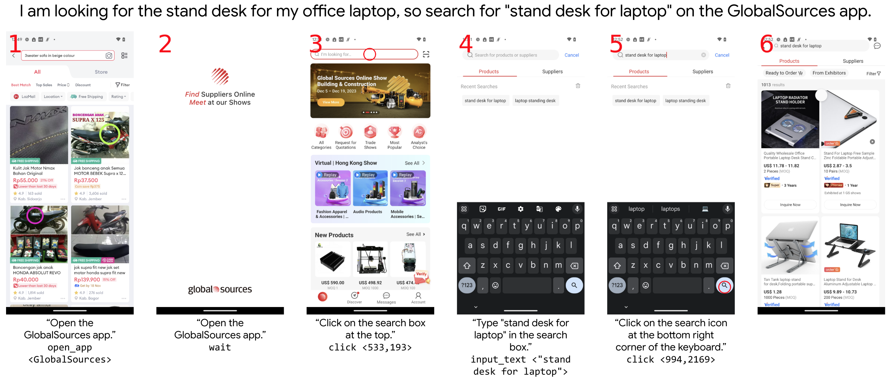

# AndroidControl

AndroidControl is a collection of over 15,000 demonstrations from human raters performing a
diverse variety of tasks on 833 different apps spanning 40 app categories on Android devices. The
dataset is structured particularly to measure the ability of agents to
generalize beyond the apps and tasks they were trained on. The dataset includes
screenshots and accessibility trees from the device, natural language instructions (both high-level
goals and low-level step instructions), and actions represented as JSON dictionaries.

## Dataset location

The AndroidControl dataset and split file can be found [here](https://console.cloud.google.com/storage/browser/gresearch/android_control).

## Dataset format

Each datapoint is stored as a
[TFRecord file](https://www.tensorflow.org/tutorials/load_data/tfrecord#reading_a_tfrecord_file_2)
with compression type `'GZIP'` with the following fields:

*   `episode_id`: a unique identifier integer for each episode. This is especially useful when generating the data splits.
*   `goal`: the goal instruction for the entire episode.
*   `screenshots`: a list of screenshot byte strings for each observation encoded as PNGs.
*   `accessibility_trees`: a list of [accessibility trees](https://github.com/google-deepmind/android_env/blob/main/android_env/proto/a11y/android_accessibility_forest.proto) for each observation.
*   `screenshot_widths`: a list of the widths of each of the screenshots.
*   `screenshot_heights`: a list of the heights of each of the screenshots.
*   `actions`: a list of actions represented as JSON dictionaries. The actions are performed between consecutive screenshots, so there are **len(screenshots) - 1** of them.
*   `step_instructions`: a list of the step instructions describing each step to complete the task. The number of step instructions equals the number of actions, but it's important to note that each step instruction does not necessarily describe a single action. A step instruction can require more than one action to complete, and in these cases the step instruction is repeated to maintain a one-to-one mapping from step instructions to actions.

### Parsing the accessibility tree
To parse the trees from their serialized strings, you must clone/install the [android_env repository](https://github.com/google-deepmind/android_env/tree/main/android_env) using the methods they describe. To access the proto in Colab we used the following

```
!git clone https://github.com/deepmind/android_env/
!cd android_env; pip install .
```

Once it's installed, you can import the proto and instantiate the forest object. Here’s an example of how to do that

```
import tensorflow as tf
from android_env.proto.a11y import android_accessibility_forest_pb2

filenames = tf.io.gfile.glob('gs://gresearch/android_control/android_control*')
raw_dataset = tf.data.TFRecordDataset(filenames, compression_type='GZIP')
dataset_iterator = tf.compat.v1.data.make_one_shot_iterator(raw_dataset)

example = tf.train.Example.FromString(dataset_iterator.get_next().numpy())

forest = android_accessibility_forest_pb2.AndroidAccessibilityForest().FromString(example.features.feature['accessibility_trees'].bytes_list.value[0])
print(forest)
```


## Action space

Our actions are represented as JSON dictionaries with an `action_type` key. The other fields in the action dictionary are unique for each `action_type` and  store parameter values for that action (e.g., "open_app" actions have an "app_name" key, but no "x" or "y" keys). The `action_type` field will have one of the following values:

* `click`: click at a specific point on the screen using the coordinates found in the `'x'` and `'y'` fields of the action.
* `long_press`: long press at a specific point on the screen using the coordinates found in the `'x'` and `'y'` fields of the action.
* `scroll`: scroll in a specific direction set in the `'direction'` field (one of 'up', 'down', 'left', or 'right').
* `open_app`: open an app with the name stored in the `'app_name'` field. This name should map to an activity name which can be used to open the app using adb.
* `input_text`: types the text in the `'text'` field. It does not perform a click or press enter at the end.
* `navigate_home`: go to the home screen.
* `navigate_back`: go back to the previous screen.
* `wait`: wait a set number of seconds. This is used when no action should be taken other than to wait for something on screen (e.g., a loading bar).

## Comparison to other datasets



## Example episodes




## Citation

```
@article{li2024effects,
  title={On the Effects of Data Scale on Computer Control Agents},
  author={Li, Wei and Bishop, William and Li, Alice and Rawles, Chris and Campbell-Ajala, Folawiyo and Tyamagundlu, Divya and Riva, Oriana},
  journal={arXiv preprint arXiv:2406.03679},
  year={2024}
}
```

## License

Copyright 2024 The Google Research Authors.

Licensed under the Apache License, Version 2.0 (the "License");
you may not use this file except in compliance with the License.
You may obtain a copy of the License at

    http://www.apache.org/licenses/LICENSE-2.0

Unless required by applicable law or agreed to in writing, software
distributed under the License is distributed on an "AS IS" BASIS,
WITHOUT WARRANTIES OR CONDITIONS OF ANY KIND, either express or implied.
See the License for the specific language governing permissions and
limitations under the License.
