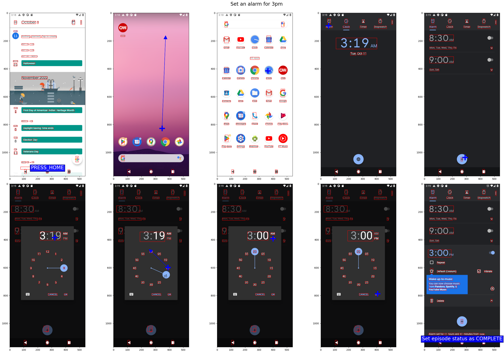
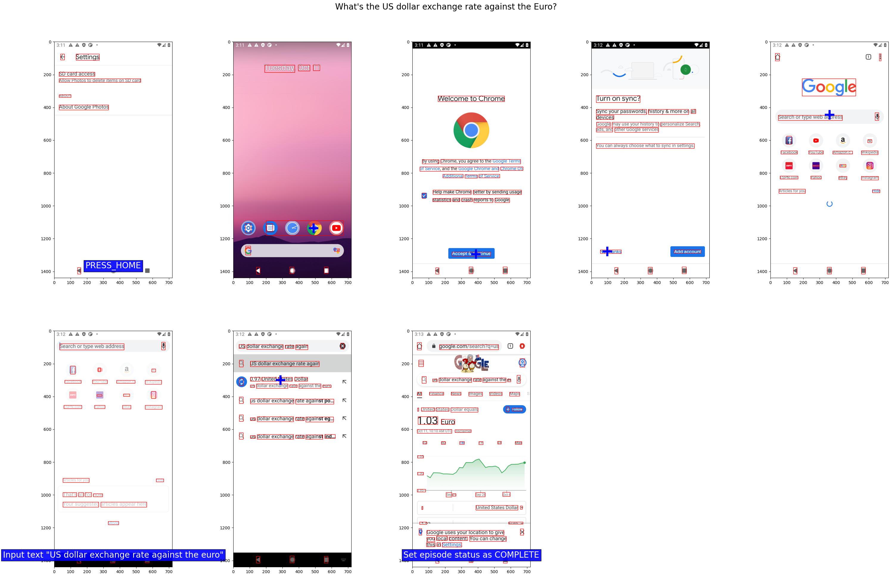
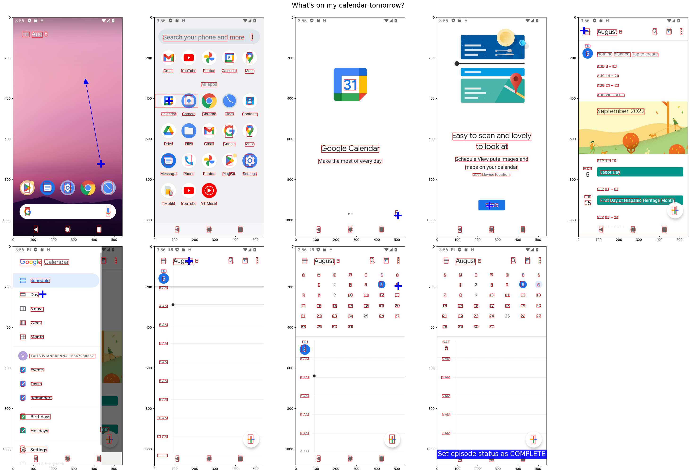

# Android in the Wild (AitW)

Android in the Wild (AitW) is a large-scale dataset for mobile device control
that contains human-collected demonstrations of natural language instructions,
user interface (UI) screens, and actions for a variety of human tasks.

Link to paper: https://arxiv.org/abs/2307.10088

## Data

The data in AitW encompasses four Android versions (v10 - 13) and
eight device types with varying screen resolutions. The natural language
instructions come from a variety of sources including humans, large language
models, and technical documentation. There is also variability in the starting
state of episodes as they were randomized during data collection.
AitW is comprised of five separate datasets, four of which
demonstrate multi-step tasks and one that contains single-step tasks.

### Multi-step

*   **GoogleApps**: high-level tasks involving the use of Google applications
    (Gmail, Google Calendar, etc.), some overlapping with tasks in the
    [PixelHelp](https://arxiv.org/abs/2005.03776) dataset
    -   e.g., "turn off javascript in the chrome app"
*   **Install**: high-level tasks related to installing and uninstalling apps
    and logging into apps, including handling log in support (e.g., forgot
    password) on 88 apps available on the Google Play Store
    -   e.g., "open app "DoorDash - Food Delivery" (install if not already
        installed)"
*   **WebShopping**: tasks related to shopping on e-commerce websites, including
    searching for an item, adding an item to a cart, and viewing the shopping
    cart
    -   e.g., "Look up the best rated coffee maker on Lowe's."
*   **General**: miscellaneous tasks including question-and-answering and
    interacting with 3rd party apps/websites
    -   e.g., "Open a new Chrome private window"

### Single-step

*   **Single**: single-step tasks manually annotated by using
    [hindsight relabeling](https://arxiv.org/abs/2005.07648) on multi-step data
    episodes mainly from WebShopping and on a smaller number of episodes
    performed on a variety of Google apps and 3rd party websites
    -   e.g., "Add to cart","Go to ebay search bar and search lg ultragear"

### Statistics

Name        | # Episodes  | # Examples    | # Unique Prompts | Data location
:---------: | :---------: | :-----------: | :--------------: | :-----------:
GoogleApps  | 625,542     | 4,903,601     | 306              | [gs://gresearch/android-in-the-wild/google_apps](https://console.cloud.google.com/storage/browser/gresearch/android-in-the-wild/google_apps)
Install     | 25,760      | 250,058       | 688              | [gs://gresearch/android-in-the-wild/install](https://console.cloud.google.com/storage/browser/gresearch/android-in-the-wild/install)
WebShopping | 28,061      | 365,253       | 13,473           | [gs://gresearch/android-in-the-wild/web_shopping](https://console.cloud.google.com/storage/browser/gresearch/android-in-the-wild/web_shopping)
General     | 9,476       | 85,413        | 545              | [gs://gresearch/android-in-the-wild/general](https://console.cloud.google.com/storage/browser/gresearch/android-in-the-wild/general)
Single      | 26,303      | 85,668        | 15,366           | [gs://gresearch/android-in-the-wild/single](https://console.cloud.google.com/storage/browser/gresearch/android-in-the-wild/single)
**Total**   | **715,142** | **5,689,993** | **30,378**       | [gs://gresearch/android-in-the-wild](https://console.cloud.google.com/storage/browser/gresearch/android-in-the-wild/)

## Colab

Run this [colab](https://github.com/google-research/google-research/blob/master/android_in_the_wild/demo.ipynb)
for a quick demo on accessing the data and utilizing our visualization tools.

## Dataset format

Each datapoint is stored as a
[TFRecord file](https://www.tensorflow.org/tutorials/load_data/tfrecord#reading_a_tfrecord_file_2)
with compression type `'GZIP'` with the following fields:

*   `android_api_level`: the Android API level of the emulator the episode was
    collected from
*   `current_activity`: the name of the activity running when the example was
    collected
*   `device_type`: the device type of the emulator the episode was collected
    from, mostly Pixel devices with one custom device image
*   `episode_id`: the unique identifier for the episode the example is from
*   `episode_length`: the overall number of steps in the episode
*   `goal_info`: the natural language instruction the episode is demonstrating
*   `image/channels`, `image/height`, `image/width`: the number of channels,
    height, and width of the screenshot
*   `image/encoded`: the encoded screenshot
*   `image/ui_annotations_positions`: a flattened array of coordinates
    representing the bounding boxes of the UI annotations; the coordinates are
    in (y, x, height, width) format and the length of this array is `4 *
    num_elements`
*   `image/ui_annotations_text`: the OCR-detected text associated with the UI
    element
*   `image/ui_annotations_ui_types`: the type of UI element for each annotation,
    can be an icon or just text
*   `results/action_type`: the type of the predicted action (see 'Action space'
    for more details)
*   `results/type_action`: if the action is a `type` then this holds the text
    string that was typed
*   `results/yx_touch`, `results/yx_lift`: the (y, x) coordinates for the touch
    and lift point of a dual point action
*   `step_id`: the example's zero-indexed step number within the episode (i.e.
    if `step_id` is 2, then this is the third step of the episode)

## Splits

To evaluate the robustness of an agent on this dataset, we randomly split each
of the five datasets episode-wise into train, test, and validation sets,
evaluate on each dataset separately, and take the average score across them.

*   **Standard**: randomly splits each dataset episode-wise

Additionally, there are 4 Out-of-Distribution (OOD) splits:

*   **Unseen Android Version**: splits based on the Android version, we train
    and validate on v10-12 and test on v13
*   **Unseen subject**: splits by extracting the *instruction template* with the
    subject masked out and splitting episodes by template
*   **Unseen verb**: splits by extracting the *instruction template* with the
    verb masked out and splitting episodes by template
*   **Unseen domain**: split based on the domain, such as the app or the website
    URL domain (e.g., amazon.com) of the task

The splits are represented by JSON files, where each file is a dictionary
mapping the label (train, validation, test) to an array of episode IDs that have
said label. They are stored in GCS and can be found
[here](https://console.cloud.google.com/storage/browser/gresearch/android-in-the-wild/splits).

## Action space

The actions in the dataset are one of the following:

*   Dual point: this action represents clicks and scrolls on the screen with two
    (x, y) coordinate-pairs denoting the start and the end of a gesture on the
    screen
*   Type: an action representing the rater typing in text, note this only send
    the text string to the device, if no element is focused on this will have no
    effect
*   Button presses: we provided raters with explicit press home, back, and enter
    actions, and while they were rarely used, there are still instances of these
    actions present
*   Status actions: these actions are used to denote the end of an episode and
    represent the status of the episode (i.e. if it was successfully completed
    or impossible to accomplish)

## Action matching for evaluation

For evaluating on our dataset, we introduce an offline evaluation metric called
**action matching**.

For actions that aren't dual point actions, we simply compare the two actions'
types and consider the actions as matching if their types are the same.

Dual-point actions can be classified into taps or swipes. Taps are defined as a
dual-point action where the touch and lift point positions are basically equal
(i.e., within 0.04 Euclidean distance from one another). Otherwise, the
dual-point action is considered a swipe. For two dual point actions to match
they must both be taps or both be swipes. Two taps match if they are close to
one another (i.e., within a 14% screen distance from one another) or fall within
the same bounding box. Two swipes match if they have the same primary swipe axis
(vertical or horizontal). We provide code for action matching in the repository.

## How the data was collected

The dataset was collected in two stages. In the first stage, we had 40 human
raters collect the data by asking them to perform a randomly-assigned
instruction (involving multiple steps) on an emulated device using a mouse and
keyboard, logging their actions as the episode progressed. To gather single-step
episodic data, we ask the raters to label subsequences of the longer-horizon
task with natural language instructions. As an example, "Turn off wifi" could be
broken into three instructions: "click settings", "open wifi settings", and
"toggle the switch".

## Example Episodes

