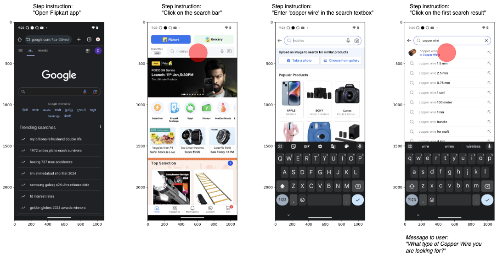

# AndroidInteraction

AndroidInteraction is a dataset designed to evaluate agent-initiated user interactions in the context of smartphone automation. It comprises 772 episodes, consisting of 3,605 steps, across more than 250 diverse Android applications. AndroidInteraction adopts the data structure of [AndroidControl](https://github.com/google-research/google-research/tree/master/android_control), with each step annotated for required user interaction, and including a natural language message to the user when interaction is necessary. Consistent with AndroidControl, each step includes screenshots and accessibility trees from the device, natural language instructions (both high-level goals and low-level step instructions), and actions represented as JSON dictionaries.

## Dataset location

The AndroidInteraction dataset and split file can be found [here](https://console.cloud.google.com/storage/browser/gresearch/android_interaction).

## Dataset format

The AndroidInteraction dataset is stored as a
[TFRecord file](https://www.tensorflow.org/tutorials/load_data/tfrecord#reading_a_tfrecord_file_2)
with compression type `'GZIP'`, based on the structure of [AndroidControl](https://github.com/google-research/google-research/tree/master/android_control). This file format first includes the following original fields:

*   `episode_id`: a unique integer identifier for each episode.
*   `goal`: the goal instruction for the entire episode.
*   `screenshots`: a list of screenshot byte strings for each observation encoded as PNGs.
*   `accessibility_trees`: a list of [accessibility trees](https://github.com/google-deepmind/android_env/blob/main/android_env/proto/a11y/android_accessibility_forest.proto) for each observation.
*   `actions`: a list of actions represented as JSON dictionaries. The actions are performed between consecutive screenshots, so there are **len(screenshots) - 1** of them.
*   `step_instructions`: a list of the step instructions describing each step to complete the task. The number of step instructions equals the number of actions, but it's important to note that each step instruction does not necessarily describe a single action. A step instruction can require more than one action to complete, and in these cases the step instruction is repeated to maintain a one-to-one mapping from step instructions to actions.

In addition, AndroidInteraction introduces the following annotations for each
episode:

*   `messages_to_user`: a list of a natural language prompts containing the message to the user, empty when no interaction is necessary.
*   `interaction_types`: a list of strings indicating the type of required interaction. Can be one of 'more information needed', 'confirmation needed' or 'infeasible', and empty when no interaction is necessary.
*   `neccesity_scores`: a list of integers score reflecting the degree to which user interaction is required, ranging from 1 (may be considered annoying) to 5 (completely essential), and -1 when no interaction is necessary. This score was determined while considering potential different preferences of different users, aiming to capture the subjectivity of such preferences.

### Parsing the accessibility tree
To parse the trees from their serialized strings, you must clone/install the [android_env repository](https://github.com/google-deepmind/android_env/tree/main/android_env) using the methods they describe. To access the proto in Colab we used the following

```
!git clone https://github.com/deepmind/android_env/
!cd android_env; pip install .
```

Once it's installed, you can import the proto and instantiate the forest object.
Here’s an example of how to do that:

```
import tensorflow as tf
from android_env.proto.a11y import android_accessibility_forest_pb2

filenames = tf.io.gfile.glob('gs://gresearch/android_control/android_control*')
raw_dataset = tf.data.TFRecordDataset(filenames, compression_type='GZIP')
dataset_iterator = tf.compat.v1.data.make_one_shot_iterator(raw_dataset)

example = tf.train.Example.FromString(dataset_iterator.get_next().numpy())

forest = android_accessibility_forest_pb2.AndroidAccessibilityForest().FromString(example.features.feature['accessibility_trees'].bytes_list.value[0])
print(forest)
```

## Action space

Our actions are represented as JSON dictionaries with an `action_type` key.
The other fields in the action dictionary are unique for each `action_type` and
store parameter values for that action (e.g., "open_app" actions have an
"app_name" key, but no "x" or "y" keys). The `action_type` field will have one
of the following values:

* `click`: click at a specific point on the screen using the coordinates found in the `'x'` and `'y'` fields of the action.
* `long_press`: long press at a specific point on the screen using the coordinates found in the `'x'` and `'y'` fields of the action.
* `scroll`: scroll in a specific direction set in the `'direction'` field (one of 'up', 'down', 'left', or 'right').
* `open_app`: open an app with the name stored in the `'app_name'` field. This name should map to an activity name which can be used to open the app using adb.
* `input_text`: types the text in the `'text'` field. It does not perform a click or press enter at the end.
* `navigate_home`: go to the home screen.
* `navigate_back`: go back to the previous screen.
* `wait`: wait a set number of seconds. This is used when no action should be taken other than to wait for something on screen (e.g., a loading bar).

## Example episode
The following figure presents an episode that was annotated as requiring
interaction with the user. For clarity, we added action illustrations, the step
instructions and the message to the user.



## License

Copyright 2024 The Google Research Authors.

Licensed under the Apache License, Version 2.0 (the "License");
you may not use this file except in compliance with the License.
You may obtain a copy of the License at

    http://www.apache.org/licenses/LICENSE-2.0

Unless required by applicable law or agreed to in writing, software
distributed under the License is distributed on an "AS IS" BASIS,
WITHOUT WARRANTIES OR CONDITIONS OF ANY KIND, either express or implied.
See the License for the specific language governing permissions and
limitations under the License.
