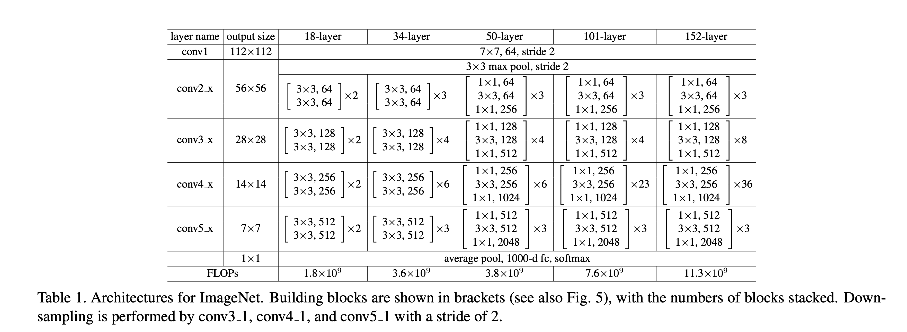

## ImageNet classification

Trains a ResNet50 model (He *et al.*, 2015) for the ImageNet classification task
(Russakovsky *et al.*, 2015). This model supports optional quantization of
weights and activation functions.



This example uses linear learning rate warmup and cosine learning rate schedule.

### Requirements
* TensorFlow dataset `imagenet2012:5.*.*`
* `≈180GB` of RAM if you want to cache the dataset in memory for faster IO
* Install package `dacite`.

### Supported setups

The model can run on GPUs and TPUs, and should run with other configurations and
hardware. The following are test cases running on GPUs.

| Hardware | Batch size | Training time | Top-1 accuracy  | TensorBoard.dev |
| --- | --- | --- | --- | --- |
| 8 x Nvidia V100 (16GB)  | 512  |  13h 25m  | 76.63% | [2020-03-12](https://tensorboard.dev/experiment/jrvtbnlETgai0joLBXhASw/) |
| 8 x Nvidia V100 (16GB), mixed precision  | 2048  | 6h 4m | 76.39% | [2020-03-11](https://tensorboard.dev/experiment/F5rM1GGQRpKNX207i30qGQ/) |

### Acceptable quantization options

Currently, all Matmul layers (all `Conv` layers and the `Dense` layer) have
quantization support.

The main method to input quantization options is through a JSON config file,
which is passed through the flag `base_config_filename`.

If `base_config_filename` is not passed to the code, i.e. `None`, the
hyperparameters can be generated from helper methods in `hparams_gen.py`. The
function `generate_common_configs()` can generate hyperparameters from the flags
defined therein. `quant_target` indicates which parts of the model are to be
quantized and can accept an argument from one of the following values.

- NONE: No quantization; default.
- WEIGHTS_ONLY: Weights are quantized only.
- WEIGHTS_AND_FIXED_ACTS: Weights and activations are quantized; no automatic GetBounds.
- WEIGHTS_AND_AUTO_ACTS: Weights and activations are quantized; with automatic GetBounds.

Example launch:
```
python3 train.py --model_dir /tmp/resnet50_imagenet_w1_a_auto --hparams_config_dict configs/paper/resnet50_w4_a4_auto.py
```


## Reproduce AQT Experiments on GCloud TPUs


### Setup a TPU VM and Install JAX/Flax

Follow the guide below  to create a TPU VM and install both JAX and Flax dependencies.

* [Run JAX/Flax on cloud TPU VM](https://cloud.google.com/tpu/docs/jax-quickstart-tpu-vm)


### Exceptions

If VM setup works well when following the guide, then ignore this section. There are exceptions where one needs to manually configure the network or firewall rules.


1. **What if "no networks available" error occurs?**
    1. In Google Cloud CLI tool, try `gcloud alpha compute networks list` and see if default network exists ([reference](https://cloud.google.com/sdk/gcloud/reference/alpha/compute/networks/list)).
    2. If not, create one in the cloud CLI tool with command `gcloud alpha compute networks create [NAME]` ([reference](https://cloud.google.com/sdk/gcloud/reference/alpha/compute/networks/create))
    3. Pass the network name via the –network flag when creating the vm
2. **What if connection to TPU VM fails or "no firewall rules" error occurs?**
    4. Create an ingress firewall rule that accepts ssh traffics from outside to the TPU VM in the cloud CLI tool with the command:  `gcloud compute firewall-rules create allow-ssh-ingress -direction=INGRESS -action=allow -rules=tcp:22 -network=default -no-enable-logging`
    5. [Reference for other firewall rules](https://cloud.google.com/vpc/docs/using-firewalls#console)


### Create and Connect VM to Cloud Storage Bucket


1. [Create a cloud storage bucket](https://cloud.google.com/storage/docs/creating-buckets)
2. [Connect TPU VM to the bucket](https://cloud.google.com/tpu/docs/storage-buckets#console)


### Download ImageNet

Proceed this section either on the local machine or a TPU VM. A TPU VM is recommended because all dependencies should be ready after the setup.

To download the ImageNet dataset, one needs to first register at the [official website](https://www.image-net.org/) and agree all the terms there. Then download the ILSVRC2012 train and val images in a desired directory.

The folder should contain two files at the end:` ILSVRC2012_img_train.tar` and `ILSVRC2012_img_val.tar`. Please rename if names appear different as it is important for the next preprocessing step.

Do not extract the downloaded files. Use python `tensorflow_datasets`(tfds) library to preprocess it. Specifically, first point the environment variable to the path where the dataset is downloaded,
```
$ export IMAGENET_DOWNLOAD_PATH=/path/where/ImageNet/is/downloaded
```
then run the following python code block in command line:
```
$ python -c "
import tensorflow_datasets as tfds
tfds.builder('imagenet2012').download_and_prepare(
    download_config=tfds.download.DownloadConfig(
        manual_dir='$IMAGENET_DOWNLOAD_PATH'))
"
```

Note that the preprocessing will extract and prepare the ImageNet dataset in a new folder defined by the environment variable `TFDS_DATA_DIR`, which is by default `~/tensorflow_datasets` under the home directory ([reference](https://www.tensorflow.org/datasets/api_docs/python/tfds/core/DatasetBuilder)). If one has insufficient disk space under `/home` (about 150 GB), please use 
`$ export TFDS_DATA_DIR=/path/to/preprocess/folder` 
in the command line _before executing the tfds python code block_ to specify a different folder for storing the processed dataset.

After the processing ends, copy the `tensorflow_datasets `directory (where the processed data are stored) to the cloud storage bucket. It can then be used across different VMs.
```
$ gsutil cp -r /path/to/tensorflow_datasets gs://GCS_BUCKET_NAME/datasets
```


### Run AQT on a Single Host

A single host machine typically has 8 TPU chips. You can verify this by ssh into the machine and typing `jax.device_count()` in the python3 environment. To launch an AQT training on such a machine, follow these steps:

1. Refer to the instructions in the [AQT repository](https://github.com/google-research/google-research/tree/master/aqt) and install AQT.
2. Point python compilation path to aqt. Also point the ImageNet path to the correct directory in the storage bucket. Run these commands on cloud TPU through SSH
    ```
    $ export PYTHONPATH=/path/to/parent/directory/of/aqt
    $ export TFDS_DATA_DIR=gs://GCS_BUCKET_NAME/datasets/tensorflow_datasets
    ```


3. Run the train script on cloud TPU VM through SSH
    ```
    $ cd /path/to/aqt/jax/imagenet
    $ python3 train.py --model_dir /tmp/resnet50_imagenet_w1_a_auto --hparams_config_dict configs/paper/resnet50_w4_a4_auto.py --batch_size 32
    ```


### Run AQT on a TPU Pod Slice

A TPU pod slice has multiple host machines, each of which has 8 TPU chips. One needs to run JAX code on every host machine to leverage the entire pod. [This link](https://cloud.google.com/tpu/docs/jax-pods) shows a simple example.

To launch AQT training on a pod slice (e.g., with 8 host machines, 64 TPU chips in total), here is the combined single command that automates dependency installation and training. After creating a VM and preparing the ImageNet dataset in the cloud storage bucket, run this command on a local machine in the cloud CLI tool (please change the VM info and directory names accordingly):
```
gcloud alpha compute tpus tpu-vm ssh [VM name]--zone [VM zone]--worker=all --command "pip install 'jax[tpu]>=0.2.16' -f https://storage.googleapis.com/jax-releases/libtpu_releases.html && pip install --upgrade clu && pip install flax && pip install dacite && git clone https://github.com/google-research/google-research.git && cd google-research && export PYTHONPATH=/path/to/parent/directory/of/aqt && export TFDS_DATA_DIR=gs://GCS_BUCKET_NAME/datasets/tensorflow_datasets && cd aqt/jax/imagenet && python3 train.py --model_dir gs://GCS_BUCKET_NAME/log_dir --hparams_config_dict configs/paper/resnet50_w4_a4_auto.py --batch_size 8192"
```


### Visualizing Tensorboard Data through Colab

Run the following code block in Colab to visualize the tensorboard data. Fill in project ID, storage bucket name and directory name that stores the data.
```
from google.colab import auth
auth.authenticate_user()
#@markdown Your Cloud Platform project ID:
project_id = 'your_cloud_project_id' #@param {type:"string"}
!gcloud config set project {project_id}

#@markdown Enter cloud storage bucket name:
bucket_name = 'your_cloud_storage_bucket_name' #@param {type:"string"}
# list file in the bucket as a test
!gsutil ls gs://{bucket_name}/
#@markdown Enter log directory name (should be under logs/):
log_dir = 'directory_in_bucket_storing_TB_data' #@param {type:"string"}

# load tensorboard files
%load_ext tensorboard
# %reload_ext tensorboard
%tensorboard --logdir gs://{bucket_name}/{log_dir}
```


