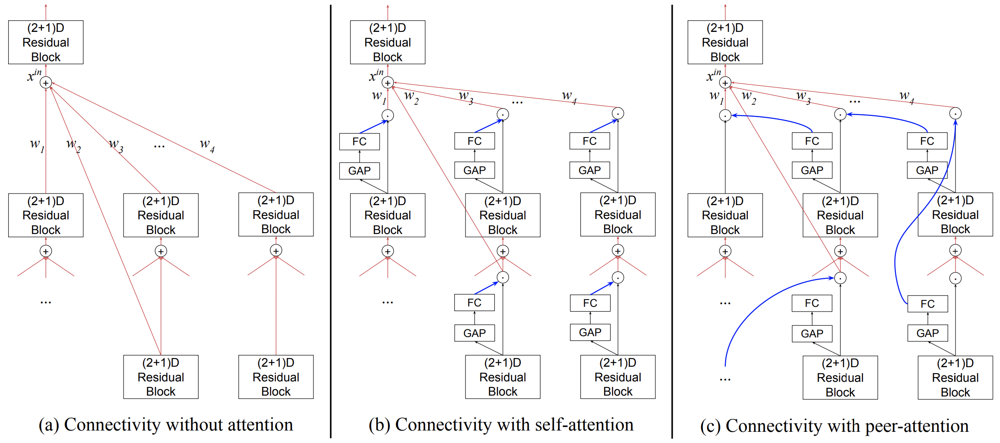
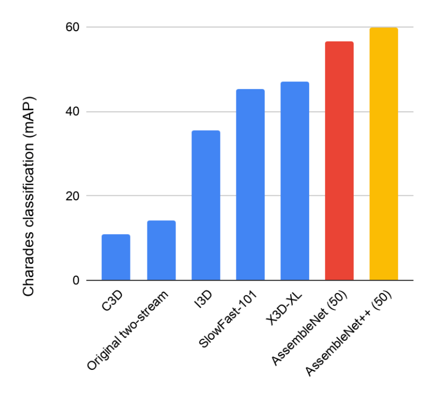
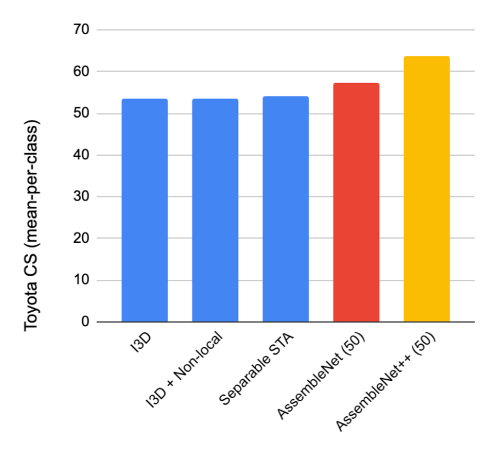

# AssembleNet and AssembleNet++

This repository contains the TF1 code to build [AssembleNet](https://arxiv.org/abs/1905.13209) and [AssembleNet++](https://arxiv.org/abs/2008.08072):

    [1] Michael S. Ryoo, AJ Piergiovanni, Mingxing Tan, Anelia Angelova,
    AssembleNet: Searching for Multi-Stream Neural Connectivity in Video
    Architectures. ICLR 2020

    [2] Michael S. Ryoo, AJ Piergiovanni, Juhana Kangaspunta, Anelia Angelova,
    AssembleNet++: Assembling Modality Representations via Attention
    Connections. ECCV 2020

This code contains the models found and presented in the papers and can be used to generate many different multi-stream video CNN models.

By specifying `FLAGS.assemblenet_mode` in [run_asn.py](run_asn.py), you can use this code to build and run three different types of video CNN models: (1) AssembleNet, (2) AssembleNet++, and (3) AssembleNet++Lite which is a lighter version of AssembleNet++ made to fit better to GPU memory.

The [run_asn.py](run_asn.py) loads our found AssembleNet and AssembleNet++ architectures from [model_structures.py](model_structures.py), and you can also use your own architecture by modifying `FLAGS.model_structure`.


# AssembleNet vs. AssembleNet++

AssembleNet and AssembleNet++ both focus on neural connectivity search for multi-stream video CNN architectures. They learn weights for the connections between multiple convolutional blocks (composed of (2+1)D or 3D residual modules) organized sequentially or in parallel, thereby optimizing the neural architecture for the data/task.

AssembleNet++ adds *peer-attention* to the basic AssembleNet, which allows each conv. block connection to be conditioned differently based on another block. It is a form of channel-wise attention, which we found to be beneficial.



The code is provided in [assemblenet.py](assemblenet.py) and [assemblenet_plus.py](assemblenet_plus.py). Notice that the provided code uses (2+1)D residual modules as the building blocks of AssembleNet/++, but you can use your own module while still benefitting from the connectivity search of AssembleNet/++.


# AssembleNet++lite

AssembleNet++lite is a smaller version of AssembleNet++ that is designed to make it more usable for GPUs. The entire experiments in AssembleNet/++ papers were done with TPUs (v3), and we want to provide the code that also easily trains on GPUs.

Specifically, [assemblenet_plus_lite.py](assemblenet_plus_lite.py) is modified to use smaller modules as its building block; it adopts an inverted bottleneck architecture, also used in MobileNet V2 and V3, as well as X3D. It also uses 3D residual modules instead of the (2+1)D ResNet modules originally used in AssembleNet and AssembleNet++, for better TPU/GPU memory utilization.
More details of this version is described in the supplementary materials of the AssembleNet++ paper.

We confirmed that a single GPU (with 16GB memory) can host a batch of 8 videos with 32 frames (or a batch of 2 videos with 128 frames), for the model training.


# AssembleNet and AssembleNet++ Structure Format

The format we use to specify AssembleNet/++ architectures is as follows: It is a `list` corresponding to a graph representation of the network, where a node is a convolutional block and an edge specifies a connection from one block to another. Each node itself (in the structure list) is a `list` with the following format: `[block_level, [list_of_input_blocks], number_filter, temporal_dilation, spatial_stride]`. `[list_of_input_blocks]` should be the list of node indexes whose values are less than the index of the node itself. The 'stems' of the network directly taking raw inputs follow a different node format: `[stem_type, temporal_dilation]`. The stem_type is -1 for RGB stem and is -2 for optical flow stem. The stem_type -3 is reserved for the object segmentation input.

In AssembleNet++lite, instead of passing a single `int` for `number_filter`, we pass a list/tuple of three `int`s. They specify the number of channels to be used for each layer in the inverted bottleneck modules.


# Fixed Connectivity vs. Connectivity Learning

When training, you can use the code in two different ways. (i) If you specify the detailed connection weights in `FLAGS.model_edge_weights` (as we are doing in [model_structures.py](model_structures.py)), the optimizer will fix these weights and focus on the learning of conv. filters. (ii) If you set `FLAGS.model_edge_weights` to be `[]`, the optimizer will simultaneously learn connection weights and conv. filters through automatic gradient computation. This allows you to search for the best connectivity for your own model, and then fix it.


# Optical Flow and Data Loading

Instead of loading optical flows as inputs from data pipeline, we are applying the [Representation Flow](https://github.com/piergiaj/representation-flow-cvpr19) to RGB frames so that we can compute the flow within TPU/GPU on fly. It's essentially optical flow since it is computed directly from RGBs. The benefit is that we don't need an external optical flow extraction and data loading. You only need to feed RGB, and the flow will be computed internally.

For the object segmentation inputs used in AssembleNet++ paper, you will need to prepare your own datapipeline, and pass it to the model while including the object input stem in the `FLAGS.model_structure`.


# Experimental Results - Video Classification

AssembleNet and AssembleNet++ obtains state-of-the-art results outperforming existing models on multiple public datasets, including the [Charades](https://prior.allenai.org/projects/charades) and the [Toyota Smart Home](https://project.inria.fr/toyotasmarthome/) datasets.

{width="480"}

{width="480"}

Note that AssembleNet++ results are without any pre-training, unlike all the other methods in the figure that benefits from pre-training.

# Setup

To install requirements:

```bash
pip install -r assemblenet/requirements.txt
```

To run the models:

```bash
python -m assemblenet.run_asn --assemblenet_mode=assemblenet
```

The valid `assemblenet_mode` are `assemblenet`, `assemblenet_plus` and `assemblenet_plus_lite`.

