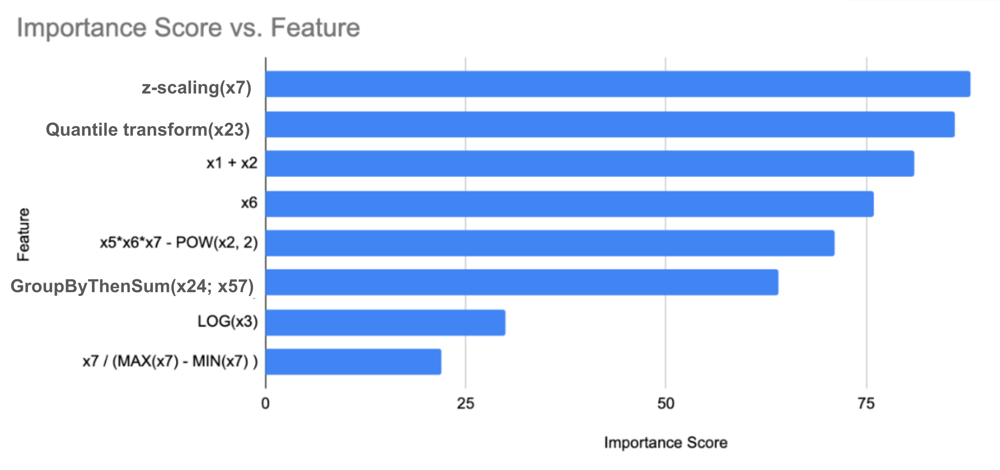

# Automated Feature Engineering (AFE)

How can we simplify and automate the complex and time-consuming process of feature engineering for machine learning models, allowing users to focus on model development and analysis while improving their model's performance and uncovering hidden insights in their data? Our goal is to develop an automated feature engineering system that can identify which engineered features can be optimal for a downstream ML task. To obtain an output such as:



AFE uses a set of feature importance masks to learn which features best benefit from which transformations. It uses local and global masking to determine the best transform functions for each feature, as well as which transformed features lead to an optimal performance with respect to the downstream task. Further details can be found in our papers on [automated feature engineering](https://arxiv.org/pdf/2406.04153) and [feature selection](https://arxiv.org/pdf/2304.03202).


[A notebook demonstrating AFE](GithubAutomatedFeatureEngineering_Demo.ipynb) on Google Cloud. This repository has built-in integration with Google Cloud in terms of data retrieval, processing, and artifacts storage.

It is easy to get started with AFE on the command line, for example, after 
running `pip3 install -r requirements.txt`, we can run:
```
python3 trainer.py --project_id="gcp_project_id" --dataset_name=housingPrice --train_table_name=airbnb2023_float --target=price --task_type=regression --num_steps=10 --model_type=discovery --upload_features_to_bq=True
```

Here is the full list of possible command line flags:
```
  --batch_buffer_size: Number of batches held in shuffling buffer.
    (default: '32')
    (an integer)
  --batch_size: Batch size
    (default: '2048')
    (an integer)
  --config: Configuration string for running pipeline from container.
  --data_buffer_size: Dataset buffer size.
    (default: '4096')
    (an integer)
  --data_name: Dataset name
    (default: 'isolet')
  --dataset_name: BigQuery dataset name for train and test.
  --decay_rate: Decay rate
    (default: '0.5')
    (a number)
  --decay_steps: Decay steps
    (default: '500')
    (an integer)
  --feature_dim: Feature dimension
    (an integer)
  --gcs_output_path: GCS output path.
  --learning_rate: Learning rate.
    (default: '0.01')
    (a number)
  --logging_filename: Name of the file used for logging discovered or selected
    features.
    (default: 'features.json')
  --model_type: Model type can be feature selection or discovery.
    (default: 'discovery')
  --num_mlp_layers: Number of MLP layers in MLP model
    (default: '2')
    (an integer)
  --num_selected_features: Number of features for feature selection
    (an integer)
  --num_steps: Number of training steps
    (default: '50')
    (an integer)
  --project_id: The BigQuery project ID.
  --seed: Random seed
    (default: '21')
    (an integer)
  --target: Name for the training target feature.
  --task_type: Task type can be classification or regression.
    (default: 'classification')
  --test_table_name: Table name of the test dataset.
  --train_table_name: Table name of the training dataset.
  --upload_features_to_bq: Whether to upload features to BQ table.
    (default: 'true')
```
Disclaimer: This is not an officially supported Google product.