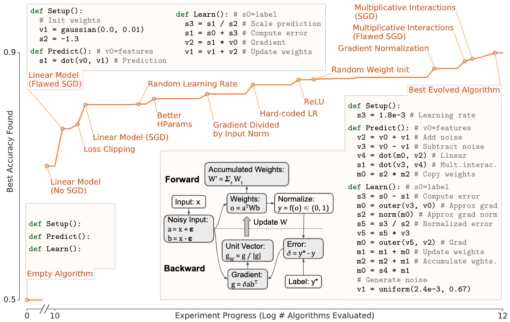
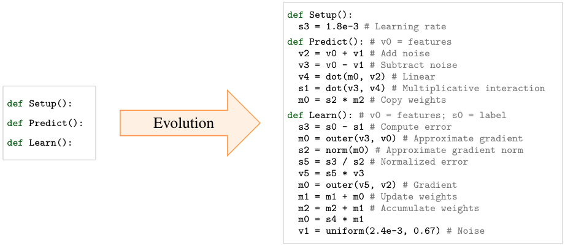

# AutoML-Zero Open-Sourced Code

This directory contains the open-sourced code for the paper:

\"**AutoML-Zero: Evolving Machine Learning Algorithms From Scratch**\" \
*E Real\*, C Liang\*, DR So, and QV Le \(\*equal contribution)*

We will first summarize the paper, and then provide code to run a 5-minute demo and to reproduce baselines.

&nbsp;

## Paper Summary: Evolving Algorithms with Minimal Human Bias

The paper presents and analyzes experiments that automatically discover computer programs to solve supervised machine learning tasks. Starting from empty or random programs and using only basic mathematical operations as building blocks, the evolutionary search method discovers linear regression, 2-layer fully connected neural networks, bilinear models, and the like. Backpropagation by gradient descent is discovered simultaneously as a way to train the models when the search process is made to evaluate on *multiple* tasks. In other words, searching the AutoML-Zero space discovers not only these simple architectures, but also the learning algorithm.

For example, one of our experiments evaluates on binary classification tasks extracted CIFAR-10. It produces the following sequence of discoveries:



In other words, AutoML-Zero aims to simultaneously search for all aspects of an ML algorithm, including the architecture, the data augmentation, and the learning strategy, all the while employing *minimal human bias*. To minimize biasing the results in favor of human-discovered ideas, we search over large sparse spaces that have not been heavily designed, using fine-grained components (e.g. 58 basic mathematical ops) and imposing minimal restrictions on form&mdash;i.e directly evolving the code. As an example of the code, here are the initial algorithm and the best algorithm discovered by the experiment above:



In our framework, an algorithm is represented as a triplet of component functions called ```Setup```, ```Predict```, and ```Learn```, as seen above. To evaluate an algorithm, the ```Setup``` function is executed once at the beginning, and the ```Predict``` and ```Learn``` functions are then executed once for each example. There are few restrictions in that every instruction inside each of these functions is free to change during the search: instructions can be inserted or removed, their arguments and output variables can be modified, and the operations used to combine those arguments can be altered. We even allow a variable number of instructions. This code performs better than hand-designs of comparable complexity, such as logistic regressors or two-layer preceptrons. This remains the case even after transferring to other datasets like SVHN or down-sampled ImageNet. Most importantly, the evolved code is *interpretable*: our paper analyzes this model in terms of multiplicative interactions, gradient descent, and similar concepts.

&nbsp;

## 5-Minute Demo: Rediscovering Linear Regression From Scratch

Considering the problem of linear regression provides a miniature version of the experiments in the paper. Confronted with this problem, a human designer might write the following algorithm:

```
TODO(ereal): write linear regression algorithm.
```

In this human-designed case, the ```Setup``` function establishes a learning rate, the ```Predict``` function applies a set of weights to the inputs, and the ```Learn``` function corrects the weights in the opposite direction to the gradient. In other words, a linear regressor trained with gradient descent.

*Can an evolutionary algorithm also discover linear regression and gradient descent?*

To answer this question, you can try the script below. It applies an experimental paradigm similar to that of our paper. The paradigm is to run evolution experiments on 10 linear *search tasks* (see paper). After each experiment, it evaluates the best algorithm discovered on 100 *selection tasks*. Once an algorithm attains a fitness (1 - RMS error) greater than 0.9999, it is selected for a final evaluation on 100 *unseen tasks*. To conclude, the demo prints the results of this one-time final evaluation and shows the code for the corresponding algorithm.

For the purposes of this demo, we use a much smaller search space: only the operations necessary to implement linear regression are allowed and the programs are constrained to a short, fixed length. This way, the demo will typically discover code similar to linear regression by gradient descent in under 5 minutes using 1 CPU.

Please install with:

```
TODO(crazydonkey): add command lines.
```

and run with:

```
TODO(crazydonkey): add command lines.
```

Repeated runs will use different random seeds. Note that the runtime may vary
widely due to the random initial conditions and hardware.

&nbsp;

## Reproducing Baselines

The following command can be used to reproduce the results in Supplementary
Section 9 ("Baselines") with the "Basic" method on 1 process (1 CPU):

*[To be continued, ETA: March, 2020]*

If you want to use more than 1 process, you will need to code a way to
parallelize the computation based on your particular distributed-computing
platform. A platform-agnostic description of what we did is given in our paper.

We left out of this directory upgrades for the "Full" method that are
pre-existing (hurdles) but included those introduced in this paper (e.g. FEC
for ML algorithms).

&nbsp;

<sup><sub>
Search keywords: machine learning, neural networks, evolution,
evolutionary algorithms, regularized evolution, program synthesis,
architecture search, NAS, neural architecture search,
neuro-architecture search, AutoML, AutoML-Zero, algorithm search,
meta-learning, genetic algorithms, genetic programming, neuroevolution,
neuro-evolution.
</sub></sup>
