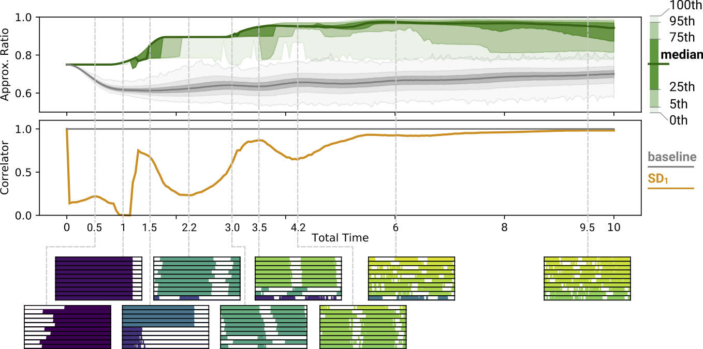

# Investigating Quantum Approximate Optimization Algorithms under Bang-bang Protocols

This repository contains a python implementation of "Investigating Quantum
Approximate Optimization Algorithms under Bang-bang Protocols" by Daniel Liang,
Li Li and Stefan Leichenauer (accepted as regular article in Physics Review
Research).

Paper link: https://arxiv.org/abs/2005.13103

{width="600"}

## Requirements

```
pip install -r requirements.txt
```

## Search an optimal bang-bang protocol using stochastic descent

NOTE: This demo code runs on a single machine. For the results presented in the paper, we run the stochastic descent search on a distributed system.

```
python -m bangbang_qaoa.search_bangbang_qaoa_protocols \
  --num_literals=10 \
  --num_clauses=10 \
  --initialization_method=random \
  --num_chunks=100 \
  --total_time=3 \
  --num_samples=1
```

Depends on the initial random seed, the result will look like below:
```
Optimal protocol:
[0, 0, 0, 0, 1, 1, 1, 1, 1, 1, 1, 1, 1, 1, 1, 1, 1, 1, 1, 1, 1, 1, 1, 1, 1, 1,
 1, 1, 1, 1, 1, 1, 1, 1, 1, 1, 1, 1, 1, 1, 1, 0, 1, 1, 1, 1, 1, 0, 1, 1, 0, 0,
 0, 0, 0, 0, 0, 0, 0, 0, 0, 0, 0, 0, 1, 1, 1, 1, 1, 1, 1, 1, 1, 1, 1, 1, 1, 1,
 1, 1, 1, 1, 1, 1, 1, 1, 1, 1, 1, 1, 1, 1, 1, 1, 1, 1, 1, 0, 0, 0]
Protocol eval: 0.931884
Number of epoch: 74
```

The QAOA `p` value of this protocol is approximately 2, which is consistent with
Figure 3(e) in the paper.
