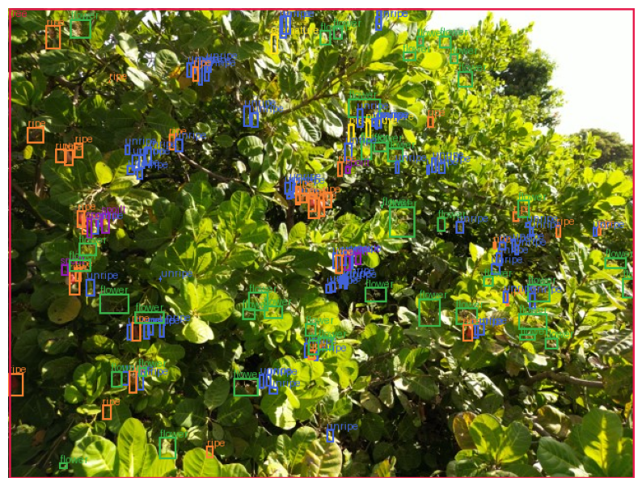
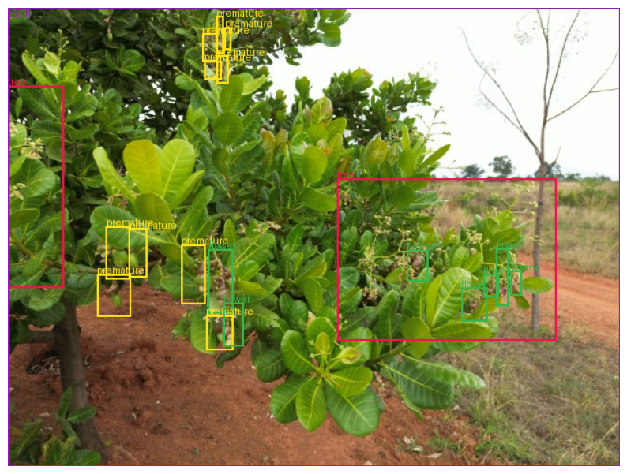
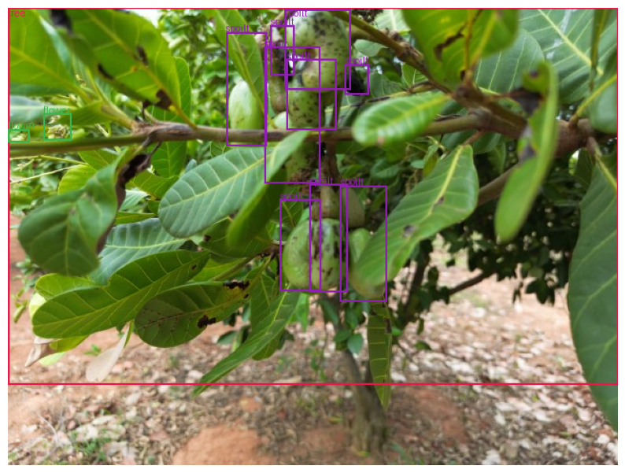
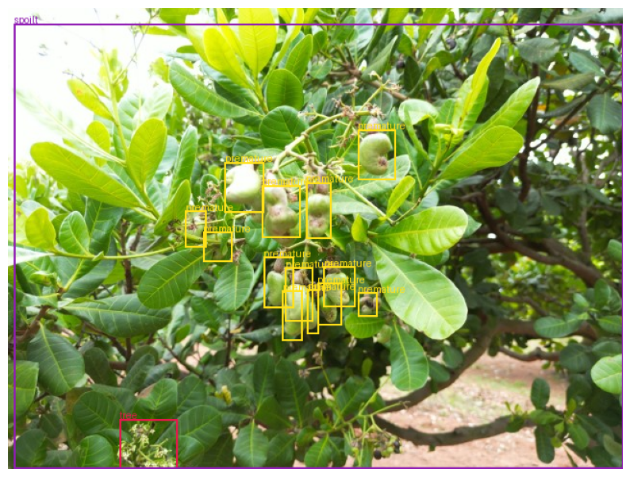

# Technical Briefing: Agricultural Computer Vision Benchmarks and Dataset Constraints

**ArtemisFM Open Source Initiative** \
*Target: Workshop Participants* \
*Last Updated: June 2026*

This technical briefing outlines the baseline experimental findings,
architectural benchmarks, and data-level limitations identified during previous
engineering workshops. It is designed to establish a solid empirical foundation
for incoming researchers, enabling systematic prioritization of subsequent
experiments and model optimization efforts in agricultural computer vision
tasks.

--------------------------------------------------------------------------------

## 1. Dataset Characteristics and Systemic Constraints

Prior to initiating model development, researchers must understand the
structural constraints of the proxy dataset utilized—the *Uganda Cashew Nut
Dataset*. This dataset comprises annotations in COCO JSON format spanning six
distinct agricultural classes: *tree, flower, premature, unripe, ripe,* and
*spoilt*. Empirical analysis of the data and manual visualization revealed
several systemic challenges:

*   **Severe Class Imbalance & Size Discrepancy:** The `tree` class represents
    only 6.1% of the total labels, but it has a dramatic size compared to all
    other labels. This creates a significant area dominance that biases the
    model.

    

*   **Inaccurate Tree Labeling (Englobing Flowers):** The confusion between
    flowers and trees is primarily due to inaccurate labeling. The `tree` label
    is sometimes too broad, englobing entire sets of flowers within it.

    

*   **Spoilt Labels on Fruit Black Spots:** The `spoilt` label is frequently
    associated with the presence of black spots specifically on the fruits.

    

*   **Globally Labeled Spoilt Trees:** In some cases, the annotation is applied
    globally, with the entire tree being accounted as `spoilt` rather than
    localizing the specific affected fruits.

    

--------------------------------------------------------------------------------

## 2. Comprehensive Experimental Benchmarks and Ablation Studies

To ground future research, a crowdsourced evaluation of three state-of-the-art
(SOTA) computer vision architectures was conducted. These models were compared
against an internal open-vocabulary baseline, **OWL-VIT**, which achieved an
Aggregate AP@50 of **0.0900** at a confidence threshold of **0.15** after a
single training epoch leveraging robust data augmentation pipelines.

The sections below document the hyperparameter spaces and ablation studies
explored by the previous research cohorts.

### A. Real-Time Object Detection (YOLO26)

Except where noted in the batch size study, all YOLO26 ablations were conducted
using a fixed baseline configuration: **batch size = 16, learning rate = 0.01,
training duration = 50 epochs, image size = 640 px**, and a standard evaluation
**confidence threshold of 0.25**.

| Ablation Dimension   | Parameter      | Aggregate AP@50 | Notes              |
:                      : Configuration  :                 :                    :
| :------------------- | :------------- | :-------------- | :----------------- |
| **Image              | 640 px         | **0.12**        | Baseline           |
: Resolution** *(at :                :                 : configuration.     :
: 0.25 threshold)*     :                :                 :                    :
|                      | 960 px         | **0.16**        | Identified as the  |
:                      :                :                 : optimal resolution :
:                      :                :                 : sweet spot.        :
|                      | 1280 px        | **0.16**        | Performance        |
:                      :                :                 : plateaued; no      :
:                      :                :                 : additional gains   :
:                      :                :                 : observed.          :
| **Epoch              | 50 Epochs      | **0.12**        | Baseline training  |
: Duration** *(at   :                :                 : length.            :
: 640 px, 0.25         :                :                 :                    :
: threshold)*          :                :                 :                    :
|                      | 75 Epochs      | **0.14**        | Steady             |
:                      :                :                 : improvement.       :
|                      | 100 Epochs     | **0.15**        | Gains are          |
:                      :                :                 : independent of     :
:                      :                :                 : image resolution   :
:                      :                :                 : scaling.           :
| **Learning Rate**    | 0.01 vs. 0.005 | **~0.12**       | Practically        |
:                      : vs. 0.001      :                 : identical metrics; :
:                      :                :                 : LR was not a       :
:                      :                :                 : limiting factor.   :
| **Batch Size &       | Batch Size 16  | **0.21**        | Decreasing         |
: Threshold** *(at  : (0.01          :                 : threshold reveals  :
: 640 px)*             : threshold)     :                 : extreme            :
:                      :                :                 : sensitivity.       :
|                      | Batch Size 32  | **0.22**        | Peak absolute      |
:                      : (0.01          :                 : performance        :
:                      : threshold)     :                 : achieved in        :
:                      :                :                 : YOLO26.            :

### B. Zero-Shot Segmentation (SAM 3)

Fine-tuning was not conducted due to hardware limitations (T4 GPU environments).
Research focused entirely on zero-shot Prompt Concept Segmentation (PCS) and
threshold tuning.

*   **Discriminant Prompt Ablation:**
    *   *Standard Prompt ("cashew flower"):* AP@50 = **0.0001**
    *   *Discriminant Prompt ("an isolated cluster of tiny pale cashew flower
        blossoms"):* AP@50 = **0.0177** (representing a 100x relative
        improvement on this specific micro-class, though absolute performance
        remains low).
*   **Confidence Threshold Sweep:**
    *   *Standard Threshold (0.25):* Aggregate AP@50 = **0.03**
    *   *Hyper-Permissive Threshold (0.01):* Aggregate AP@50 = **0.04**
        (demonstrating that low zero-shot performance is due to fundamental
        domain limitations rather than post-inference filtering settings).

### C. Generative Object Detection (DiffusionDet)

DiffusionDet formulates object detection as a generative denoising process.

*   **Inference Denoising Steps Ablation:**
    *   *4 Steps:* Underperformed compared to the 6-step baseline.
    *   *6 Steps:* Identified as the optimal configuration.
    *   *9 Steps:* Did not yield further performance improvements.
*   **Loss Function Weighting Ablation:**
    *   *Geometric-Focused (GIoU) vs. Classification-Focused Loss:* Both
        configurations resulted in an identical aggregate AP@50 of **0.12**,
        demonstrating that inference-time loss weight adjustments do not alter
        performance.
*   **Training Iterations Ablation:**
    *   *200 Iterations:* Negligible detection capacity.
    *   *5,000 Iterations:* AP@50 = **0.12** (suggesting a positive performance
        trajectory if training duration is extended further).
*   **Confidence Threshold Sensitivity:**
    *   The model proved highly insensitive to threshold tuning, yielding
        identical performance (AP@50 = **0.12**) across both strict (**0.30**)
        and permissive (**0.01**) thresholds.

> **Cross-Model Summary:** Bounding-box architectures still hold distinct
> performance advantages over zero-shot and generative models in this dense
> micro-agricultural setting. While the 1-epoch OWL-VIT model showcased
> impressive sample efficiency, the fully trained YOLO26 model surpassed it.

--------------------------------------------------------------------------------
