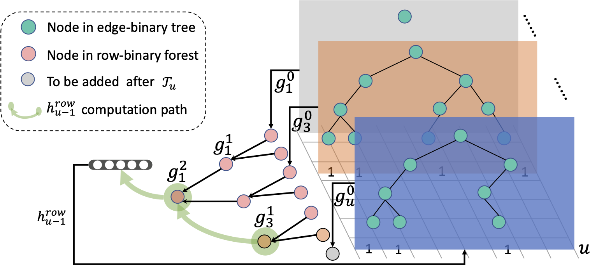
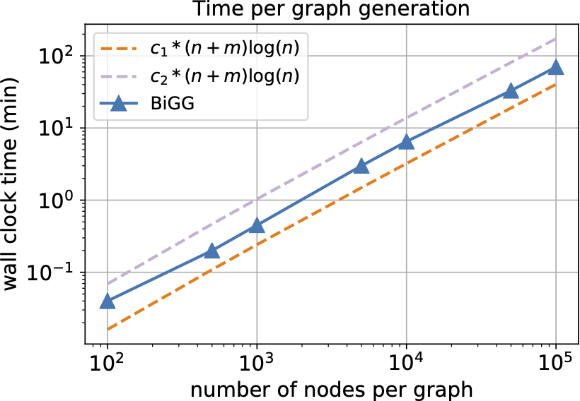

# Scalable Deep Generative Modeling for Sparse Graphs

Paper available at: https://arxiv.org/pdf/2006.15502.pdf




Upon using this codebase, please cite the paper:
```
@article{dai2020scalable,
    title={Scalable Deep Generative Modeling for Sparse Graphs},
    author={Dai, Hanjun and Nazi, Azade and Li, Yujia and Dai, Bo and Schuurmans, Dale},
    journal={arXiv preprint arXiv:2006.15502},
    year={2020}
}
```

## Install

Navigate to the root of project, and perform:

    pip install -e .

The installation requires both gcc and CUDA toolkit (if gpu is enabled)

If you want to reproduce the benchmark results, please also install [GRAN](https://github.com/lrjconan/GRAN) and [G2SAT](https://github.com/JiaxuanYou/G2SAT) and add them into your `PYTHONPATH`.

## Project organization

Please organize this project according to following structure:

```
bigg/
|___bigg/  # source code
|   |___common # common implementations
|   |___...
|
|___setup.py 
|
|___data/  # raw data / cooked data
|   |___DD/
|   |   |__DD_A.txt
|   |   |__...
|   |___G2SAT 
|   |   |__lcg_stats.csv
|   |   |__train_formulas/
|   |   |__test_formulas/
|   |___...
|
|___results # pretrained model and generated graphs
|   |___DD/
|   |___...
|
|...
```

## Data

Besides the synthetic data, we use the publicly avaiable benchmark datasets.

- ### Data from [GRAN](https://github.com/lrjconan/GRAN)

Please download the raw data from https://github.com/lrjconan/GRAN/tree/master/data and put folders into `data/`.

- ### Data from [G2SAT](https://github.com/JiaxuanYou/G2SAT)

Please download the raw data from https://github.com/JiaxuanYou/G2SAT/tree/master/dataset and put them under `data/`. 

Make sure the folder structure is consistent. 

## Pretrained model dumps

You can find the pretrained models via https://console.cloud.google.com/storage/browser/research_public_share/bigg_icml2020

To use these models, please download and put the folders under `results/`. 


## Experiments on GRAN graphs

1. ### Data preprataion 

First let's cook the data using following steps
```
cd bigg/data_process
./run_syn_datagen.sh
```
The above script will generate the train/val/test split of the corresponding dataset. Please modify the `g_type` field for different datasets, and `ordering` for different node orderings. 

2. ### Generate new graphs with the pretrained model

Make sure the model dumps are downloaded and in the specific location. 
```
cd bigg/experiments/synthetic/scripts
./run_lobster.sh -phase test -epoch_load -1
```
The above script will generate graphs in a pickle file in the same folder as the corresponding model dump.
You can also try the scripts for other types of graphs.

3. ### Train from scratch 

To train from scratch, simply run the script directly 
```
./run_grid.sh
```
We use step-decay for the learning rate. When the training loss gets plateau, you need to reduce the learning rate:
```
./run_grid.sh -epoch_load EPOCH -learning_rate 1e-5
```
You can specify the EPOCH number to load to continue training. 

## Experiments on SAT graphs

1. ### Data preprataion 

First follow the instruction in https://github.com/JiaxuanYou/G2SAT to process the formulas into edge_list. 
You are supposed to get the set of edge list under the data folder:
```
data/
|___G2SAT
    |__train_formulas/
    |__train_set/
    |__test_formulas/
    |__...
```

After that, please cook the data using the following script
```
cd bigg/data_process
./run_sat_gen.sh
```
You can also modify the `folder_name` to cook different data portion.

2. ### Generate new formulas with the pretrained model

Make sure the model dumps are downloaded and in the specific location. 
```
cd bigg/experiments/sat_graphs
./run_full.sh -eval_folder train -epoch_load -1 -greedy_frac 0.9
```
The above script evaluates the consistency with training set, with a mixed sampling distribution between greedy and multinomial one. 

After generation, you are supposed to get the formula folder under `results/sat-train/blk-500-b-1/train-pred_formulas-e--1-g-0.00/`. 
Please follow the instructions in [G2SAT](https://github.com/JiaxuanYou/G2SAT) to evaluate the statistics of your generated formulas. 

3. ### Training from scratch

Simply run the `run_full.sh` or `run_sub.sh` script directly, depends on the training set. 
Note that the graphs are large, so please adjust the `blksize` in the scripts to better fit into GPU memory.

## Model parallelism

We also demonstrate the model parallelism for BiGG. You don't have to use this option and all the experiments can be reproduced in a single GPU, but this can be 2x faster if you have multiple GPUs.

    cd bigg/experiments/synthetic
    ./demo_model_parallelism.sh

You can tune the block size (blksize), number of processes (should be <= num of available gpus)
