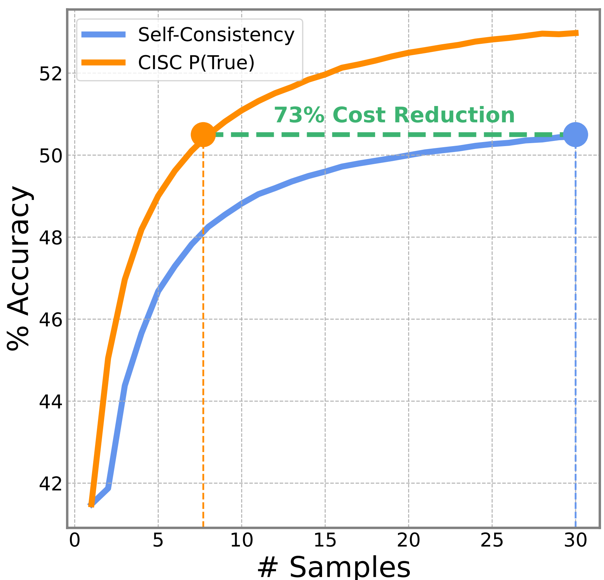

# Code for "Confidence Improves Self-Consistency in LLMs"

Official implementation for the
**Confidence Improves Self-Consistency in LLMs** paper, which is
<span style="color:#74B72E"> **Accepted to ACL Finding 2025.** </span>

**Authors:** Amir Taubenfeld\*, Tom Sheffer\*, Eran Ofek, Amir Feder, Ariel
Goldstein, Zorik Gekhman, Gal Yona (\* Equal contribution)

**Paper:** [https://arxiv.org/abs/2502.06233](https://arxiv.org/abs/2502.06233)

**Abstract:**
Self-consistency decoding enhances LLMs’ performance on reasoning tasks by sampling diverse reasoning paths and selecting the most frequent answer. However, it is computationally expensive, as sampling many of these (lengthy) paths is required to increase the chances that the correct answer emerges as the most frequent one. To address this, we introduce Confidence-Informed Self-Consistency (CISC). CISC performs a weighted majority vote based on confidence scores obtained directly from the model. By prioritizing high-confidence paths, it can identify the correct answer with a significantly smaller sample size. When tested on nine models and four datasets, CISC outperforms self-consistency in nearly all configurations, reducing the required number of reasoning paths by over 40% on average. In addition, we introduce the notion of within-question confidence evaluation, after showing that standard evaluation methods are poor predictors of success in distinguishing correct and incorrect answers to the same question. In fact, the most calibrated confidence method proved to be the least effective for CISC. Lastly, beyond these practical implications, our results and analyses show that LLMs can effectively judge the correctness of their own outputs, contributing to the ongoing debate on this topic.

<div align="center">
  
</div>

*Figure 1: Accuracy as a function of the number of sampled responses for
self-consistency vs CISC, using Gemma2-9B on the MATH dataset. CISC achieves
higher overall accuracy while significantly reducing computational costs. With
just 8 samples, it surpasses the performance of 30-sample self-consistency.*

## Key Contributions

1.  **Confidence-Informed Self-Consistency (CISC):** A lightweight extension of
    self-consistency that uses model-generated confidence scores for a weighted
    majority vote, significantly reducing computational cost.
2.  **Within-Question Discrimination (WQD):** A novel metric for evaluating
    confidence scores, specifically measuring their ability to distinguish
    correct and incorrect responses to the *same* question.

## Table of Contents

*   [Overview](#overview)
*   [Installation](#installation)
*   [Datasets](#datasets)
*   [Running the Demo Notebook](#running-the-demo-notebook)
    *   [1. Setup and Model Loading](#1-setup-and-model-loading)
    *   [2. Experiment Configuration](#2-experiment-configuration)
    *   [3. Running the Model (QA & Confidence Extraction)](#3-running-the-model-qa-confidence-extraction)
    *   [4. Computing Metrics and Plotting Results](#4-computing-metrics-and-plotting-results)
    *   [5. Implementation Remarks](#5-implementation-remarks)
        *   [Note on Runners](#note-on-runners)
        *   [Confidence Prompting and Caching Efficiency](#confidence-prompting-and-caching-efficiency)
*   [Understanding the Codebase](#understanding-the-codebase)
*   [Reproducing Paper Results](#reproducing-paper-results)
*   [Citation](#citation)
*   [License](#license)
*   [Contact](#contact)

## Overview
This repository provides the code to run experiments with **Confidence-Informed
Self-Consistency (CISC)** and evaluate different confidence extraction methods.
The primary way to interact with this codebase for a demonstration is through
the `simple_cisc_notebook.ipynb` Jupyter notebook.

## Installation

    ```bash
    git clone https://github.com/google-research/google-research.git
    cd google-research/cisc
    pip install .
    ```

## Datasets
The paper evaluates CISC on the following four datasets, which are supported
out-of-the-box in this codebase:

*   **GSM8K:** Grade-school math word problems.
*   **MATH:** Challenging math word problems.
*   **MMLU-Pro:** A challenging version of the Multitask Language Understanding benchmark.
*   **Big-Bench-Hard (BBH):** A selection of challenging tasks from Big-Bench.

When you run the code for these datasets for the first time, the code
will attempt to download and cache them automatically. Ensure you have an
internet connection and sufficient disk space.

**Adding New Datasets:**

To add support for a new dataset:

1. Implement a Python file (e.g., in a `cisc/src/datasets/` directory if you create one) that handles loading and preprocessing your new dataset into the expected format.
2. Update `cisc/src/run_lib.py` to recognize and use your new dataset loader.

## Running the Demo Notebook
To get started and see CISC in action, try the `simple_cisc_notebook.ipynb`
Jupyter notebook. This notebook provides a step-by-step demonstration of the
core functionalities.

Next, we explain the key parts of the notebook:

### 1. Setup and Model Loading

*   **Imports:** Necessary modules from the `cisc.src` package are imported.
*   **Model Selection:** Specify the base Hugging Face model and, optionally, a PEFT (Parameter-Efficient Fine-Tuning) adapter directory.

### 2. Experiment Configuration

The "Run The Model" cell is where you define the parameters for your
demonstration run.

**Key parameters to configure:**

*   **Choosing Confidence Methods:**
    *   **P(True):** Measures confidence by having the model classify its
        confidence as either 1 or 0. The score is the probability the model
        assigns to the 1 token. (Method from arXiv:2207.05221) - Enabled by
        `confidence_likelihoods=confidence_extraction.ConfidenceExtractionType.BINARY.value`.
    *   **Response Probability:** Calculates the geometric mean of the
        probabilities for each token in the response. This reflects the model's
        certainty throughout the generation of its reasoning path - Enable by
        setting `run_sequence_probability=True`.
    *   **Verbal Confidence (0-100):** Model predicts a confidence score (0-100)
        for its answer - Set
        `verbal_confidence=confidence_extraction.ConfidenceExtractionType.HUNDRED.value`.
    *   **Verbal Confidence (Binary):** Model predicts a confidence score (0-1)
        for its answer - Set
        `verbal_confidence=confidence_extraction.ConfidenceExtractionType.BINARY.value`
        (if you also want P(True), this will extract a separate verbal binary
        score).

### 3. Running the Model (QA & Confidence Extraction)
This section executes the core computational steps:

*   **Question Answering:** `run_lib.run_question_answering_on_datasets(...)` generates `num_traces` answers for each of the `num_rows` questions from the specified `dataset_names`.
*   **Confidence Extraction:** `run_lib.run_confidence_extraction_on_experiment_results(...)` processes the generated answers to extract the confidence scores defined in `confidence_config`.

This process can be time-consuming, especially with larger models, more traces,
or more questions. Outputs (pickled `ExperimentResult` objects) are saved to a
versioned subdirectory within `/tmp/cisc/[tag]/` (e.g.,
`/tmp/cisc/my_cisc_test/YYYY_MM_DD_HH_MM/`).

### 4. Computing Metrics and Plotting Results

The final cells of the notebook analyze the generated data:

*   **"Compute Metrics":**
    *   Defines `aggregator_configs` for both standard Self-Consistency (SC) and various CISC configurations.
    *   **For CISC, you'll specify:**
        *   `confidence_col_name`: The column name of the confidence score to
            use (e.g., `"logit_confidence"` for P(True), `"verbal_confidence"`
            for verbal methods, `"response_probability"` for sequence
            probability).
        *   `temperature`: The normalization temperature `T` for CISC's softmax
            step. **Crucially, the optimal `temperature` varies by model and
            confidence method.** Refer to Appendix D of the paper for
            empirically found optimal values. The notebook uses an example
            value.
    *   `run_eval_lib.calculate_stats_for_model_and_dataset` is then called to compute accuracy scores across different sample sizes using bootstrapping (as described in Section 4.6 of the paper).
*   **"Draw Graphs":** Visualizes the accuracy vs. number of samples, comparing SC and different CISC methods.
*   **"Within Question Discrimination":** Computes and displays WQD metrics.
    This section in the code evaluates how well different confidence scores
    (`CONFIDENCE_TYPE`) can distinguish between correct and incorrect answers to
    the *same question*.

### 5. Implementation Remarks:

#### Note on Runners

The demo notebook utilizes `cisc.src.runners.hugging_face_runner.Runner` to
interact with Hugging Face models **locally**. The experiments reported in the
paper were conducted using a Google internal runner which is not provided in
this codebase.

For users aiming to deploy CISC in a production-like setting or integrate with a
specific inference server, you should implement the runner interface at
cisc.src.runners.runner. This allows flexibility in how model inference is
performed while leveraging the core CISC logic.

#### Confidence Prompting and Caching Efficiency
A key aspect of CISC's efficiency, as detailed in Section 4.1 and Appendix B of
the paper, is the **two-step confidence prompting approach**. Confidence
extraction prompts are short and appended *after* the model generates the
reasoning path and answer. This design allows for the re-use of the
auto-regressive cache (KV cache) from the answer generation phase when
generating the confidence score, significantly minimizing computational overhead
for confidence extraction.

The current codebase (including `hugging_face_runner.py`) is primarily
intended for research and demonstration and **does not explicitly implement this
advanced caching optimization for the confidence extraction step.** While the
two-step prompting logic is present (first generate answer, then generate
confidence), the KV cache management required for maximum efficiency is
typically handled by optimized inference servers or custom inference code.

To fully realize the minimal overhead and performance gains described in the
paper for the confidence extraction step, users deploying CISC in
performance-critical environments should ensure their inference setup supports
or implements this KV cache re-use strategy. This often involves continuing
generation from the same token sequence rather than re-processing the entire
prompt.

## Understanding the Codebase
For those wishing to delve deeper, modify the methodology, or integrate CISC
into other projects, understanding the codebase structure is helpful. The core
logic is located within the `cisc/src/` directory:

*   **`run_lib.py`**: The main orchestrator for experiments. Handles question
    answering, confidence extraction, and managing experiment configurations and
    results.
*   **`runners/`**:
    *   `hugging_face_runner.py`: Interacts with Hugging Face `transformers` models for text generation. Supports loading base models and applying PEFT adapters.
    *   `batcher.py`: Manages batching of inputs for efficient model inference.
*   **`confidence_extraction.py`**: Defines configurations and enumeration types
    for various confidence extraction methods discussed in the paper (P(True),
    Verbal, Response Probability).
*   **`post_processing/`**: This sub-package contains modules for analyzing the
    results:
    *   `aggregators.py`: Implements the aggregation strategies, including standard Self-Consistency (majority vote) and Confidence-Informed Self-Consistency (CISC's weighted majority vote).
    *   `run_eval_lib.py`: Core logic for calculating evaluation statistics, such as accuracy curves with bootstrapping.
    *   `per_question_eval.py`: Handles evaluation grouped by question, including the WQD-related calculations.
    *   `per_trace_processing.py`: Utilities for cleaning, validating, and processing individual model-generated traces (answer + reasoning path).
    *   `metrics_lib.py`: Implements specific metrics from the paper, such as "% Cost Reduction" and "% Accuracy Improvement".
    *   `visualization_utils.py`: Contains helper functions for plotting
        results, used by the demo notebook.

The `simple_cisc_notebook.ipynb` provides a practical example of how these
components are used together.

## Reproducing Paper Results
The `simple_cisc_notebook.ipynb` is designed for demonstration and
exploration. To fully reproduce the results presented in the paper (e.g., Table
1, Figure 3), a more systematic approach is required:

1.  **Dataset Availability:** Ensure all four benchmark datasets (GSM8K, MATH,
    MMLU-Pro, BBH) are correctly set up and accessible as described in the
    [Datasets](#datasets) section.
2.  **Comprehensive Experimentation:**
    *   The paper evaluates nine different LLMs across these four datasets. You will need to iterate through all these model-dataset combinations.
    *   This typically involves scripting beyond the interactive notebook. You
        may need to adapt the notebook's core logic (from `run_lib.py` and
        `run_eval_lib.py`) into Python scripts that can loop through
        configurations, model identifiers, dataset names, and relevant
        parameters.
3.  **Critical Parameters for Replication:**
    *   **Sample Budgets (`num_traces`):** Run experiments with the sample
        budgets reported in the paper (e.g., performance at 5 and 10 samples,
        and generating up to 30 samples for comparison curves).
    *   **Optimal CISC Temperatures:** This is crucial. For each model and
        confidence method pair, use the optimal normalization temperatures
        (`temperature` in `aggregator_configs`) reported in Appendix D of the
        paper. These values significantly impact CISC's performance. You might
        need to manage these temperatures (e.g., in a dictionary or
        configuration file) when running experiments systematically.
    *   **Confidence Methods:** Ensure you test all confidence methods discussed (P(True), Response Probability, Verbal Binary, Verbal 0-100).
4.  **Bootstrap Samples:** The paper uses `num_bootstrap=500` (as set in
    `run_eval_lib.calculate_stats_for_model_and_dataset` in the notebook) for
    robust average accuracy calculations. Maintain this setting for comparable
    results.
5.  **WQD Scores (Table 3):** To reproduce WQD scores, you need to generate
    data with `num_traces = 30` (as used for WQD calculation in the paper). The
    WQD metric itself can be derived from the "Pairwise Accuracy - Breakdown"
    section of the notebook. This involves running the analysis for each
    confidence method across all relevant models and datasets.
6.  **Inference Setup for Performance:** Keep in mind the [Note on Runners](#note-on-runners) and the discussion on [Confidence Prompting and Caching Efficiency](#confidence-prompting-and-caching-efficiency). While this codebase allows for reproducing the *accuracy* results, achieving the *computational efficiency* claims at scale relies on an optimized inference setup.

## Citation
If you use this code, the CISC methodology, or the WQD metric in your research,
please cite our paper:
<!-- disableFinding(SNIPPET_INVALID_LANGUAGE) -->

```bibtex
@article{taubenfeld2025confidence,
  title={Confidence Improves Self-Consistency in LLMs},
  author={Taubenfeld, Amir and Sheffer, Tom and Ofek, Eran and Feder, Amir and Goldstein, Ariel and Gekhman, Zorik and Yona, Gal},
  journal={arXiv preprint arXiv:2502.06233},
  year={2025}
}
```

## License
This project is licensed under the **Apache License 2.0**

## Contact

For questions, clarifications, or discussions regarding the paper or this
codebase, please feel free to contact the authors:

Amir Taubenfeld: `amirt@google.com`

Tom Sheffer: `tomsheffer@google.com`

*This is not an officially supported Google product.*

