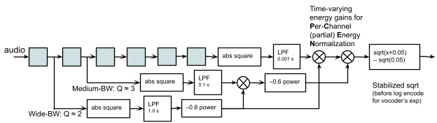
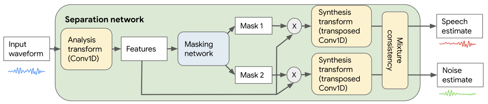
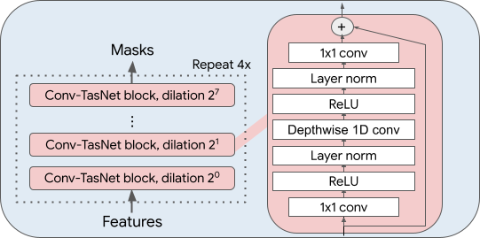

# Cochlear Implant Hackathon Code

This directory contains Python Colab notebooks for taking input audio (wav files of music, speech in noise, etc.), applying speech enhancement (primarily when music is not detected), and generating electrodograms for cochlear implants.

These were developed as a submission for [https://cihackathon.com/](https://cihackathon.com/).

To listen to the audio corresponding to the electrodograms, you will need to use a vocoder simulation (e.g., the one provided by cihackathon organizers [here](https://github.com/jabeim/AB-Generic-Python-Toolbox)).

## Input data

To run the notebooks, you need a set of audio waveform files to process. Sample audio files for cihackathon are available for at [https://cihackathon.com/](https://cihackathon.com/).

Store these audio files in a folder in your Google Drive. The default folder in notebooks is `cihack_audio`.

## Running the notebooks

These notebooks read and write audio to/from Google Drive. Make sure you update the paths in the notebooks.

### speech_enhancement_inference.ipynb
This notebook loads a pre-trained model that separates speech from other non-speech sounds (e.g. noise, music).

### yamnet_speech_enhancement_mixing.ipynb
Because enhanced speech audio often removes portions of music (i.e. music is often treated as noise-to-be-removed), this notebook uses [YAMNet](https://www.tensorflow.org/hub/tutorials/yamnet) to determine the predicted music content and causally mix the original and speech enhanced audio. Also included is a baseline mixing strategy which mixes a fixed fraction of noise (music) with speech enhanced audio without using YAMNet.

### audio_to_electrodogram.ipynb
This notebook takes audio (any audio; it can be original audio, or speech enhanced audio, or speech enhanced audio mixed with original audio) and generates electrodograms in the format specified for the cihackathon.

## Overview of audio processing approach

### Mixing

First, the speech enhanced audio is mixed with some fraction of the original audio, and then PCEN is applied.

### PCEN

The output pulses – represented in an array known as an electrodogram – are in the “continuous interleaved sampling” (CIS) pattern common to most CIs, since that was the form expected by the hackathon’s evaluation method that reconstructed a surrogate sound via a “vocoder” that attempts to simulate how an actual user might perceive the pulse patterns.  The filterbank, a series of filters which separate a signal into overlapping ranges of frequencies, associates each electrode with a limited range of frequencies.  At each filter in the bank, the filter’s output energy is processed through an adaptive gain control called [“per-channel energy normalization” (PCEN)](https://doi.org/10.1109/ICASSP.2017.7953242), which emphasizes onsets and rhythm, and dynamically adapts the stimulation intensity to a wide range of sound intensities.

Caption: Filter channel detail: each channel uses six identical one-pole complex filters in cascade to make a complex gammatone filter, which separates audio into separate ranges of frequencies.

### The Conv-TasNet speech enhancement model

The model is causal but large, at 2.9 M parameters, but has a low latency of only 2.5 milliseconds. It is based on [Conv-TasNet](https://doi.org/10.1109/TASLP.2019.2915167), a neural network architecture that can be trained to separate different kinds of sounds, such as speech and nonspeech noise. Conv-TasNet is a fully-convolutional neural network architecture for sound separation. The figure below presents a block diagram of this model. First, the input audio waveform is processed by a learnable analysis transform, implemented as a one-dimensional convolution (Conv1D) layer, that produces some features. These features are fed to a “masking network”, which is a convolutional neural network that predicts two masks (one for speech, and the other for nonspeech) that are the same size as the input features.

Caption: Block diagram of speech enhancement system based on Conv-TasNet.

The masking network is composed of causal separable dilated Conv1D blocks as illustrated below. Dilation increases with layer index, which expands the effective receptive field size of the network. The resulting masks are multiplied with the features, and these masked features are converted back to the time domain by a learnable synthesis transform (a transposed one-dimensional convolution). As a final step, the speech and noise estimates are projected through a [mixture consistency layer](https://research.google/pubs/pub47816/) that ensures the separated speech and noise estimates add up to the original mixture. The speech enhancement system is trained to minimize a negative thresholded signal-to-noise ratio (SNR) loss on supervised mixtures of speech from librivox.org and noise from freesound.org. This data and loss function are described in [this recent paper](https://research.google/pubs/pub49727/) (supervised baseline in section 4.2).

Caption: Close-up of the masking network.

This project is not an official Google product.

