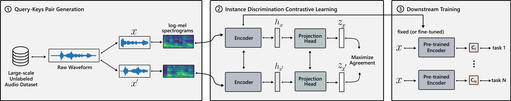

# Contrastive learning of general purpose audio representations



This Python library allows pre-training and fine-tuning contrastive embeddings of audio with the COLA method.
In particular, one can:

* Pre-train COLA embeddings, which use a simple contrastive learning method
* Train a linear classifier on pre-trained embeddings
* Train a supervised neural network from scratch
* Initialize a classifier with pre-trained COLA embeddings and fine-tune on a new dataset

## Dependencies
* [TensorFlow](https://www.tensorflow.org/)
* [TensorFlow Datasets](https://www.tensorflow.org/datasets/overview)

## Quickstart
Training has three modes:

* `SSL`, to pre-train a model with self-supervised contrastive learning
* `DS` to fine-tune a pre-trained model on a downstream task
* `SUP` to train a simple supervised system

Pre-train a COLA embedding on a dataset from tensorflow_datasets (here, LibriSpeech):

```bash
python -m main --experiment_id=cola_pretrain --model_dir=/tmp/cola \
--training_mode=SSL --ssl_dataset=LBS --strategy=gpu
```
Note that so far labels are not necessary.
After pre-training, the model is saved in `/tmp/cola/librispeech/cola_pretrain`.

One can train a linear classifier on these embeddings, on the Speech Commands dataset, in a supervised fashion:

```bash
python -m main --experiment_id=cola_downstream --ssl_checkpoint_id=cola_pretrain \
--model_dir=/tmp/cola --training_mode=DS --ssl_dataset=LBS --ds_dataset=SPCV2 \
--strategy=gpu --freeze_encoder=true
```

The flags `--ssl_checkpoint_id` and `--ssl_dataset` indicate that the pre-trained model is stored in `/tmp/cola/librispeech/cola_pretrain`.

Note the `--freeze_encoder` flag. If set to `False`, the entire network is fine-tuned.

## Advanced usage
Pre-training and fine-tuning only handle tfds datasets, for simplicity. One can easily use arbitrary datasets by overriding the `get_self_supervised_data` and `get_downstream_dataset` methods in `data.py`.
## Reference
If you use this repository, please consider citing:

```
@article{saeed2020,
    title={Contrastive learning of general purpose audio representations},
    author={Aaqib Saeed and David Grangier and Neil Zeghidour},
    year={2020},
}
```
