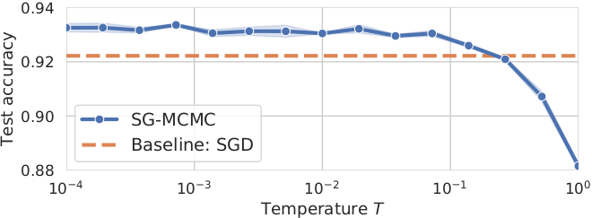
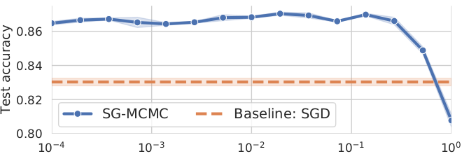
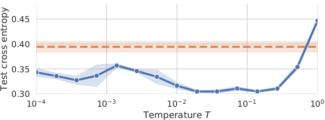
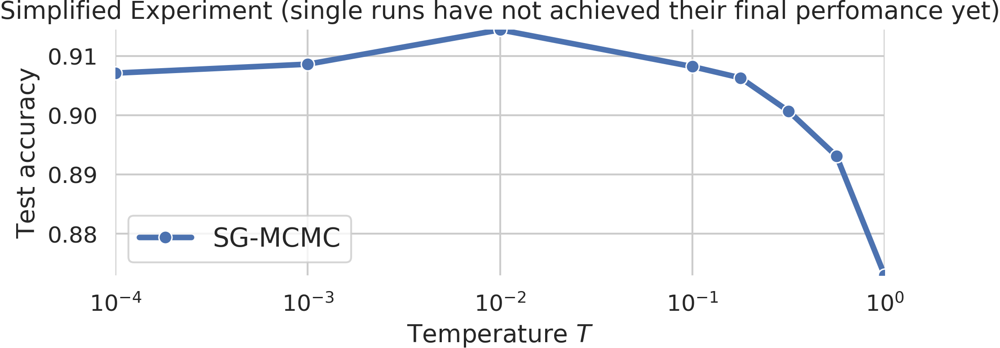

# How Good is the Bayes Posterior in Deep Neural Networks Really?

This repository contains code to run the SG-MCMC experiments from the paper
[How Good is the Bayes Posterior in Deep Neural Networks Really?](https://arxiv.org/pdf/2002.02405.pdf) to reproduce its figures 1, 2, and 3.

**Abstract:**
During the past five years the Bayesian deep learning community has developed increasingly accurate and efficient approximate inference procedures that allow for Bayesian inference in deep neural networks.
However, despite this algorithmic progress and the promise of improved uncertainty quantification and sample efficiency there are---as of early 2020---no publicized deployments of Bayesian neural networks in industrial practice.
In this work we cast doubt on the current understanding of Bayes posteriors in popular deep neural networks:
we demonstrate through careful MCMC sampling that the posterior predictive induced by the Bayes posterior yields systematically worse predictions compared to simpler methods including point estimates obtained from SGD.
Furthermore, we demonstrate that predictive performance is improved significantly through the use of a "cold posterior" that overcounts evidence.
Such cold posteriors sharply deviate from the Bayesian paradigm but are commonly used as heuristic in Bayesian deep learning papers.
We put forward several hypotheses that could explain cold posteriors and evaluate the hypotheses through experiments.
Our work questions the goal of accurate posterior approximations in Bayesian deep learning:
If the true Bayes posterior is poor, what is the use of more accurate approximations?
Instead, we argue that it is timely to focus on understanding the origin of the improved performance of cold posteriors.

### Cold posteriors

This repository contains code to reproduce the experiments from the [paper](https://arxiv.org/pdf/2002.02405.pdf) that demonstrate _cold posterior_ effect
for a ResNet-20 model on the dataset CIFAR-10 and a CNN-LSTM model on IMDB sentiment
dataset. We can improve the generalization performance significantly by
cooling the posterior with a temperature T<<1. The cold posterior sharply deviates
from the true Bayes posterior (which is attained for T=1).

ResNet-20 / CIFAR-10      |   CNN-LSTM / IMDB
:------------------------:|:-------------------------:
  | 
 | 


### Instructions

All bash files have to be executed from the parent folder of ```cold_posterior_bnn/``` (see below).

To install the required packages in a python virtual environment and run tests, run

```sh
cold_posterior_bnn/run.sh
```

**ResNet-20 experiment**

To reproduce the ResNet-20 experiment from the paper, run the following command.
*Attention, this can take up to 30 days on a single GPU!*

```sh
cold_posterior_bnn/run_resnet_experiment.sh
```

For a simplified version of the experiment that only takes 1-2 days on a single GPU,
run the following command. *For the simplified experiment we halved the number of epochs
and included less temperature evaluations. Due to the lower number of total epochs
the individual runs are not all converged and the final performance is worse than in the
full experiment. However, this experiment still shows the cold posterior effect.*



```sh
cold_posterior_bnn/run_resnet_experiment_small.sh
```

To aggregate the results of the different runs and to produce the final plot, open the
notebook

```none
cold_posterior_bnn/plot_results.ipynb
```

The results of the simplified ResNet experiment are stored in the folder ```cold_posterior_bnn/results_resnet```.


**CNN-LSTM experiment**

To reproduce the CNN-LSTM experiment from the paper, run the following command.
*Attention, this can take up to 15 days on a single GPU!*

```sh
cold_posterior_bnn/run_cnnlstm_experiment.sh
```

For a simplified version of the experiment that only takes around one day on a single GPU, run

```sh
cold_posterior_bnn/run_cnnlstm_experiment_small.sh
```

To aggregate the results of the different runs and to produce the final plot, open the
notebook

```none
cold_posterior_bnn/plot_results.ipynb
```

The results are stored in the folder ```cold_posterior_bnn/results_cnnlstm```.


### For questions reach out to

Florian Wenzel ([florianwenzel@google.com](mailto:florianwenzel@google.com))<br>
Rodolphe Jenatton ([rjenatton@google.com](mailto:rjenatton@google.com))<br>
Sebastian Nowozin ([nowozin@google.com](mailto:nowozin@google.com))


### Reference

> Florian Wenzel, Kevin Roth, Bastiaan S. Veeling, Jakub Swiatkowski, Linh Tran,
> Stephan Mandt, Jasper Snoek, Tim Salimans, Rodolphe Jenatton and Sebastian
> Nowozin (2020).
> [How Good is the Bayes Posterior in Deep Neural Networks Really?](https://arxiv.org/pdf/2002.02405.pdf).
> In _arXiv preprint arXiv:2002.02405_.

```none
@article{wenzel2020good,
  author = {Florian Wenzel and Kevin Roth and Bastiaan S. Veeling and Jakub Swiatkowski and Linh Tran and Stephan Mandt and Jasper Snoek and Tim Salimans and Rodolphe Jenatton and Sebastian Nowozin},
  title = {How Good is the Bayes Posterior in Deep Neural Networks Really?},
  journal={arXiv preprint arXiv:2002.02405},
  year = {2020},
}
```
