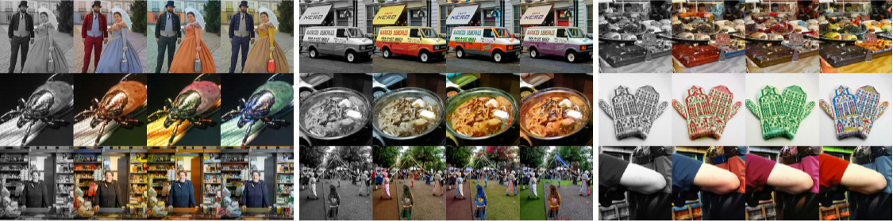
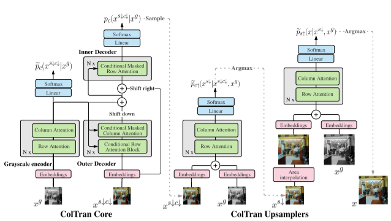

# Colorization Transformer

Source code accompanying the paper [Colorization Transformer](https://openreview.net/forum?id=5NA1PinlGFu) to be presented at
ICLR 2021.
Work by Manoj Kumar, Dirk Weissenborn and Nal Kalchbrenner.




### Important: Note on Evaluation:

Colorization is a multi-modal problem, where a given object can have multiple plausible colors.
On recolorizing a RGB image, a single random sample represents another plausible colorization. It
is unlikely to have the same colors as the ground-truth RGB image. So while evaluating the Colorization Transformer,
one should use distribution-level metrics such as the FID and NOT per-image metrics such as LPIPS or SSIM.


### Update: 23 March 2021

* Custom colorization script over [here](https://github.com/google-research/google-research/blob/master/coltran/custom_colorize.py)

## Paper summary


ColTran consists of three components, a `colorizer`, `color upsampler` and `spatial upsampler`.



* The `colorizer` is an autoregressive, self-attention based architecture comprised of conditional transformer layers. It coarsely colorizes low resolution `64x64` grayscale images pixel-by-pixel.
* The `color upsampler` is a parallel, deterministic self-attention based network. It refines a coarse low resolution image
into a `64x64` RGB image.
* The architecture of the `spatial upsampler` is similar to the `color upsampler`. It superesolves the low resolution RGB image into the final output.
* The `colorizer` has an auxiliary parallel color prediction model composed of a single linear layer.

We report results after training each of these individual components on `4x4 TPUv2` chips. Please adjust the model size and batch-size while training using fewer resources. Our results on training these components using lower resources are available in the [appendix](https://openreview.net/pdf?id=5NA1PinlGFu).

Full configurations used to train models in the paper are available in the directory `configs`. Configs for extremely small models are provided at `test_configs` to test that the model build quickly. Set the flag `--steps_per_summaries=100` to output logs quickly. When sampling, set `config.sample.log_dir` to an
appropriate write directory.

## Requirements

```
pip install -r requirements.txt
```

In particular, ensure that the version of TensorFlow is >= 2.6.0

## Custom Colorization Script.

A script to colorize or recolorize custom images is included at
[colorization script](https://github.com/google-research/google-research/blob/master/coltran/custom_colorize.py).
Instructions to run the script are present [at the top of the file](https://github.com/google-research/google-research/blob/master/coltran/custom_colorize.py).
On colorizing images from ImageNet, we recommend to use the [sampling script](https://github.com/google-research/google-research/tree/master/coltran#sampling).


## Training

Run the following command to train the colorizer

```
python -m coltran.run --config=coltran/configs/colorizer.py --mode=train --logdir=/colorizer_ckpt_dir
```
To train the color and spatial upsampler, replace `configs/colorizer.py` with
`configs/color_upsampler.py` and `configs/spatial_upsampler.py` respectively


## Evaluation

For evaluation,

```
python -m coltran.run --config=coltran/configs/colorizer.py --mode=eval_valid --logdir=/colorizer_ckpt_dir
```

## Sampling

### Single GPU Sampling

Sampling high resolution images is a three step procedure. On a P100 GPU, the colorizer samples a batch of 20 images around 3.5 minutes while on a V100
GPU, the time taken is approximately 90 seconds. The color and spatial upsampler sample in the order of milliseconds.

Sampling configurations for each model are described by `config.sample` ConfigDict at `configs/.py`

* **sample.num_outputs** - Total number of grayscale images
* **sample.logdir** - Sample write directory.
* **sample.gen_data_dir** - Path to where the samples from the previous step are stored.
* **sample.skip_batches** - The first `skip_batches*batch_size` images from the public imagenet TF-Datasets are skipped.

Please ensure that ``num_outputs`` and ``skip_batches`` are the same across all three components.
The generated samples are written as TFRecords to `$logdir/${config.sample.logdir}`

#### Colorizer

The command samples low resolution coarsely colored 64x64 images.

```
python -m coltran.sample --config=coltran/configs/colorizer.py --mode=sample_test --logdir=/colorizer_ckpt_dir
```

#### Color Upsampler

The command converts the coarse 64x64 images from the previous step to finer 64x64 images.

**CAUTION: Please set `config.sample.gen_data_dir` of the color upsampler config to `/colorizer_ckpt_dir/${config.sample.logdir}`**

```
python -m coltran.sample --config=coltran/configs/color_upsampler.py --mode=sample_test --logdir=/cup_ckpt_dir
```

#### Spatial Upsampler

The command superresolves the previous output to high resolution 256x256 output.

**CAUTION: Please set `config.sample.gen_data_dir` of the spatial upsampler config to `$/cup_ckpt_dir/${config.sample.logdir}`**

```
python -m coltran.sample --config=coltran/configs/spatial_upsampler.py --mode=sample_test --logdir=/cup_ckpt_dir
```

### Multi GPU Sampling

Sampling can be parallelized across batches in a multi-GPU setup with the flag `config.sample.skip_batches`. For e.g, in a setup with 2 machines and a batch-size of 20, to colorize 100 grayscale images per-machine set `config.sample.skip_batches` of the first and second machine to 0 and 5 respectively.

## Pre-trained checkpoints

We release zip-compressed [pre-trained checkpoints](https://console.cloud.google.com/storage/browser/gresearch/coltran) on ImageNet in the following [zip file](https://storage.cloud.google.com/gresearch/coltran/coltran.zip). Unzip this file to a local directory.
The checkpoints for the colorizer, color upsampler and spatial upsampler are present in the corresponding sub-directories.

To sample, run the sampling script with the `logdir` flag set to the local path.

## Reference Tensorboards

Summaries of our train runs are publicly available via [tensorboard.dev](https://tensorboard.dev/#get-started)
* Colorizer - [Link](https://tensorboard.dev/experiment/jrf7Og9oTeGEL2KrArQu6Q/#scalars&_smoothingWeight=0)
* Color Upsampler - [Link](https://tensorboard.dev/experiment/H1djRZFXSbmmRMx5eG7hoA/#scalars&_smoothingWeight=0)
* Spatial Upsampler - [Link](https://tensorboard.dev/experiment/eZAzlXyESA2lmjmR5hDWNQ/#scalars&_smoothingWeight=0)

## Parsing TFRecords

The generated TF Records can be converted to images easily with the following code

```
def parse_example(example_proto, res=64):
  features = {'image': tf.io.FixedLenFeature([res*res*3], tf.int64)}
  example = tf.io.parse_example(example_proto, features=features)
  image = tf.reshape(example['image'], (res, res, 3))
  return image

gen_dataset = tf.data.TFRecordDataset(listdir(path))
gen_dataset = gen_dataset.map(lambda x: parse_example(x, res))
gen_dataset = iter(gen_dataset)
for image in gen_dataset:
  plt.imshow(image)
```


## Citation

If you use the code or model please cite our paper.

```
@inproceedings{
kumar2021colorization,
title={Colorization Transformer},
author={Manoj Kumar and Dirk Weissenborn and Nal Kalchbrenner},
booktitle={International Conference on Learning Representations},
year={2021},
url={https://openreview.net/forum?id=5NA1PinlGFu}
}

```
