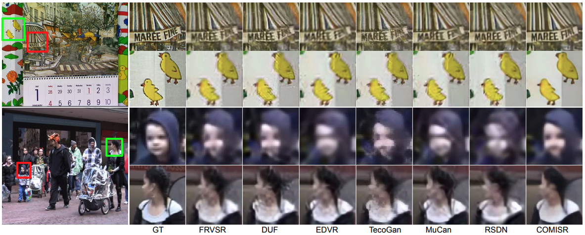

# COMISR:Compression-Informed Video Super-Resolution

This repo contains the testing code for the paper in the ICCV 2021.
["COMISR: Compression-Informed Video Super-Resolution"](https://arxiv.org/abs/2105.01237)

*Disclaimer: This is not an official Google product.*



## Pre-requisite

Install dependencies:
```
pip3 install -r requirements.txt
```

The vid4 testing data can be downloaded from: gs://gresearch/comisr/data/
[gcloud sdk](https://cloud.google.com/sdk/docs/install)

The folder path should be similar to:
.../testdata/lr_crf25/calendar\
.../testdata/lr_crf25/city\
.../testdata/lr_crf25/foliage\
.../testdata/lr_crf25/walk\

.../testdata/hr/calendar\
.../testdata/hr/city\
.../testdata/hr/foliage\
.../testdata/hr/walk\

## Creating compressed frames
We use [ffmpeg](https://www.ffmpeg.org/) to compress video frames. Below is one sample CLI usage.

Suppose you have a sequence of frames in im%2d.png format, e.g. calendar from vid4.

ffmpeg -framerate 10 -i im%2d.png -c:v libx264 -crf 0 lossless.mp4 \
&& ffmpeg -i lossless.mp4 -vcodec libx264 -crf 25 crf25.mp4 \
&& ffmpeg -ss 00:00:00 -t 00:00:10 -i crf25.mp4 -r 10 crf25_%2d.png


## Pre-trained Model
The pre-trained model can be downloaded from gs://gresearch/comisr/model/


## Usage
python inference_and_eval.py --checkpoint_path=/xxx/model.ckpt --input_lr_dir=/xxx/lr_4x_crf25 --targets=/xxx/hr --output_dir=/xxx/output_dir


## Citation
If you find this code is useful for your publication, please cite the original paper:
```
@inproceedings{yli_comisr_iccv2021,
  title = {COMISR: Compression-Informed Video Super-Resolution},
  author = {Yinxiao Li and Pengchong Jin and Feng Yang and Ce Liu and Ming-Hsuan Yang and Peyman Milanfar},
  booktitle = {ICCV},
  year = {2021}
}
```


