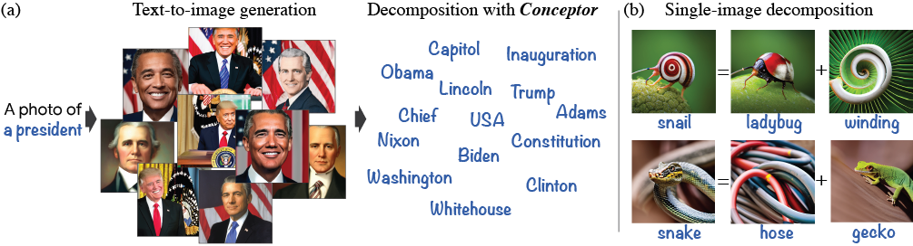
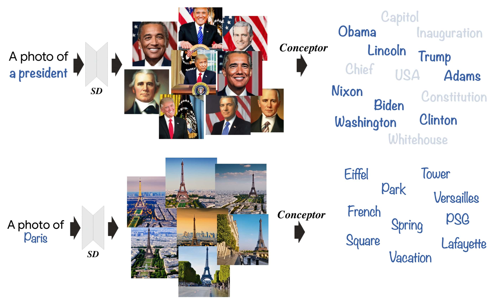
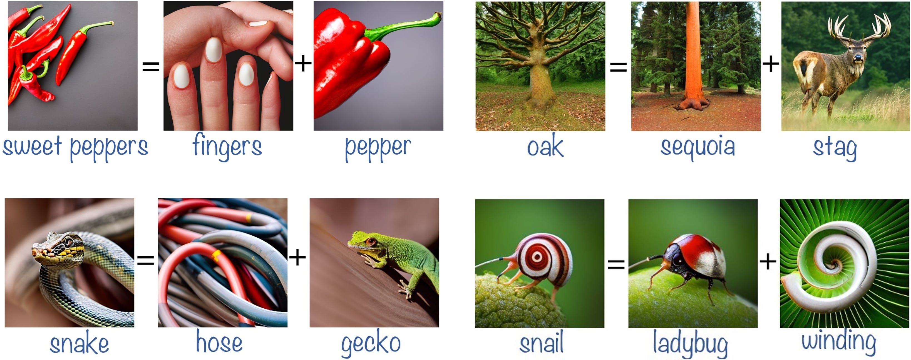
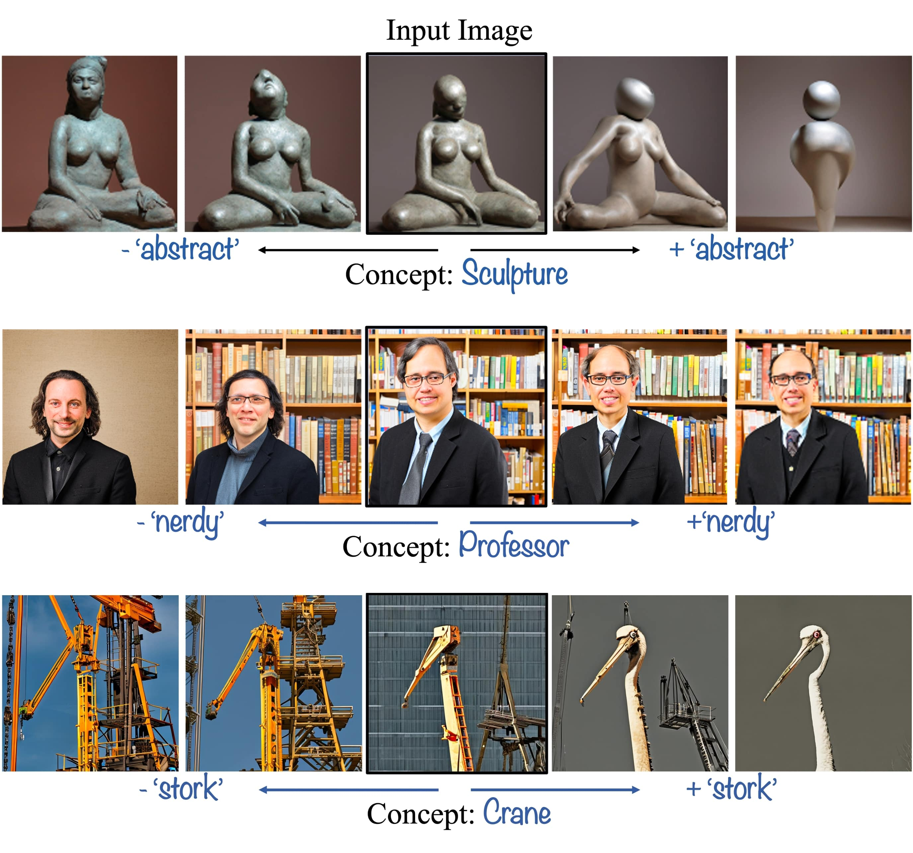

# The Hidden Language of Diffusion Models

<p align="center">
 
<p>
<a href="https://hila-chefer.github.io/Conceptor/"></a> 
 <a href="https://arxiv.org/abs/2306.00966"></a>

> Text-to-image diffusion models have demonstrated an unparalleled ability to generate high-quality, diverse images from a textual concept (e.g., "a doctor", "love"). However, the internal process of mapping text to a rich visual representation remains an enigma. In this work, we tackle the challenge of understanding concept representations in text-to-image models by decomposing an input text prompt into a small set of interpretable elements. This is achieved by learning a pseudo-token that is a sparse weighted combination of tokens from the model's vocabulary, with the objective of reconstructing the images generated for the given concept. Applied over the state-of-the-art Stable Diffusion model, this decomposition reveals non-trivial and surprising structures in the representations of concepts. For example, we find that some concepts such as "a president" or "a composer" are dominated by specific instances (e.g., "Obama", "Biden") and their interpolations. Other concepts, such as "happiness" combine associated terms that can be concrete ("family", "laughter") or abstract ("friendship", "emotion"). In addition to peering into the inner workings of Stable Diffusion, our method also enables applications such as single-image decomposition to tokens, bias detection and mitigation, and semantic image manipulation.

## Description  
Official implementation of the paper The Hidden Language of Diffusion Models. 

### Environment
Our code builds on the requirements of the [Hugging Face Diffusers repository](https://github.com/huggingface/diffusers). To set up the environment, please run:

```
conda env create -f environment.yaml
conda activate conceptor
```
## Concept Explanation with Conceptor
<p align="center">
  
<br>
Given a concept of interest (e.g., a president) and a text-to-image model, we generate a set of images to visually represent the concept. Conceptor then learns to decompose the concept into a small set of interpretable tokens, with the objective of reconstructing the generated images. The decomposition reveals interesting behaviors such as reliance on exemplars (e.g., "Obama", "Biden").
</p>

### Step 1- extracting the CLIP text embeddings for the vocabulary
To avoid computing the CLIP text embeddings for the entire vocabulary each time we optimize a decomposition, we provide code to extract the CLIP embedding for the entire vocabulary once, and save the embeddings such that we can load them for each concept.

```
python -m save_dictionary_embeddings.py --pretrained_model_name_or_path="stabilityai/stable-diffusion-2-1-base" --path_to_encoder_embeddings="./clip_text_encoding.pt"
```
This code calculates the CLIP text embeddings for the vocabulary of SD (loaded from pretrained weights according to ```pretrained_model_name_or_path```), and saves the embeddings to path ```path_to_encoder_embeddings```.

### Step 2- decompose the concept
We provide an end-to-end script to decompose the concept and perform validation. 
```
python -m one_step_reconstruction.py --prompt="a photo of a dog" --concept="dog" --pretrained_model_name_or_path="stabilityai/stable-diffusion-2-1-base" --placeholder_token="<>" --train_batch_size=6 --validation_prompt="a photo of a <>" --num_validation_images=20 --train_data_dir="./dog_train"/ --validation_data_dir="./dog_val" --output_dir="./dog" --dictionary_size=5000 --num_explanation_tokens=50 --validation_steps=50 --learning_rate=1e-3 --max_train_steps 500 --seed 1024 --validation_seed 2 --sparsity_coeff=0.001 --path_to_encoder_embeddings="./clip_text_encoding.pt" --remove_concept_tokens > ./log.txt
```
This code will generate training and validation images for the concept prompt ```prompt``` and save them to ```train_data_dir``` and ```validation_data_dir```, respectively. The vocabulary embedding will be extracted from step 1 (```path_to_encoder_embeddings='./clip_text_encoding.pt'```). The log for the run will be saved to ```log.txt```, and the validation images and the coefficients for the entire vocabulary will be saved to ```output_dir```.
The best validation coefficients will be saved in ```best_alphas.pt```.
*Note:* remove the flag `remove_concept_tokens` if you are interested in keeping the concept token in the dictionary.


### Step 3- extract the top 50 tokens, and generate images
In the notebook ```visualize_concept.ipynb``` we provide code to visualize the top tokens from the learned decomposition.

## Single-image Decomposition with Conceptor
The notebook `single_image_decomposition.ipynb` contains the code to decompose a single image and visualize its corresponding features.
<p align="center">
  
<br>
 Given a single image from the concept, our method extracts the tokens in the decomposition that caused the generation of the image. For example, a snail is decomposed into a combination of ladybug and winding due to the structure of its body, and the texture of its shell.
</p>

## Concept Manipulation with Conceptor
Fine-grained concept manipulation can be obtained by modifying the coefficient corresponding to a specific feature of interest.
<p align="center">
  
<br>
 Our method enables fine-grained concept manipulation by modifying the coefficient corresponding to a token of interest. For example, by manipulating the coefficient corresponding to the token abstract in the decomposition of the concept sculpture, we can make an input sculpture more or less abstract.
</p>

## Citing our paper
If you make use of our work, please cite our paper:
```
@article{chefer2023hidden,
        title={The Hidden Language of Diffusion Models},
        author={Chefer, Hila and Lang, Oran and Geva, Mor and Polosukhin, Volodymyr and Shocher, Assaf and Irani, Michal and Mosseri, Inbar and Wolf, Lior},
        journal={arXiv preprint arXiv:2306.00966},
        year={2023}
}
```
