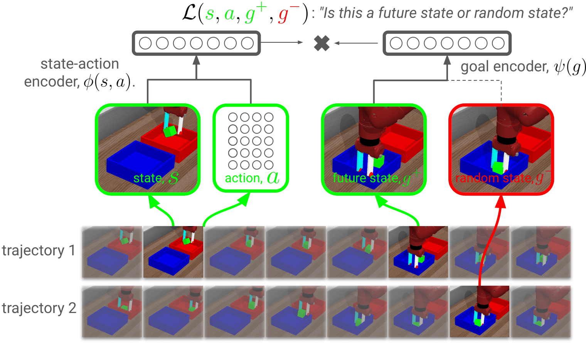

# [Contrastive Learning as Goal-Conditioned Reinforcement Learning](https://arxiv.org/pdf/2206.07568.pdf)
<p align="center"></p>

<p align="center"> Benjamin Eysenbach, &nbsp; Tianjun Zhang, &nbsp; Ruslan Salakhutdinov &nbsp; Sergey Levine</p>
<p align="center">
   Paper: <a href="https://arxiv.org/pdf/2206.07568.pdf">https://arxiv.org/pdf/2206.07568.pdf</a>
</p>

*Abstract*: In reinforcement learning (RL), it is easier to solve a task if given a good representation. While _deep_ RL should automatically acquire such good representations, prior work often finds that learning representations in an end-to-end fashion is unstable and instead equip RL algorithms with additional representation learning parts (e.g., auxiliary losses, data augmentation). How can we design RL algorithms that directly acquire good representations? In this paper, instead of adding representation learning parts to an existing RL algorithm, we show (contrastive) representation learning methods can be cast as RL algorithms in their own right. To do this, we build upon prior work and apply contrastive representation learning to action-labeled trajectories, in such a way that the (inner product of) learned representations exactly corresponds to a goal-conditioned value function. We use this idea to reinterpret a prior RL method as performing contrastive learning, and then use the idea to propose a much simpler method that achieves similar performance. Across a range of goal-conditioned RL tasks, we demonstrate that contrastive RL methods achieve higher success rates than prior non-contrastive methods. We also show that contrastive RL outperforms prior methods on image-based tasks, without using data augmentation or auxiliary objectives.

This repository contains the new algorithms, some of the baselines, and the associated environments used in this paper. If you use this repository, please consider adding the following citation:

```
@article{eysenbach2020contrastive,
  title={Contrastive Learning as Goal-Conditioned Reinforcement Learning},
  author={Eysenbach, Benjamin and Zhang, Tianjun and Salakhutdinov, Ruslan and Levine, Sergey},
  journal={arXiv preprint arXiv:2206.07568},
  year={2022}
}
```

### Installation

1. Clone the `contrastive_rl` repository: `svn export https://github.com/google-research/google-research/trunk/contrastive_rl; cd contrastive rl`
2. Create an Anaconda environment: `conda create -n contrastive_rl python=3.9 -y`
3. Activate the environment: `conda activate contrastive_rl`
4. Install the dependencies: `pip install -r requirements.txt --no-deps`
5. Check that the installation worked: `chmod +x run.sh; ./run.sh`

### Running the experiments

To check that the installation has completed, run `./run.sh` to perform training for just a handful of steps. To replicate the results from the paper, please run:
```python lp_contrastive.py```

Check out the `lp_contrastive.py` file for more information on how to select different algorithms and environments. For example, to try the offline RL experiments, set `env_name = 'offline_ant_umaze'`. One important note is that the image-based experiments should be run using multiprocessing, to avoid OpenGL context errors:
```python lp_contrastive.py --lp_launch_type=local_mp```


### Questions?
If you have any questions, comments, or suggestions, please reach out to Benjamin Eysenbach (eysenbach@google.com).
