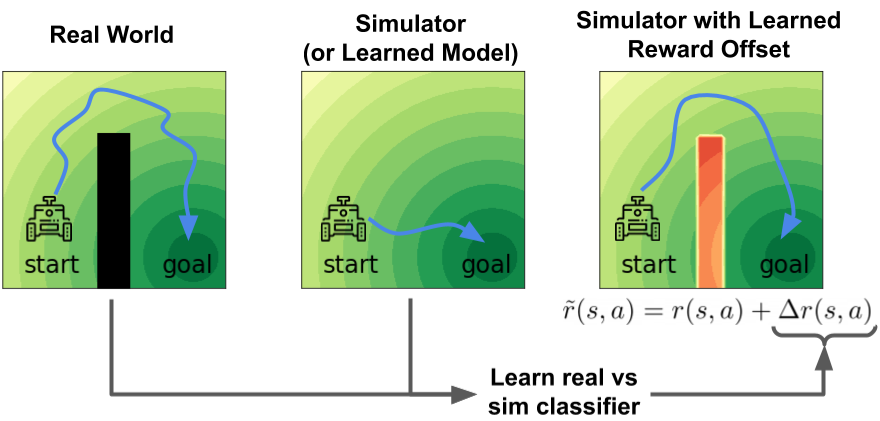

# Off-Dynamics Reinforcement Learning: Training for Transfer with Domain Classifiers

<p align="center"> Benjamin Eysenbach, &nbsp; Swapnil Asawa, &nbsp; Shreyas Chaudhari, &nbsp; Ruslan Salakhutinov ,&nbsp;  Sergey Levine </p>

<p align="center">
  <br>
   <a href="http://arxiv.org/abs/2006.13916">paper</a> <!--, &nbsp; <a href="">blog post</a> -->
</p>

This repository provides an implementation of Domain Adaptation with Rewards from Classifiers [DARC] from "Off-Dynamics Reinforcement Learning: Training for Transfer with Domain Classifiers." In this work, we propose a simple, practical, and intuitive approach for domain adaptation in reinforcement learning. Our approach stems from the idea that the agent's experience in the source domain should look similar to its experience in the target domain. Building off of a probabilistic view of RL, we formally show that we can achieve this goal by _compensating for the difference in dynamics by modifying the reward function_ (see figure). This modified reward function is simple to estimate by learning auxiliary classifiers that distinguish source-domain transitions from target-domain transitions. Intuitively, the modified reward function penalizes the agent for visiting states and taking actions in the source domain which are not possible in the target domain. Said another way, the agent is penalized for transitions that would indicate that the agent is interacting with the source domain, rather than the target domain.


If you use this code, please consider adding the corresponding citation:

```
@article{eysenbach2020off,
  title={Off-Dynamics Reinforcement Learning: Training for Transfer with Domain Classifiers},
  author={Eysenbach, Benjamin and Asawa, Swapnil and Chaudhari, Shreyas and Salakhutinov, Ruslan and Levine, Sergey},
  journal={arXiv preprint arXiv:2006.13916},
  year={2020}
}

```

## Installation
These instructions were tested in Google Cloud Compute with Ubuntu version 18.04.


### 1. Install Mujoco
Copy your mujoco key to `~/.mujoco/mjkey.txt`, then complete the steps below:

```
sudo apt install unzip gcc libosmesa6-dev libgl1-mesa-glx libglfw3 patchelf
sudo ln -s /usr/lib/x86_64-linux-gnu/libGL.so.1 /usr/lib/x86_64-linux-gnu/libGL.so
wget https://www.roboti.us/download/mujoco200_linux.zip -P /tmp
unzip /tmp/mujoco200_linux.zip -d ~/.mujoco
mv ~/.mujoco/mujoco200_linux ~/.mujoco/mujoco200
echo "export LD_LIBRARY_PATH=\$LD_LIBRARY_PATH:$HOME/.mujoco/mujoco200/bin" >> ~/.bashrc
```

### 2. Install Anaconda
```
wget https://repo.anaconda.com/miniconda/Miniconda2-latest-Linux-x86_64.sh
chmod +x Miniconda2-latest-Linux-x86_64.sh
chmod +x ./Miniconda2-latest-Linux-x86_64.sh
```
Restart your terminal so the changes take effect.


### 3. Create an Anaconda environment and install the remaining dependencies
```
conda create --name darc python=3.6
conda activate darc
pip install tensorflow==2.2.0
pip install tf_agents==0.5.0
pip install gym==0.13.1
pip install mujoco-py==2.0.2.10
pip install tensorflow-probability==0.10.1
```

## Running Experiments

The following lines replicate the DARC experiments:

```
python train_eval.py --root_dir=~/darc/broken_reacher --gin_bindings='train_eval.environment_name="broken_reacher"' --gin_bindings='train_eval.delta_r_warmup=1e5' --gin_bindings='critic_loss.delta_r_warmup=1e5'
python train_eval.py --root_dir=~/darc/broken_cheetah --gin_bindings='train_eval.environment_name="broken_joint_half_cheetah"'  --gin_bindings='train_eval.delta_r_warmup=1e5' --gin_bindings='critic_loss.delta_r_warmup=1e5'
python train_eval.py --root_dir=~/darc/broken_ant --gin_bindings='train_eval.environment_name="broken_joint_ant"' --gin_bindings='get_broken_joint_env.broken_joint=3' --gin_bindings='train_eval.delta_r_warmup=1e5' --gin_bindings='critic_loss.delta_r_warmup=1e5'
python train_eval.py --root_dir=~/darc/cheetah_obstacle --gin_bindings='train_eval.environment_name="half_cheetah_obstacle"' --gin_bindings='get_broken_joint_env.broken_joint=3' --gin_bindings='train_eval.delta_r_warmup=1e5' --gin_bindings='critic_loss.delta_r_warmup=1e5'
```

The importance weighting baseline can be run as follows:

```
python train_eval.py --root_dir=~/darc/importance_weight --gin_bindings='train_eval.environment_name="broken_reacher"' --gin_bindings='critic_loss.delta_r_scale=0.0' --gin_bindings='OdrlAgent.use_importance_weights=True'
```

The RL on target baseline can be run as follows:

```
python train_eval.py --root_dir=~/darc/rl_on_target --gin_bindings='train_eval.environment_name="broken_reacher"' --gin_bindings='critic_loss.delta_r_scale=0.0'
```

The RL on source baseline can be run as follows:

```
python train_eval.py --root_dir=~/darc/rl_on_source --gin_bindings='train_eval.environment_name="broken_reacher"' --gin_bindings='train_eval.train_on_real=True' --gin_bindings='critic_loss.delta_r_scale=0.0'
```

The RL on target (10x) baseline can be run as follows:

```
python train_eval.py --root_dir=~/darc/rl_on_target_10x --gin_bindings='train_eval.environment_name="broken_reacher"' --gin_bindings='train_eval.train_on_real=True' --gin_bindings='critic_loss.delta_r_scale=0.0' --gin_bindings='train_eval.train_steps_per_iteration=10'
```
