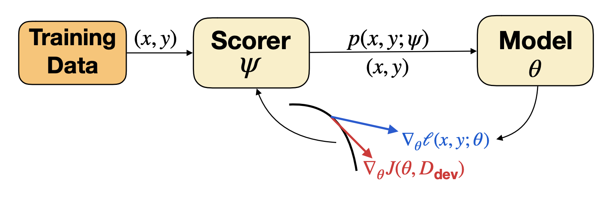

# Differential Data Selection



This repository provides the sample implementions of the
[Differentiable Data Selection](https://arxiv.org/abs/1911.10088) method for
CIFAR-10 image classification with Wide-ResNet-28-10. Note that the
implementation only runs with TPUs.

To run an experiment, please first [set up your Cloud TPU environment](https://cloud.google.com/tpu/docs/quickstart). Then, there are two steps:

* **Train a normal model on CIFAR-10**. This model will be used as the
  representation for the DDS scorer in the next step. For this, please use the
  command:
  ```
  python -m main.py --master=/PATH/TO/YOUR/TPU/WORKER --output_dir=/PATH/TO/YOUR/OUTPUT/FOLDER --log_every=100 --use_tpu --use_bfloat16 --noreset_output_dir --norunning_local_dev --task_mode=train --dataset_name=cifar10 --model_type=wrn-28-10 --label_smoothing=0. --train_batch_size=1024 --eval_batch_size=1024 --image_size=32 --num_classes=10 --lr=0.1 --optim_type=momentum --lr_decay_type=cosine --ema_decay=0.9999 --weight_decay=0.0002 --dense_dropout_rate=0.1 --save_every=1000 --num_train_steps=100000 --num_warmup_steps=250
  ```

* **Train a DDS model**. For this, please use the command:
  ```
  python -m main.py --master=/PATH/TO/YOUR/TPU/WORKER --scorer_ckpt=/PATH/TO/THE/SCORER/MODEL/FROM/THE/PREVIOUS/STEP --log_every=100 --use_tpu --use_bfloat16 --noreset_output_dir --gfs_user=hyhieu-brain --norunning_local_dev --task_mode=dds --dataset_name=cifar10_dds --scorer_clip=0.5 --scorer_lr=1e-06 --model_type=wrn-28-10 --train_batch_size=1024 --eval_batch_size=1024 --image_size=32 --num_classes=10 --lr=0.1 --optim_type=momentum --lr_decay_type=cosine --ema_decay=0.9999 --weight_decay=0.0002 --dense_dropout_rate=0.1 --save_every=1000 --use_augment --augment_magnitude=17 --num_train_steps=150000 --num_warmup_steps=2500
  ```
  The logs for our example run of this step is provided [here](https://tensorboard.dev/experiment/6uQra6UnSjiqvKW3qCN5yQ).

If you use this code for your work, please kindly cite our paper:
```
@inproceedings{wang20optimizing,
  author    = {Wang, Xinyi and Pham, Hieu and Michel, Paul and Anastasopoulos, Antonios and Neubig, Graham and Carbonell, Jaime G.},
  title     = {Optimizing Data Usage via Differentiable Rewards},
  booktitle = {International Conference on Machine Learning},
  year      = {2020},
}
```
