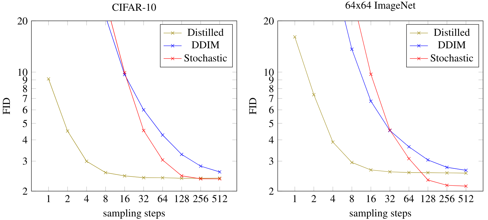

# Progressive Distillation for Fast Sampling of Diffusion Models
Code and model checkpoints for the <a href="https://openreview.net/forum?id=TIdIXIpzhoI">ICLR 2022 paper</a> by Tim Salimans and Jonathan Ho.

**abstract**:
Diffusion models have recently shown great promise for generative modeling, outperforming GANs on perceptual quality and autoregressive models at density estimation. A remaining downside is their slow sampling time: generating high quality samples takes many hundreds or thousands of model evaluations. Here we make two contributions to help eliminate this downside: First, we present new parameterizations of diffusion models that provide increased stability when using few sampling steps. Second, we present a method to distill a trained deterministic diffusion sampler, using many steps, into a new diffusion model that takes half as many sampling steps. We then keep progressively applying this distillation procedure to our model, halving the number of required sampling steps each time. On standard image generation benchmarks like CIFAR-10, ImageNet, and LSUN, we start out with state-of-the-art samplers taking as many as 8192 steps, and are able to distill down to models taking as few as 4 steps without losing much perceptual quality; achieving, for example, a FID of 3.0 on CIFAR-10 in 4 steps. Finally, we show that the full progressive distillation procedure does not take more time than it takes to train the original model, thus representing an efficient solution for generative modeling using diffusion at both train and test time.

