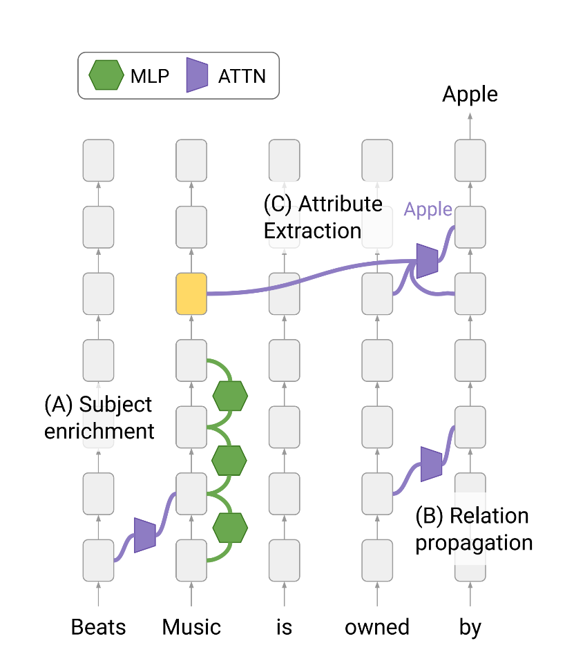

# Dissecting Recall of Factual Associations in Auto-Regressive Language Models

This is the official code repository for the paper [Dissecting Recall of Factual Associations in Auto-Regressive Language Models](https://arxiv.org/abs/2304.14767), Mor Geva, Jasmijn Bastings, Katja Filippova, Amir Globerson. 2023.

#### Setup
The [Jupyter Notebook](factual_associations_dissection.ipynb) includes the code for running our experiments in the paper over GPT2-xl. The file can be opened in
[Google Colaboratory](https://colab.research.google.com/).

All the experiments in our work were conducted in a Python 7 environment, with a single GPU (V100 for GPT2-xl and A100 for GPT-J).
Required python packages with specific versions are listed in [requiements.txt](requiements.txt).

#### Experiments

The notebook has 5 sections. The first section sets up the environment (i.e., importing the relevant packages, loading the data for evaluation and the model), and the second section includes an implementation of various hooks on different modules in the network, that are needed for intermediate information extraction and interventions. 

The next three sections cover our main experiments, according to the three main sections in the paper:

- **Information Flow Analysis**, which includes our attention knockout method for studying information flow during inference.

- **Attribute extraction**, including projection of hidden representations and sublayer outputs to the vocabulary and patching of hidden states.

- **Attributes rate evaluation** (subject enrichment). This includes our evaluation process against paragraphs, and sublayer knockout experiments.

For guidance on how to employ this code to other models, please see the comment below.

###### Parameters inspection in the vocabulary space

**Attention heads:**
To interpret the parameters of attention heads in the network, we have used the method introduced by [Dar et al., ACL 2023](https://arxiv.org/abs/2209.02535), as implemented in the official code repository released by the authors:
[https://github.com/guyd1995/embedding-space](https://github.com/guyd1995/embedding-space).

**MLP sub-updates:**
To interpret the parameters of the MLP sublayers, we used the code of [LM-Debugger](https://arxiv.org/abs/2204.12130), an open source tool introduced by [Geva et al., EMNLP Demo 2023](https://arxiv.org/abs/2204.12130).

#### Adjustments for Other Models

Our code can be applied as-is for other sizes of GPT2, and can be easily adjusted to other transformer-based models available on Huggingface.
To adjust the experiments to other models, the following adaptations are needed:

**(1) Code modifications.** Different models on Huggingface have different naming schemes (e.g., the first MLP matrix is called `c_fc` in GPT2 and `fc_in` in GPT-J). The hooks used to extract intermediate information and intervene on the network computation are applied to modules by their names. Therefore, the part in the code that needs to be adjusted when switching to other models is the hooks, where the modification merely should adjust the names of the hooked modules. One way to inspect the names is to look at the source code in Huggingface (e.g. for [GPT2](https://github.com/huggingface/transformers/blob/main/src/transformers/models/gpt2/modeling_gpt2.py) and [GPT-J](https://github.com/huggingface/transformers/blob/main/src/transformers/models/gptj/modeling_gptj.py))

**(2) Data generation.** Generating a set of input queries where the model's next token prediction matches the correct attribute. This in order to make sure that the analysis focuses on predictions that involve an attribute extraction.
To do this, one can follow the simple procedure described in [Meng et al., NeurIPS 2022](https://arxiv.org/pdf/2202.05262.pdf).  

---

This is not an officially supported Google product.

