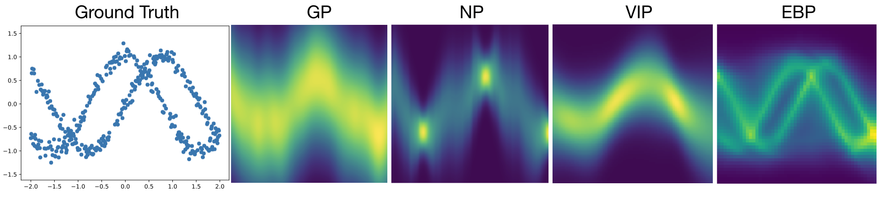
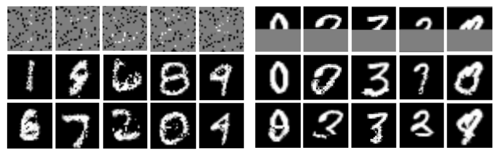
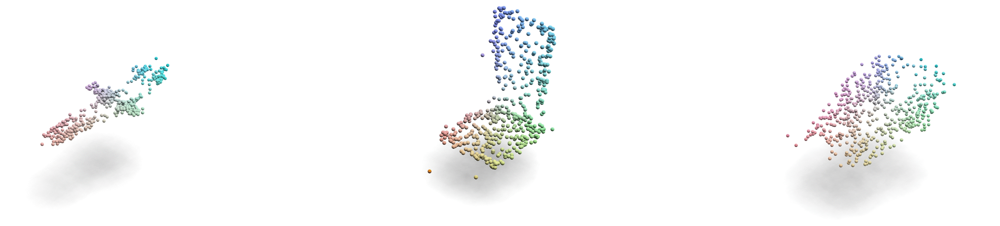
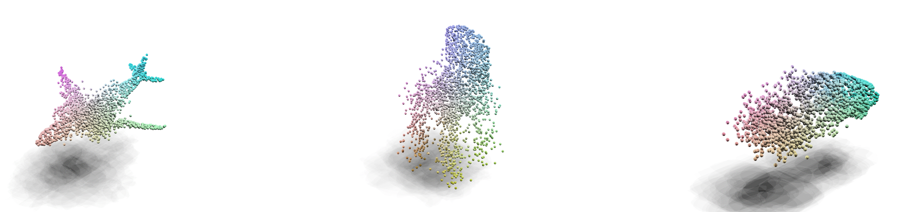

# EBP: Energy-Based Processes for Exchangeable Data

Code for "Energy-Based Processes for Exchangeable Data"
 by Mengjiao Yang, Bo Dai, Hanjun Dai, Dale Schuurmans.

Paper available at https://arxiv.org/abs/2003.07521

Upon using this codebase, please cite the paper:

```
@article{yang2020energy,
  title={Energy-Based Processes for Exchangeable Data},
  author={Yang, Mengjiao and Dai, Bo and Dai, Hanjun and Schuurmans, Dale},
  journal={arXiv preprint arXiv:2003.07521},
  year={2020}
}
```

## Examples

### Multi-modal synthetic data
Visualization of the learned energy of Gaussian Processes (GPs), Nueral Processes (NPs), Variational Implicit Processes (VIPs), 
and energy-based processes (EBPs). EBPs successfully capture multi-modality of the toy data.


### Image completion
Samples of generated MNIST digits conditioned on a subset of pixels:


### Point-cloud generation
Point-cloud generation using the learned RNN sampler:


### Point-cloud denoising
Point-cloud denoising using the learned energy function:


## Install

Navigate to the root of project, and perform:

    pip3 install -e .

The installation requires both gcc and CUDA (if gpu is enabled)

## Training

    cd ebp/experiments/
    ./run_ebp.sh

## Test

To plot the energy heatmap, pass the latest check-pointed epoch number

    ./run_ebp.sh
    ./run_ebp.sh -epoch_load 99
