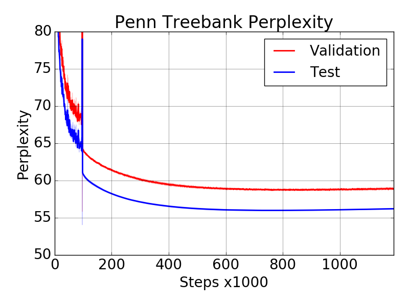

# Language Model Implementation of [ENAS](https://arxiv.org/abs/1802.03268).

## Preprocess data
The Penn Treebank dataset can be found at:

```
https://github.com/wojzaremba/lstm/tree/master/data
```

After downloading the dataset, please run the following script to preprocess
the files `{train,valid,test}.txt` into a `pkl` bundle:

```
python -m enas_lm.src.process
```

## ENAS models
To search for a cell using default parameters:

```
python -m enas_lm.src.search \
  --output_dir="$(pwd)/output" \
  --data_path="$(pwd)/ptb/ptb.pkl"
```

To evaluate the found architecture with default parameters on TPUs, please first
follow [this guide](https://cloud.google.com/tpu/docs/quickstart) to set up a
Cloud TPU account. A `1x1` donut of TPUv2 should provide enough memory for our
run. The running command is:

```
python -m enas_lm.src.tpu.fixed \
  --fixed_arc='0 2 1 0 2 1 2 2 4 0 5 0 3 2 6 2' \
  --output_dir=${STORAGE_BUCKET}/output \
  --data_path="${STORAGE_BUCKET}/data/ptb.pkl" \
  --use_tpu \
  --tpu_job_name=${TPU_NAME}
```
Our `10` runs produce test perplexity: `56.1 ± 0.1`.



We also provide a GPU implementation of the method, which is much slower than
the TPU version above. To evaluate the found architecture with default
parameters on GPU, you can directly use the command:

```
python -m enas_lm.src.fixed \
  --fixed_arc='0 2 1 0 2 1 2 2 4 0 5 0 3 2 6 2' \
  --output_dir="$(pwd)/output" \
  --data_path="$(pwd)/ptb/ptb.pkl"
```
Our `10` runs produce test perplexity: `57.3 ± 0.1`.

## Comparing with architectures found by other methods
To evaluate the architecture found by [DARTS](https://arxiv.org/abs/1806.09055):

```
python -m enas_lm.src.fixed \
  --fixed_arc='0 2 1 1 1 1 1 3 2 0 5 2 3 0 5 1' \
  --output_dir="$(pwd)/output" \
  --data_path="$(pwd)/ptb/ptb.pkl"
```

Expected test perplexity: `58.1`

To run the [AWD-LSTM](https://arxiv.org/pdf/1708.02182.pdf) baseline:

```
python -m enas_lm.src.lstm \
  --output_dir="$(pwd)/output" \
  --data_path="$(pwd)/ptb/ptb.pkl"
```

Expected test perplexity: `58.21`
