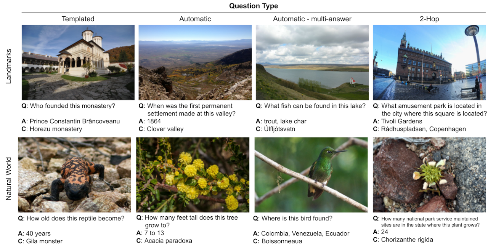

# Encyclopedic VQA

Encyclopedic-VQA
([ICCV'23 paper, ArXiv version](https://arxiv.org/abs/2306.09224)) is a large
scale visual question answering (VQA) dataset featuring visual questions about
detailed properties of fine-grained categories and instances.

*   It contains 221k unique question+answer pairs each matched with (up to) 5
    images, resulting in 1M VQA samples.
*   We provide a controlled knowledge base derived from Wikipedia (based on
    [WikiWeb2M](https://arxiv.org/abs/2305.03668)), with evidence to support
    each answer.
*   Our dataset poses a hard challenge for large vision+language models:
    [PaLI](https://arxiv.org/abs/2209.06794) is state-of-the-art on OK-VQA, yet
    only achieves 13.0% accuracy on the single-hop single-answer part of our
    dataset.
*   We demonstrate that augmenting [PaLM](https://arxiv.org/abs/2204.02311) with
    a mechanism (Google Lens) to retrieve information from the knowledge base
    (Wikipedia based) yields 48.8% accuracy on the single-hop part of our
    dataset. As such, our dataset enables research on retrieval augmented
    vision+language models.



**Citation**

```
@inproceedings{mensink23iccv,
title={Encyclopedic {VQA}: Visual questions about detailed properties of fine-grained categories},
author={Thomas Mensink and Jasper Uijlings and Lluis Castrejon and Arushi Goel and Felipe Cadar and Howard Zhou and Fei Sha and Andre Araujo and Vittorio Ferrari},
booktitle={ICCV},
year={2023},
}
```

## VQA questions

The VQA questions can be downloaded in .csv format here:

*   [train.csv](https://storage.googleapis.com/encyclopedic-vqa/train.csv)
    (74MB)
*   [val.csv](https://storage.googleapis.com/encyclopedic-vqa/val.csv) (1MB)
*   [test.csv](https://storage.googleapis.com/encyclopedic-vqa/test.csv) (2MB)

Our CSV files contain a single row per textual question. Each textual question
is paired with (up to) 5 images, leading to ~5x more VQA triplets than rows in
the CSV files. Each triplet consists of a textual question ( `question`), an
answer (`answer`), and an image (specified by `dataset_image_ids`). The exact
fields in the CSV files are:

*   `question`: The question *Q* to be used for the VQA triplets.
*   `answer`: The answer to the question. This field may contain multiple
    answers: if the question was answered by multiple annotators, answers are
    separated by '|'. In case of the multi_answer questions, individual answers
    are separated by '&&'.
*   `dataset_image_ids`: A list of up to 5 identifier for the image associated
    with the question. The IDs correspond to the images from the image dataset.
*   `dataset_name`: The name of the image dataset.
*   `dataset_category_id`: An identifier for the category of the subject in the
    image which corresponds to the original IDs of the respective datasets.
*   `question_type`: The type of the question, which can be one of ['templated',
    'automatic', 'multi_answer', '2_hop'].
*   `wikipedia_url`: The URL of the Wikipedia article that corresponds to the
    knowledge base for the question. This URL acts as a key to our provided
    knowledge base. For two_hop questions this field contains the two
    consecutive URLs separated by '|'.
*   `wikipedia_title`: The title of the Wikipedia article that corresponds to
    the knowledge base for the question. Warning: not a stable identifier, use
    the `wikipedia_url` instead.
*   `evidence`: The evidence supporting the answer, in the form of a string.
    Only for templated questions.
*   `evidence_section_id`: An integer identifier indicating the section of the
    knowledge base where the evidence can be found. For two_hop questions there
    are two IDs separated by '|'.
*   `evidence_section_title`: The title of the section of the knowledge base
    where the evidence can be found. Corresponds to `evidence_section_id`. For
    two_hop questions the two IDs are separated by '|'.
*   `encyclopedic_vqa_split`: This defines the split in our Encyclopedic-VQA
    dataset: train, val, or test.
*   `question_original`: The original text of the question before any
    rephrasing. Note that for automatically generated questions it contains the
    original subject of the question *C* which is depicted in the image. This
    facilitates doing language-only experiments for this `question_type`.
*   `wikipedia_url_used_in_train`: Boolean denoting whether the wikipedia_url of
    this questions occurs also in the training set. When this is 'False', the
    subject of the question (*C* in our paper) with its corresponding wikipedia
    page is unseen during training.

This images for the VQA questions can be downloaded here:

*   [iNaturalist 2021](https://github.com/visipedia/inat_comp/tree/master/2021)
*   [Google Landmarks Dataset V2](https://github.com/cvdfoundation/google-landmark)


## Controlled Knowledge Base

Our controlled knowledge base is a repackaging of the WikiWeb2M dataset
([WikiWeb2M paper](https://arxiv.org/abs/2305.03668), which in turn builds on
the
[WIT: Wikipedia-based Image Text Dataset](https://github.com/google-research-datasets/wit).
The original WikiWeb2M dataset is available
[here](https://github.com/google-research-datasets/wit/blob/main/wikiweb2m.md).
Our repackaging can be downloaded below (zipped json file). The image pixels
have to be downloaded separately:

*   [encyclopedic_kb_wiki.zip](https://storage.googleapis.com/encyclopedic-vqa/encyclopedic_kb_wiki.zip)
    (4.9GB).
*   [image pixels on Hugging Face](https://huggingface.co/datasets/TREC-AToMiC/AToMiC-Images-v0.2).

To verify the download, the sha256sum is of the json file is
`36af1b6718a975c355a776114be216f4800c61320897b2186d33d17a08e44c77`. You can do
this from the linux command line:

```
sha256sum encyclopedic_kb_wiki.json
```

The knowledge base is a json file which first maps a `wikipedia_url` to a
wikipedia entry, where the `wikipedia_url` matches the one from the VQA
questions.

The wikipedia entry is again a dictionary with the following fields:

*   `title`: Title of the Wikipedia article.
*   `section_titles`: List with titles of each section. Its first element is
    identical to `title`.
*   `section_texts`: List with text contents for each section.
*   `image_urls`: List with urls to images within the Wikipedia article.
*   `image_reference_descriptions`: List with the reference descriptions (i.e.
    captions) of the images.
*   `image_section_indices`: List of integers denoting the sections where each
    image belongs to (i.e. index in `section_titles` and `section_texts`).
*   `url`: The `wikipedia_url` (again).

## Evaluation

To evaluate answers we use [BEM](https://arxiv.org/abs/2202.07654), which uses a
BERT model fine-tuned to determine equivalent answers for a given question. This
method correctly evaluates candidate answers that are valid but that do not
exactly match the reference answers in our annotations, as opposed to common VQA
metrics.

This evaluation method is implemented by the `evaluate_example` function in
`evaluation_utils.py`. For example:

```
import evaluation_utils

question = 'Where does this hotel derive its name from?'
question_type = 'automatic'

# semantically correct answer.
score1 = evaluation_utils.evaluate_example(
    question,
    reference_list=['the Menger family'],
    candidate='William and Mary Menger',
    question_type=question_type)

# semantically incorrect answer.
score2 = evaluation_utils.evaluate_example(
    question,
    reference_list=['the Menger family'],
    candidate='the Baker family',
    question_type=question_type)

# score1 is 1.0, score2 is 0.0.
print(f'{score1=}, {score2=}')
```

To calculate the final VQA accuracy for a data split, we compute the average
score over all of its examples.

## Lens Retrieval

To help reproduce experiments in the paper, we provide the result of querying
 Google Lens for the images in the test set here:

* [lens_entities.csv](https://storage.googleapis.com/encyclopedic-vqa/lens_entities.csv)

This CSV file contains a row for each image in the test set of Encyclopedic-VQA,
 identified by its `dataset_name` and `dataset_image_id`.
For each image, we provide a list with the Wikipedia URLs for the main entity in
 the image as detected by Lens in column `lens_wiki_urls`.
If multiple URLs are present, they are ordered by decreasing confidence score,
i.e. the first URL is the most certain entity in the image according to Lens.
We use an empty list to indicate that Lens did not identify any entity in the
 image.
All experiments in the paper use the first URL only, except when measuring the
recall of Lens as a retrieval system.


## References

-   [WikiWeb2M] A Suite of Generative Tasks for Multi-Level Multimodal Webpage
    Understandin, A. Burns et al., ([arXiv](https://arxiv.org/abs/2305.03668)).
-   [BEM] Tomayto, Tomahto. Beyond Token-level Answer Equivalence for Question
    Answering Evaluation, J. Bulian et al.,
    ([arXiv](http://arxiv.org/abs/2202.07654)).

## Contact

If you have any questions, please reach out to:

*   Thomas Mensink - mensink@google.com
*   Jasper Uijlings - jrru@google.com
*   Lluis Castrejon - lluisc@google.com
*   André Araujo - andrearaujo@google.com
*   Vittorio Ferrari - vittoferrari@google.com
