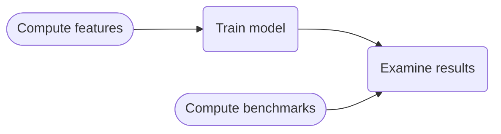

# MAGNET: MAGnitude Neural EsTimation model

This code implements MAGNET for magnitude prediction of earthquakes.
MAGNET is presented in the paper ***fill in when published***.

# Install

The package was tested using a python env created with conda package manager.
From the root of project, perform:

```
conda create --name <environment_name> --file requirements.txt
pip install --no-deps -e .
```

# Model training procedure

The general scheme of training a model using MAGNET is as follows:



_Compute features_ and _Compute benchmarks_ stages are performed separately from
the training process, results are cached and read during training or when
needed.

_Compute features,  Compute benchmarks_ and _Train model_ are executed by
scripts (see package structure below). 

An Example for _Examine results_ is given by the ipynb notebooks in this repo.

# Package structure

Below is the detailed folder content

```
eq_mag_prediction
├── eq_mag_prediction # package code
│   ├── scripts       # meant for running from command line interface
│   ├── ingestion     # ingestion of catalogs
|   :
|
├── notebooks         # ipynb notebooks exemplifying functionality
└── results           # meant for storage of script results and pre trained models
    ├── cached_benchmarks
    ├── cached_features
    ├── catalogs
    │   ├── ingested
    │   └── raw
    └── trained_models
        ├── GeoNet_NZ
        ├── Hauksson
        └── JMA

```

## scripts

Scripts are meant for execution by CLI, after activating the workspace:

```
python3  path/to/script.py
```

1.  `calculate_benchmark_gr_properties.py`: calculates and caches benchmarks for
    comparison.
2.  `magnitude_prediction_compute_features.py`: computes features for model
    training.
3.  `magnitude_predictor_trainer.py`: train a model.

See file contents for flags and options while running.

> <span style="font-size:0.8em;"> Cached results from
> `calculate_benchmark_gr_properties.py` and
> `magnitude_prediction_compute_features.py` are named using hash code that
> indicates the exact inputs that were used to calculate them. The names
> themselves are not fully indicative, and are read using dedicated reading
> functions that search for the specific encoded names. </span>

## ingestions

Scripts that transform raw downloaded catalogs into standardized format for
model training and analysis.

```
python3  path/to/ingestion/script.py
```

By default, ingestion scripts will look for the raw catalog in
`eq_mag_prediction/results/catalogs/raw` and cache the modified in
`eq_mag_prediction/results/catalogs/ingested`. In order to change this behavior
see flags in ingestion code itself.

> JMA catalog may be ingested via a protobuf format (https://protobuf.dev/)
>instead pythonically. See description of ```ingest_jma_via_proto.py``` for
>details.

> ```pdfs_of_major_earthquakes.ipynb``` plots model's prediction for a list of
major earthquakes in the catalog region. By the notebook design,  the list of
major earthquakes are given by the ingested major earthquakes catalog, per
region. See description in ```ingest_***_major_earthquakes.py``` scripts.


## notebooks
ipynb notebooks exemplifying usage of model loading and result analysis. By
default reads from `trained_models` folder.

## results
Where trained models are stored, and cached by default.

Default cache location for benchmarks, features and ingested catalogs as well.

Pre-trained models, encoders, and calculated benchmarks can be found in
* **LINK TO ZENODO** *