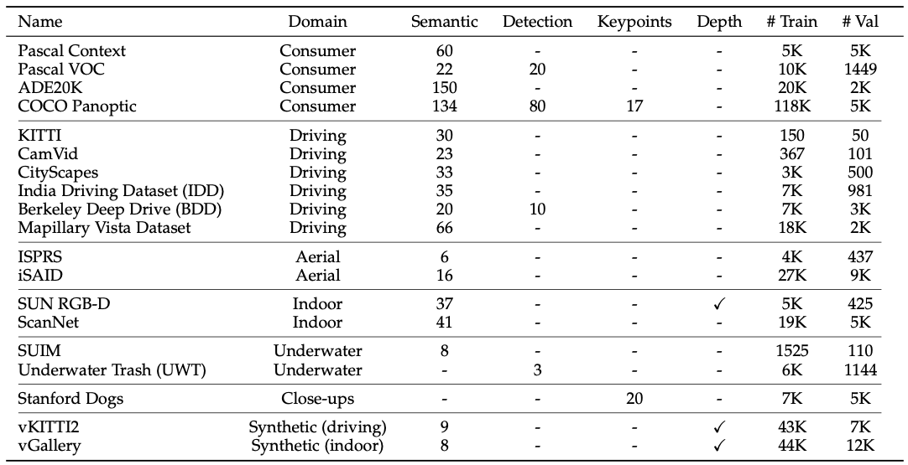
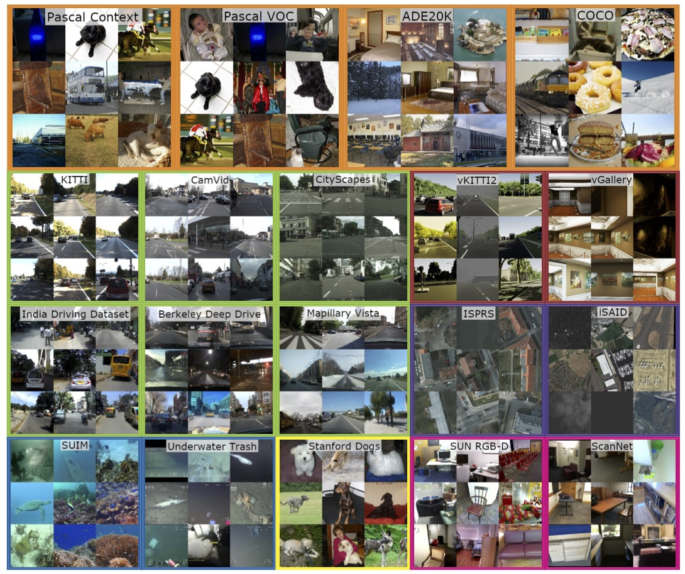

# Introduction

The code in this directory provides a unified TFDS interface for 20 different 
datasets: ADE20K, BDD, CamVid, CityScapes, COCO, Indian Driving Dataset, KITTI,
Mapillary, Pascal VOC, Pascal context, ScanNet, SUNRGBD, WildDash, iSAID, ISPRS, 
Stanford Dogs, SUIM, Underwater Trash, vGallery, and vKITTI2.


(Listing 19 out of 20 datasets, WildDash is omitted, see below for details.)

In particular, our TFDS interfaces provides for each dataset standardized 
features with standardized feature names to facilitate seamlessly running 
experiments on a wide variety of datasets. The features are formalized in 
`fids_features.py` and includes the following features (whose presence varies 
depending on the nature of the dataset):

- **id**: string with ID of the sample using the original IDs of the dataset.
- **image**: HxWx3 RGB image (uint8).
- **segmentation**: HxW segmentation image (uint16). Each 'pixel' denotes a 
class: 0='background', 1='car', 2='cat', where background is *always* class 0
while the others are dataset specific.
- **segmentation_mseg_universal**: HxW segmentation image (uint16). Each 'pixel' 
denotes a class in the universal MSeg taxonomy, where for *all* datasets the
same labels are used: 0='background', 1='backpack', 2='umbrella', etc.
- **boxes**: Nx4 boxes. Representation: [row_min, col_min, row_max, col_max], 
where coordinates are in [0, 1].
- **box_labels**: NxC one-hot class label vectors for each of the N boxes for C 
classes
- **person_keypoints**: Mx3 human keypoints. Representation: [row, col, is_visible].

These datasets were used in our TPAMI paper:

```
@article={mensink2022pami,
  title={Factors of Influence for Transfer Learning across Diverse Appearance Domains and Task Types},
  author={Thomas Mensink and Jasper Uijlings and Alina Kuznetsova and Michael Gygli and Vittorio Ferrari},
  year={2022}
  journal={TPAMI}
  arxiv={https://arxiv.org/abs/2103.13318}
```


(Illustration of 19 out of 20 datasets, WildDash is omitted, see below for details.)

### Notes

1. While WildDash is in the released collection of datasets it is not used in our paper / experiments. The reason is that both the train and validation set are identical in the current implementation.
2. MPII Human Pose is used in our paper / experiments, but not included in the current release. The reason is that for parsing the ground-truth internal tools are used. 

# Download and Prepare
In order to use the TFDS interface, all datasets needs to be downloaded and 
sometimes also need to be pre-processed beforehand. To start with a warning: *downloading all these datasets takes quite some time*, however each of these datasets can be imported into TFDS individually.

Below we describe per dataset what is required.

### MSEG
For ADE20K, BDD, CamVid, CityScapes, COCO, Indian Driving Dataset, KITTI, Mapillary, Pascal, ScanNet, SUNRGBD, and WildDash we first need the [MSEG datasets](https://github.com/mseg-dataset/mseg-api).
Luckily they have prepared a detailed overview of downloading and preprocessing [instructions](https://github.com/mseg-dataset/mseg-api/blob/master/download_scripts/README.md).

We assume the following directories are used (if not, please adjust `dataset_dirs.py`):

```python
MSEG_ROOT_DIR = './data/mseg/'
MSEG_MASTER_FILE_PATH = f'{MSEG_ROOT_DIR}/MSeg_master.tsv'
```

1. **ADE20K**: In contrast to MSEG we also provide instance segmentation ground-truths.
Therefore, we need the path to the original images (downloaded as part of the mseg dataset):
`ADE20K_ORIGINAL_BASE=f'{MSEG_ROOT_DIR}/after_remapping/ADE20K/ADE20K_2016_07_26/images/'`

1. **BDD**: In addition to the MSEG datasets, we also include instance segmentation from the BDD10K dataset and bounding box annotations, drivable annotations from the BDD100K dataset ([url](https://bdd-data.berkeley.edu/)). This requires additional downloads:
  - Download the 100K dataset to:
  `./data/bdd100k/`, including
  - the 100K images (in `images/100k`)
  - the segmentation annotations to (`seg`)
  - the drivable annotations (to `drivable_maps`)
  - the detection json files (to `labels`, (*i.e.*, `bdd100k_labels_images_train.json`))
  - the panoptic segmentation to `pan_seg`)

1. **COCO**: For the COCO dataset, bounding boxes, person keypoint and box annotations, and instance segmentation maps are added. In order to use these, please download:
  - `person_keypoints_*2017.json`, and `instances_*2017.json` from the COCO dataset ([url](https://cocodataset.org/#download)) and move these into:
  `./data/coco/annotations`

1. **SUNRGBD**: For the SUNRGBD dataset ([url](https://rgbd.cs.princeton.edu/)) we also use the depth feature. If this is not retained when downloading and pre-processing the MSEG datasets, please download SUNRGBD V1 from [here](https://rgbd.cs.princeton.edu/) and copy the `depth` directory to: `./data/sunrgbd/depth/`

1. **WildDash**: In *none* of our experiments we use the WildDash dataset. It is constructed in the MSEG-API such that the test set and the train set are identical.

### iSAID and ISPRS
[iSAID](https://captain-whu.github.io/iSAID/) and [ISPRS](https://www.isprs.org/education/benchmarks/UrbanSemLab/Default.aspx) are two aerial imagery datasets. The images in these datasets are generally very large (*i.e.*, `4000 x 4000` pixels) and hence, they are split into smaller (partly overlapping) tiles. See the `preprocess` directory for more information.

  - Download the ISPRS dataset to `./data/isprs` and run `preprocess/isprs_split.py`
  - This results in a directory structure like:
  ```
  ./data/isaid/test/images
  ./data/isaid/test/patches
  ./data/isaid/train/images
  ./data/isaid/train/patches
  ./data/isaid/val/images
  ./data/isaid/val/patches  
  ```
  - Download the iSAID dataset to `./data/isaid` and run `preprocess/isaid_split.py`
  - This results in a directory structure like:
  ```
  ./data/isprs/patches/potsdam
  ./data/isprs/patches/vaihingen
  ./data/isprs/potsdam/gt
  ./data/isprs/potsdam/top
  ./data/isprs/vaihingen/gt
  ./data/isprs/vaihingen/top
```
  - Note that the preprocess functions is partly based on the [iSAID devkit](https://github.com/CAPTAIN-WHU/iSAID_Devkit).

### Stanford Dogs
Stanford Dogs ([url1](https://github.com/benjiebob/StanfordExtra), [url2](http://vision.stanford.edu/aditya86/ImageNetDogs/)) is a keypoint dataset for dogs. 

1. Download the images to `./data/stanford_dogs/Images`
1. Download the `StanfordExtra_v1.json` to `./data/stanford_dogs/`

### SUIM
The SUIM dataset [url](https://irvlab.cs.umn.edu/resources/suim-dataset) 
contains 1525 train images and 110 test images. Each image is accompanied with 
a semantic segmentation mask with 8 classes:
Background (waterbody), Human divers, Aquatic plants \& sea-grass, Wrecks \&
ruins, Robots, Reefs \& invertebrates, Fish \& vertebrates, and Sea-floor
\& rocks.

1. Download the dataset to `./data/suim/`.

### Underwater Trash
The Underwater Trash Dataset (UTD, [url1](http://irvlab.cs.umn.edu/resources/trash-icra19), [url2](https://conservancy.umn.edu/handle/11299/214366)) is a detection dataset with underwater imagery.
It contains images of many different types of marine debris, captured from 
real-world environments, providing a variety of objects in different states of 
decay, occlusion, and overgrowth. The dataset contains 5,700 images, all labeled
with bounding boxes on instances of trash, biological objects such as plants and 
animals, and ROVs.

1. Download the dataset to `./data/underwater_trash/`


### vGallery
The Virtual Gallery dataset (vGallery, [url](https://europe.naverlabs.com/research/3d-vision/virtual-gallery-dataset/)) is a synthetic dataset of a scene containing 3-4 
rooms, in which (free-for-use) famous paintings are placed on the walls. 
The virtual model and the captured images were generated with Unity game engine.
In this paper, we use the imagery, depth and class segmentation.

1. Download the dataset to `./data/vgallery/`

### vKITTI 2
The Virtual KITTI 2 (vKitti2, [url](https://europe.naverlabs.com/Research/Computer-Vision/Proxy-Virtual-Worlds)) is an updated version of the well-known Virtual KITTI 
dataset which consists of virtual clones from the KITTI tracking benchmark. 
In our paper, we use the imagery, depth and class segmentations.

1. Download the dataset to `./data/vkitti2`

# Example usage
After downloading any of the datasets (conform the details above), the dataset can be transformed to tfds following the example in `example_dataset_preparation.ipynb`. This can be done for a single dataset or a subset of the dataset, or for all datasets.

```python
import tensorflow_datasets as tfds
from factors_of_influence.fids import fids_tfds_builders as fids

ds_build = tfds.builder('fids_kitti_segmentation')
ds_build.download_and_prepare() # Required just once for conversion to TFDS.

# Afterwards load the dataset with:
ds, ds_info = tfds.load('fids_kitti_segmentation', with_info=True)
```

## Metadata
For the segmentation task, the metadata (image mean (per channel), image std 
(per channel), number of classes, list with class names) is provided in `fids/fids_metadata_segmentation.py`.

# Contact

If you run into any problems of have questions or suggestions, please reach out to: mensink@google.com

