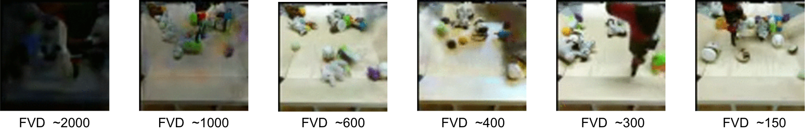

# Fréchet Video Distance

This repository contains the code to compute the Fréchet Video Distance (FVD) as described in [https://arxiv.org/abs/1812.01717](https://arxiv.org/abs/1812.01717).



## Usage

FVD is implemented in tensorflow and requires `tensorflow` and `tensorflow-hub` to be available. An example is available [here](https://github.com/google-research/google-research/blob/master/frechet_video_distance/example.py).

Given a tensor of real videos, and a tensor of generated videos that both have dimensionality `[NUMBER_OF_VIDEOS, VIDEO_LENGTH, FRAME_WIDTH, FRAME_HEIGHT, 3]` with values in 0-255, FVD is computed as

```python
from frechet_video_distance import frechet_video_distance as fvd

result = fvd.calculate_fvd(
    fvd.create_id3_embedding(fvd.preprocess(real_videos, (224, 224))),
    fvd.create_id3_embedding(fvd.preprocess(generated_videos, (224, 224))))
```

## Citation
If you are using FVD please cite us!
```
@article{unterthiner2018towards,
  title={Towards Accurate Generative Models of Video: A New Metric \& Challenges},
  author={Unterthiner, Thomas and van Steenkiste, Sjoerd and Kurach, Karol and Marinier, Raphael and Michalski, Marcin and Gelly, Sylvain},
  journal={arXiv preprint arXiv:1812.01717},
  year={2018}
}
```
##
