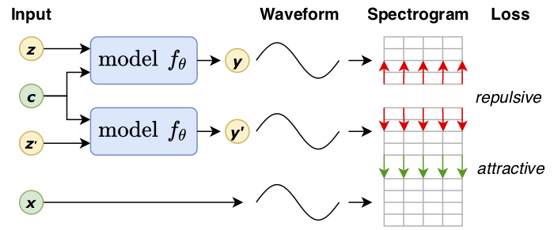
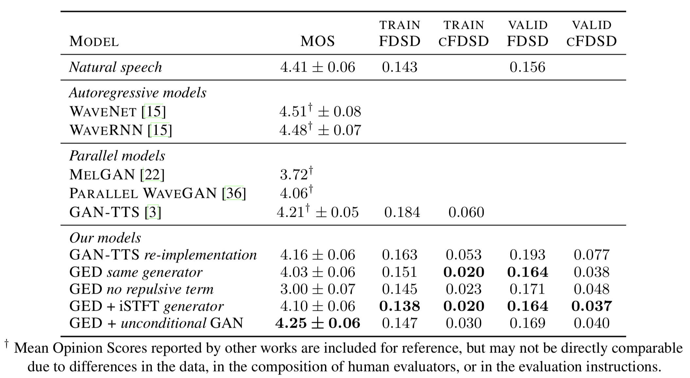

# A Spectral Energy Distance for Parallel Speech Synthesis
### Alexey A. Gritsenko, Tim Salimans, Rianne van den Berg, Jasper Snoek and Nal Kalchbrenner

Full-text paper available on [arXiv](https://arxiv.org/abs/2008.01160).

## Summary
* New generalized energy distance for Parallel TTS without analytical likelihood
* This distance is a proper scoring rule, it is unbiased and can be estimated
  from mini-batches
* Competitive with and improves upon SOTA (MOS 4.25)
* The first work to use a repulsive term with multi-scale spectrotram-based
  distances

### Visual depiction of the training process


## Abstract
Speech synthesis is an important practical generative modeling problem that has
seen great progress over the last few years, with likelihood-based
autoregressive neural models now outperforming traditional concatenative
systems. A downside of such autoregressive models is that they require executing
tens of thousands of sequential operations per second of generated audio, making
them ill-suited for deployment on specialized deep learning hardware. Here, we
propose a new learning method that allows us to train highly parallel models of
speech, without requiring access to an analytical likelihood function. Our
approach is based on a generalized energy distance between the distributions of
the generated and real audio. This *spectral energy distance* is a proper
scoring rule with respect to the distribution over magnitude-spectrograms of the
generated waveform audio and offers statistical consistency guarantees. The
distance can be calculated from minibatches without bias, and does not involve
adversarial learning, yielding a stable and consistent method for training
implicit generative models. Empirically, we achieve state-of-the-art generation
quality among implicit generative models, as judged by the recently-proposed
cFDSD metric. When combining our method with adversarial techniques, we also
improve upon the recently-proposed GAN-TTS model in terms of Mean Opinion Score
as judged by trained human evaluators.

## Results



## Speech samples
| Model                         |  Samples |
|:----------------------------- |---------:|
| GAN-TTS *re-implementation*   | [Link](https://drive.google.com/drive/folders/1coS4cXD-kt8qYRMYVgIsAVYr6KD06Jog?usp=sharing) |
| GED *same generator*          | [Link](https://drive.google.com/drive/folders/1F6xKINmw_-hqY8cJQfA918U4fnY3TKIv?usp=sharing) |
| GED *no repulsive term*       | [Link](https://drive.google.com/drive/folders/1V_qidV2LJwqX4ADAfABijo58Xp-m51mV?usp=sharing) |
| GED + iSTFT *generator*       | [Link](https://drive.google.com/drive/folders/12LRSEJL9HJwqn3wdFU4mKqsFXEw92CWm?usp=sharing) |
| GED + *unconditional* GAN     | [Link](https://drive.google.com/drive/folders/1LvFwiZLc-kZRwHsTzIRl2rGNNiOdk7JW?usp=sharing) |

## Source code
Model code and pre-trained checkpoints are **not** shared. However, we include
the following:

* Implementation of the spectral energy distance function introduced in our
  paper [`ged_tts/distance_function`]
* Colab applying GED to fit a mixture of Gaussians [`ged_tts/toy_example`]
* *Re-implementation* of the Fréchet Deep Speech Distance (FDSD) metric
  calculation proposed in Bińkowski *et al.* "High fidelity speech synthesis
  with adversarial networks." arXiv preprint arXiv:1909.11646 (2019)
  [`ged_tts/fdsd`]

## Citation
```latex
@misc{Gritsenko2020,
    title={A Spectral Energy Distance for Parallel Speech Synthesis},
    author={Alexey A. Gritsenko and Tim Salimans and Rianne van den Berg and Jasper Snoek and Nal Kalchbrenner},
    year={2020},
    eprint={2008.01160},
    archivePrefix={arXiv},
    primaryClass={eess.AS}
}
```
