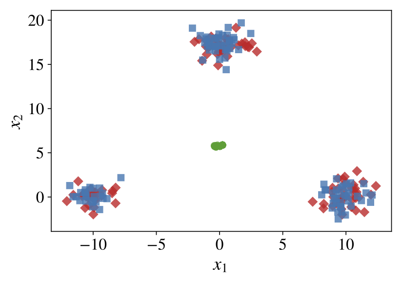
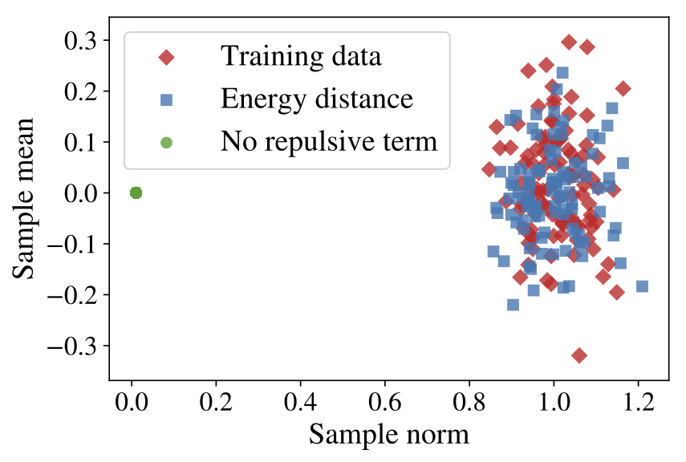

## Toy example

Notebook reproducing Figure 1 from the our publication (see also below).

Samples from models trained by minimizing the energy distance (blue) or the more commonly used loss without repulsive term (green), and comparing to samples from the training data (red). Samples from the energy distance trained model are representative of the data, and all sampled points lie close to training examples. Samples from the model trained without repulsive term are not typical of training data.

### Mixture of three Gaussians
Samples from a two-dimensional Gaussian mixture model with three components.

### High-dimensional Gaussian
Samples $$\mathbf{x}$$ from a single 100-dim Gaussian, with $$||\mathbf{x}||_{2}$$ on the x-axis and $$\sum_{i}^{n} \mathbf{x}_{i} / n$$ on the y-axis.

