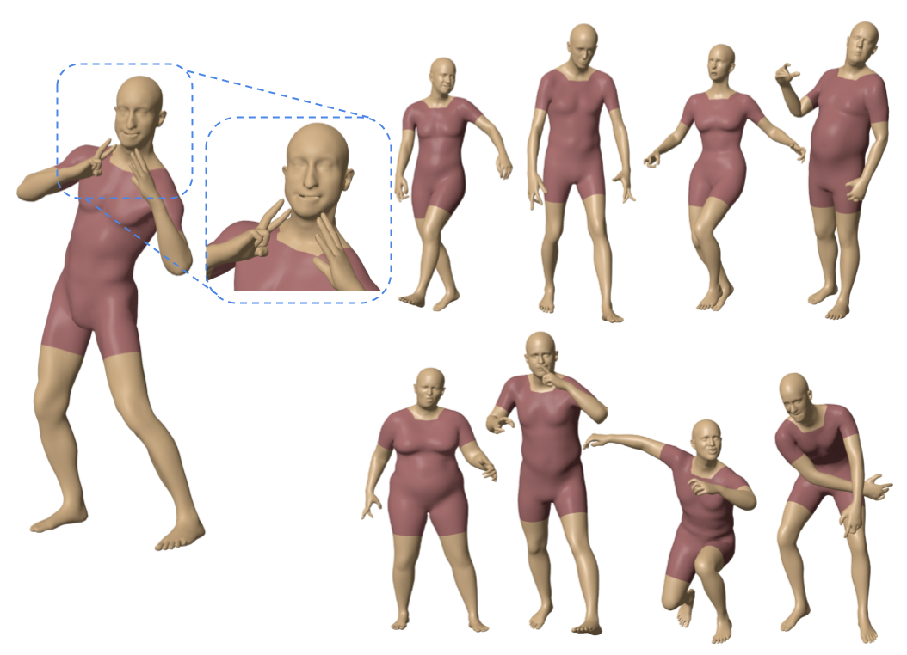
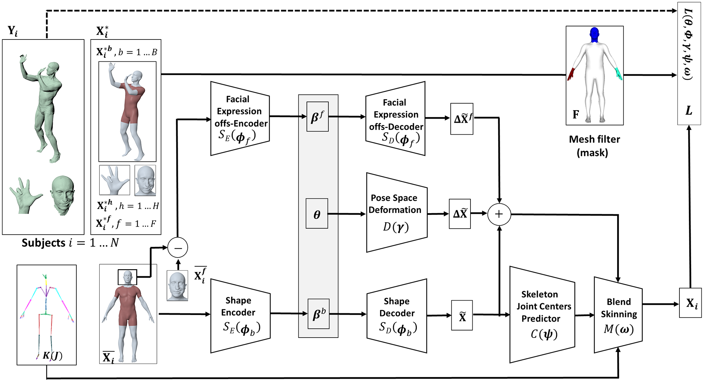
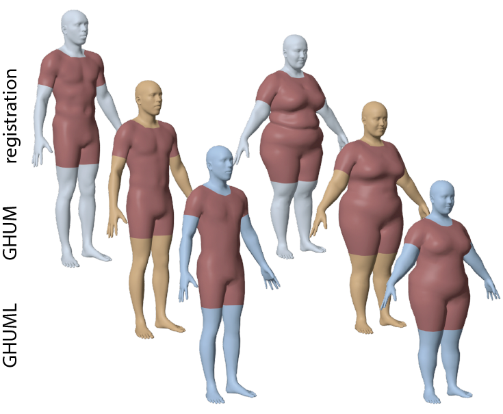
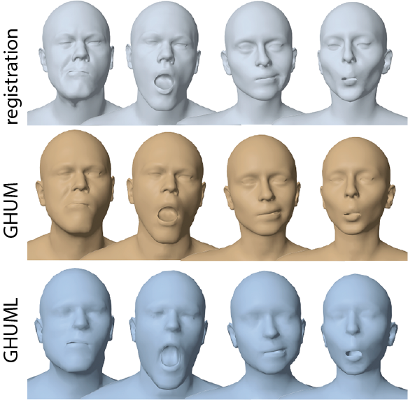
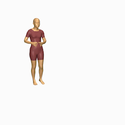

# GHUM & GHUML: Generative 3D Human Shape and Articulated Pose Models
<p align="center"> Hongyi Xu, &nbsp; Eduard Gabriel Bazavan, &nbsp; Andrei Zanfir, &nbsp; William T. Freeman,&nbsp;  Rahul Sukthankar, &nbsp; Cristian Sminchisescu </p>
<p align="center"> <strong>Google Research</strong> </p>

## Introduction

<p align="justify">We present a statistical, articulated 3D human shape modeling pipeline, within a fully trainable, modular, deep learning framework. Given high-resolution complete 3D
body scans of humans, captured in various poses, together with additional closeups of their head and facial expressions, as well as hand articulation, and given initial, artist designed, gender neutral rigged quad-meshes, we train all model parameters including non-linear shape spaces based on variational auto-encoders, pose-space deformation correctives, skeleton joint center predictors, and blend skinning functions, in a single consistent learning loop. The models are simultaneously trained with all the 3d dynamic scan data (over 60, 000 diverse human configurations in our new dataset) in order to capture correlations and ensure consistency of various components. Models support facial expression analysis, as well as body (with detailed hand) shape and pose estimation. We provide two fully trained generic human models of different resolutions – the moderate-resolution GHUM consisting of 10,168 vertices and the low-resolution GHUML(ite) of 3,194 vertices.</p>

<p align="center">
  
</p>

## Features

<table>
  <tr>
    <td> </td> 
    <td align="left">16-dimensional body shape latent spaces, represented as both linear PCA bases and nonlinear variational autoencoders. We provide low-dimensional gender-neutral shape spaces, as well as gender-specific ones, trained based on 4,329 male and female body shape scans. </td>
  </tr>
  <tr>
    <td> </td> 
    <td align="left">20-dimensional facial expressions latent spaces, with options for both linear/PCA bases and nonlinear variational autoencoders.  </td>
  </tr>
  <tr>
    <td> </td> 
    <td align="left">Articulated full body representations (including head and hands) with optimized blend skinning, joint centers, and  pose-space deformation,  in the context of minimal human skeleton parameterizations (63 joints, 124 DOFs) with anatomical joint angle limit constraints. The dynamic shape (posing) model component is constrained by over 60,000 dynamic full body and closeup face and hand scans from 60 people (exhibiting a variety of body poses, hand gestures, and facial action units/FACS). </td>
  </tr>
  <tr>
    <td> </td> 
    <td align="left">Normalizing-flow based kinematic priors for both body and hands, obtained by retargeting over 2 million configurations of body mocap raw (optimizing skeleton, shape and marker placement) and over 4.8K hand configurations.   Our model supports posing using both Euler angles and 6D rotation representations, and we release posing support and kinematic priors for both. </td>
  </tr>
</table>

## Paper \& Presentation
[Paper and supplemental material](https://drive.google.com/file/d/1k5mb6-FkqM7SJfaDQ7vrfkVO-BZpfnTO/view?usp=sharing)

[Video](https://drive.google.com/file/d/1OH76ZC36A-0D_I5rJDh24wdJyRxHusdI/view?usp=sharing),  [Slides](https://drive.google.com/file/d/14xSu0OeYW46mMvsPO8r1bGrKgiHWxXCH/view?usp=sharing)

## Model Download

[Request model form](https://docs.google.com/forms/d/e/1FAIpQLSduGNoQUQxaIwna944hdgsX7m9bSM4aqh2YDXD02V2VfNnP9g/viewform). 

## Citations
If you use this model or code for your publication, please cite the following papers [1](http://openaccess.thecvf.com/content_CVPR_2020/papers/Xu_GHUM__GHUML_Generative_3D_Human_Shape_and_Articulated_Pose_CVPR_2020_paper.pdf)
, [2](https://arxiv.org/abs/2003.10350):
```
@inproceedings{xu2020ghum,
  title={GHUM \& GHUML: Generative 3D Human Shape and Articulated Pose Models},
  author={Xu, Hongyi and Bazavan, Eduard Gabriel and Zanfir, Andrei and Freeman, William T and Sukthankar, Rahul and Sminchisescu, Cristian},
  booktitle={Proceedings of the IEEE/CVF Conference on Computer Vision and Pattern Recognition},
  pages={6184--6193},
  year={2020}
}
```
```
@article{zanfir2020weakly,
  title={Weakly Supervised 3D Human Pose and Shape Reconstruction with Normalizing Flows},
  author={Zanfir, Andrei and Bazavan, Eduard Gabriel and Xu, Hongyi and Freeman, Bill and Sukthankar, Rahul and Sminchisescu, Cristian},
  journal={arXiv preprint arXiv:2003.10350},
  year={2020}
}
```

### Team
Hongyi Xu, Eduard Gabriel Bazavan, Andrei Zanfir, Mihai Zanfir, William T. Freeman, Rahul Sukthankar, Cristian Sminchisescu

### Contact
If you have any questions about our model or code, please email
<ghum-inquiry@google.com>.