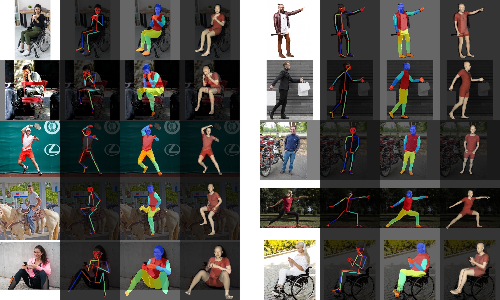
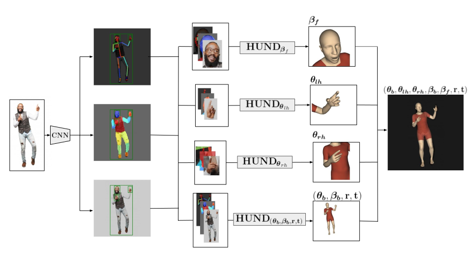
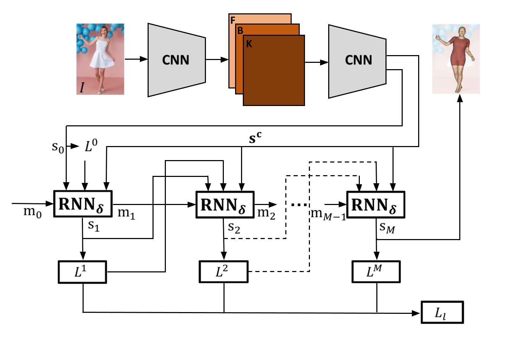

# HUND: Neural Descent for Visual 3D Human Pose and Shape
<p align="center"> Andrei Zanfir, &nbsp; Eduard Gabriel Bazavan, &nbsp;  Mihai Zanfir, &nbsp; William T. Freeman,&nbsp;  Rahul Sukthankar, &nbsp; Cristian Sminchisescu </p>
<p align="center"> <strong>Google Research</strong> </p>

<p align="left">
  <a href="https://twitter.com/CSminchisescu"></a>
</p>

## Introduction
<p align="middle">
<p align="justify">
</p>

We present deep neural network methodology to reconstruct the 3d pose and shape of people, including hand gestures and facial expression, given an input RGB image. We rely on a recently introduced, expressive full body statistical 3d human model, GHUM, trained end-to-end, and learn to reconstruct its pose and shape state in a self-supervised regime.  Central to our methodology is a learning to learnand optimize approach, referred to as HUman Neural Descent (HUND), which avoids both second-order differentiation when training the model parameters,and expensive state gradient descent in order to accurately minimize a semantic differentiable rendering loss at test time.  Instead, we rely on novel recurrent stages to update the pose and shape parameters such that not only losses are minimized effectively, but the process is meta-regularized in order to ensure end-progress. HUND’s symmetry between training and testing makes it the first 3d human sensing architecture to natively support different operating regimes including self-supervised ones. In diverse tests, we show that HUND achieves very competitive results in datasets like H3.6M and 3DPW, as well as good quality 3d reconstructions for complex imagery collected in-the-wild. </p>

## Methodology
Our complete full body 3d sensing HUND network combines a feed-forward architecture to detect landmarks and semantically segment body parts with an attention mechanism that further processes the face, hands and the rest of the body as separate HUND predictive networks, with results fused in order to obtain the final, full body estimate.

<p align="middle">
 
</p>

### HUND Architecture
In HUND, recurrent neural network stages refine the state output (in this case the 3d human pose and shape of a statistical GHUM model) based on previous state estimates, loss values, and a context encoding of the input image, similarly in spirit to non-linear optimization. However, differently from models relying on gradient-based back-ends, HUND can be trained end-to-end using stochastic gradient descent, offers no asymmetry between training and testing, supports the possibility of potentially more complex, problem-dependent step updates compared to non-linear optimization, and is significantly faster. Moreover, by using such an architecture, symmetric in training and testing, with capability of refinement and self-consistency, we show, for the first time, that a 3d human pose and shape estimation system trained from monocular images can entirely bootstrap itself.
<p align="middle">
 
</p>

## Paper
[Paper and supplementary material.](https://openaccess.thecvf.com/content/CVPR2021/html/Zanfir_Neural_Descent_for_Visual_3D_Human_Pose_and_Shape_CVPR_2021_paper.html)

## Model Download
[HUND request form.](https://docs.google.com/forms/d/e/1FAIpQLSduGNoQUQxaIwna944hdgsX7m9bSM4aqh2YDXD02V2VfNnP9g/viewform)


## Citations
If you use this model or code for your publication, please cite the following paper [1](https://openaccess.thecvf.com/content/CVPR2021/html/Zanfir_Neural_Descent_for_Visual_3D_Human_Pose_and_Shape_CVPR_2021_paper.html), [2](http://openaccess.thecvf.com/content_CVPR_2020/papers/Xu_GHUM__GHUML_Generative_3D_Human_Shape_and_Articulated_Pose_CVPR_2020_paper.pdf):
```
@inproceedings{zanfir2021neural,
  title={Neural descent for visual 3d human pose and shape},
  author={Zanfir, Andrei and Bazavan, Eduard Gabriel and Zanfir, Mihai and Freeman, William T and Sukthankar, Rahul and Sminchisescu, Cristian},
  booktitle={Proceedings of the IEEE/CVF Conference on Computer Vision and Pattern Recognition},
  pages={14484--14493},
  year={2021}
}
```
```
@inproceedings{xu2020ghum,
  title={GHUM \& GHUML: Generative 3D Human Shape and Articulated Pose Models},
  author={Xu, Hongyi and Bazavan, Eduard Gabriel and Zanfir, Andrei and Freeman, William T and Sukthankar, Rahul and Sminchisescu, Cristian},
  booktitle={Proceedings of the IEEE/CVF Conference on Computer Vision and Pattern Recognition},
  pages={6184--6193},
  year={2020}
}
```

### Team
Andrei Zanfir, Eduard Gabriel Bazavan, Mihai Zanfir, William T. Freeman, Rahul Sukthankar, Cristian Sminchisescu

### Contact
If you have any questions about our model or code, please email
<ghum-inquiry@google.com>.

