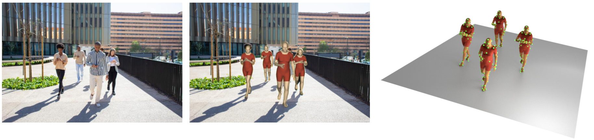
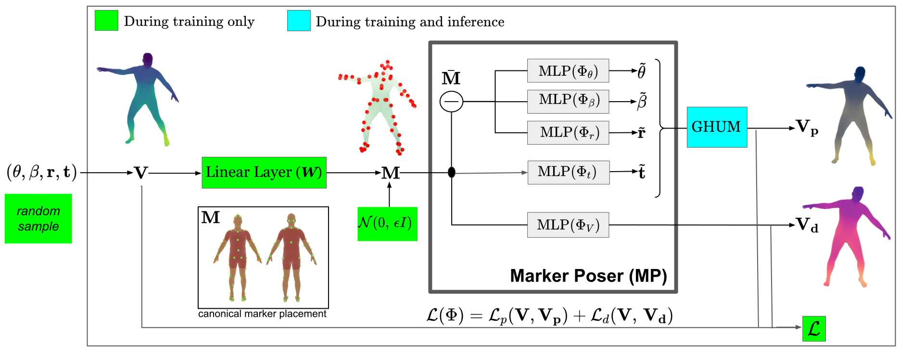
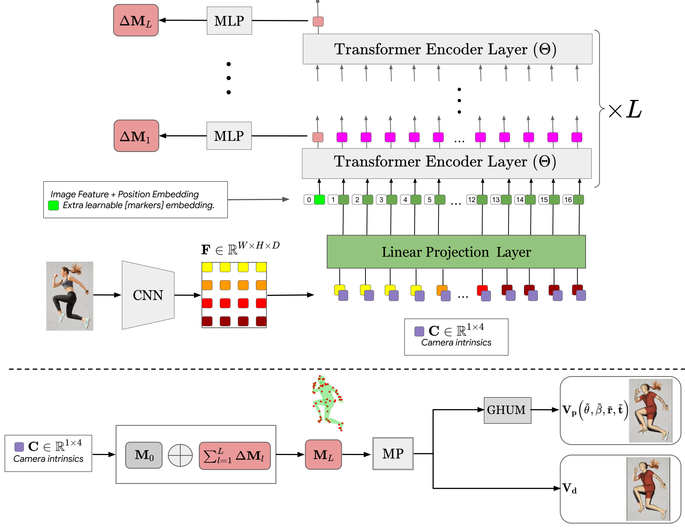

# THUNDR: Transformer-based 3D HUmaN Reconstruction with Markers
<p align="center"> Mihai Zanfir, &nbsp; Andrei Zanfir, &nbsp; Eduard Gabriel Bazavan, &nbsp; William T. Freeman,&nbsp;  Rahul Sukthankar, &nbsp; Cristian Sminchisescu </p>
<p align="center"> <strong>Google Research</strong> </p>

<p align="left">
  <a href="https://twitter.com/CSminchisescu"></a>
</p>

## Introduction

<p align="justify">We present THUNDR, a transformer-based deep neural network methodology to reconstruct the 3d pose and shape of people, given monocular RGB images. Key to our methodology is an intermediate 3d marker representation, where we aim to combine the predictive power of model-free-output architectures and the regularizing, anthropometrically-preserving properties of a statistical human surface model like GHUM -- a recently introduced, expressive full body statistical 3d human model, trained end-to-end. Our novel transformer-based prediction pipeline can focus on image regions relevant to the task, supports self-supervised regimes, and ensures that solutions are consistent with human anthropometry. We show state-of-the-art results on Human3.6M and 3DPW, for both the fully-supervised and the self-supervised models, for the task of inferring 3d human shape, joint positions, and global translation. Moreover, we observe very solid 3d reconstruction performance for difficult human poses collected in the wild. </p>

## Methodology
We rely on the visual reality of 3d body
surface markers (in some conceptualization, a ‘model-free’
representation) and that of a 3d statistical body (a ‘model-based’ concept) as pillars in designing a hybrid 3d visual
learning and reconstruction pipeline. Markers have the additional advantages of being useful for registration between
different parametric models, can be conveniently relied-upon
for fitting, and can be used as a reduced representation of
body shape and pose. Our model
combines multiple novel transformer refinement stages for
efficiency and localization of key predictive features, and relies on combining ‘model-free’ and ‘model-based’ losses for
both accuracy and for results consistent with human anthropometry.

### Marker Poser
Using synthetic training data, constructed by drawing samples from the latent spaces of GHUM, we train a network (i.e. Marker Poser) that translates surface marker locations to both the parameterization and mesh representation of GHUM.
<p align="middle">
 
</p>

### THUNDR Architecture
Different from existing pose
and shape estimation methods, that directly output the parameters of a human model from a
single feature representation of an image, we instead regress
an intermediate 3d representation in the form of surface landmarks (markers) and regularize it in training using the GHUM body model. Moreover, we preserve the spatial structure
of high-level image features by avoiding pooling operations,
and relying instead on self-attention to enrich our representation. We use a hybrid convolutional-transformer architecture, and iteratively
refine estimates by cascaded, input-sensitive
processing blocks, with homogeneous parameters.
<p align="middle">
 
</p>

## Paper
[Paper and supplementary material.](https://drive.google.com/file/d/1MgnwtvV_yIjUoeQXw0bRuedNjwCHQg7M/view?usp=sharing)

## Model Download
[THUNDR request form.](https://docs.google.com/forms/d/e/1FAIpQLSduGNoQUQxaIwna944hdgsX7m9bSM4aqh2YDXD02V2VfNnP9g/viewform)


## Citations
If you use this model or code for your publication, please cite the following paper [1](https://arxiv.org/pdf/2106.09336), [2](http://openaccess.thecvf.com/content_CVPR_2020/papers/Xu_GHUM__GHUML_Generative_3D_Human_Shape_and_Articulated_Pose_CVPR_2020_paper.pdf):
```
@article{zanfir2021thundr,
  title={THUNDR: Transformer-based 3D HUmaN Reconstruction with Markers},
  author={Zanfir, Mihai and Zanfir, Andrei and Bazavan, Eduard Gabriel and Freeman, William T and Sukthankar, Rahul and Sminchisescu, Cristian},
  booktitle={Proceedings of the IEEE/CVF Conference on Computer Vision and Pattern Recognition},
  year={2021}
}
```
```
@inproceedings{xu2020ghum,
  title={GHUM \& GHUML: Generative 3D Human Shape and Articulated Pose Models},
  author={Xu, Hongyi and Bazavan, Eduard Gabriel and Zanfir, Andrei and Freeman, William T and Sukthankar, Rahul and Sminchisescu, Cristian},
  booktitle={Proceedings of the IEEE/CVF Conference on Computer Vision and Pattern Recognition},
  pages={6184--6193},
  year={2020}
}
```

### Team
Mihai Zanfir, Andrei Zanfir, Eduard Gabriel Bazavan, William T. Freeman, Rahul Sukthankar, Cristian Sminchisescu

### Contact
If you have any questions about our model or code, please email
<ghum-inquiry@google.com>.

