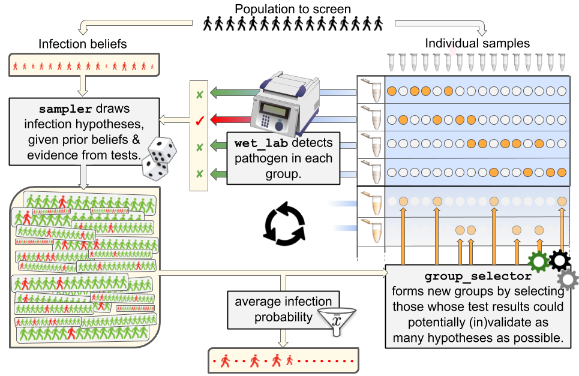
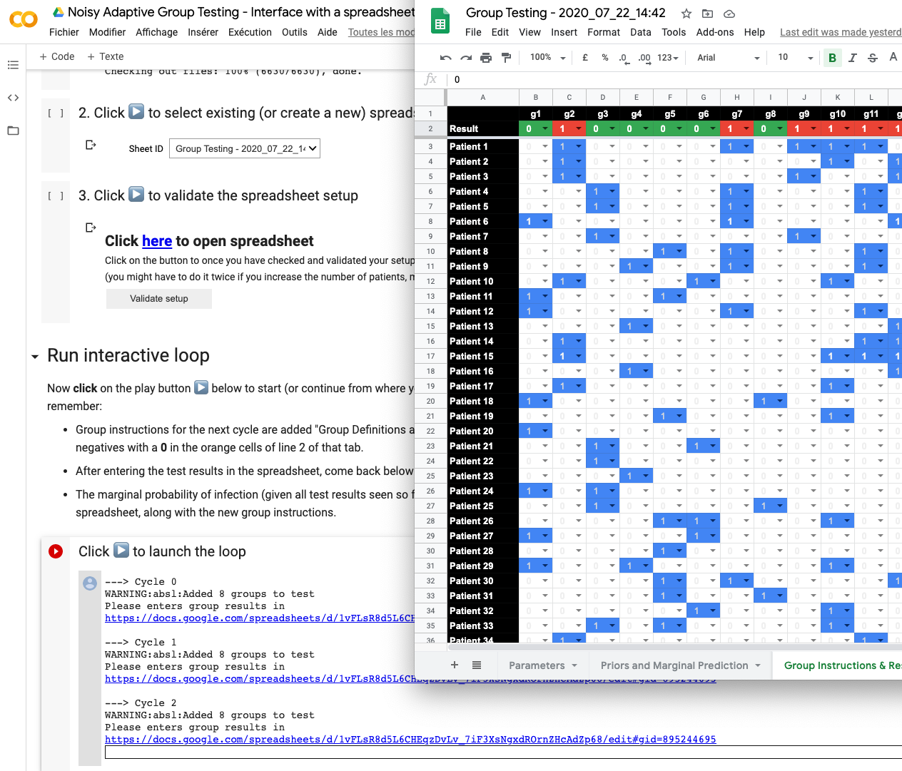

# Group Testing: screening more individuals with less tests

This folder contains the implementation of our [recent work on group testing](https://arxiv.org/abs/2004.12508), as described in our [blog post](https://ai.googleblog.com/2020/07/exploring-faster-screening-with-fewer.html).

In this work we revisit the [group testing problem](https://en.wikipedia.org/wiki/Group_testing), in which one can take advantage of testing pooled samples to accelerate the detection of infectious individuals in a large population. It is well known that the noisiness of tests (*i.e.* when there is a non-zero probability of seeing the test return as negative when the tested person is in fact infected, or vice-versa) can significantly degrade the performance of [classic Dorfman splitting](https://en.wikipedia.org/wiki/Group_testing#Invention_and_initial_progress) and more generally of [combinatorial approaches](https://en.wikipedia.org/wiki/Group_testing#Combinatorial_group_testing). We consider here a new strategy that can be used in such a noisy regime by relying instead on a purely Bayesian approach.

*Our first contribution* comes from the use of modern statistical techniques ([sequential Monte carlo samplers](https://en.wikipedia.org/wiki/Particle_filter), SMCS) to provide approximations to the posterior distribution of infection states given prior beliefs and tests observed so far. Note that this SMCS can be used to *decode test results for any group testing strategy*, not necessarily ours.

*Our second contribution* relies on the definition of criteria to select a next wave of tests, by using that posterior approximation to define a [Bayesian optimal experimental design](https://en.wikipedia.org/wiki/Bayesian_experimental_design) problem. Our algorithms select a new wave of groups by maximizing the expected (w.r.t. the posterior approximation) utility of these groups. We consider the expected neg-entropy of the posterior conditioned on the tests of these new groups (this is equivalent to maximizing the [mutual information](https://en.wikipedia.org/wiki/Mutual_information) between the new tests' results random vector and that of the posterior), as well as the average [AUC](https://en.wikipedia.org/wiki/Receiver_operating_characteristic#Area_under_the_curve) of all the possible marginal distributions that could be obtained by carrying out these tests, compared with all possible infection state vectors recorded in the posterior. Maximizing these two criteria over a binary space of pooling matrices is a difficult optimization problem that we tackle using a forward-backward [greedy algorithm](https://en.wikipedia.org/wiki/Greedy_algorithm). These two strategies are benchmarked against other baselines in our paper in a wide variety of settings, including misspecified setups, in which the algorithm operates with parameters (infection priors, sensitivity, specificity) that do not match those of the simulator.

## Overall description of source code

Our code base implements the following classes:

- A `simulator` object that can evaluate, through one or multiple runs, the performance of a group testing algorithm given a testing environment (size of population to be screened, prior of infection within that population, sensitivity/specificity of tests, maximum number of tests that can be run simultaneously, etc...).

- A `state` object that stores all relevant information observed so far in a simulation, and coordinates calls between testing actions carried out by a `wet_lab`, posterior sampling as produced by a `sampler` and the selection of new groups to test, as carried out sequentially by a `policy`:
  - a `wet_lab` is tasked with computing the testing results from pooled samples. This can be either simulated (in which case the `wet_lab` also sets arbitrarily the ground truth of who is infected or not, drawn using the `base_infection_rate` prior and stored in the `diseased` variable) or describes the entry point for a *real* wet lab that will produce actual test results using pooled samples and a testing machine.
  - a `sampler` object is loosely defined as an algorithm able to produce relevant information on the posterior probability distribution of the infected binary status vector of all screened patients, using both prior and past test results. We implemented [loopy belief propagation](https://en.wikipedia.org/wiki/Belief_propagation) (LBP) samplers that can compute the marginal distribution of infection given previous tests results, or, alternatively [SMC samplers](https://www.stats.ox.ac.uk/~doucet/delmoral_doucet_jasra_sequentialmontecarlosamplersJRSSB.pdf) that produce weighted samples (binary vectors) that aim to approximate the posterior distribution.
  - a `policy` object which is itself a sequence of `group_selector` objects. At each stage, the `policy` picks the `group_selector` corresponding to that stage and uses it to compute, using possibly past results and/or outputs from the `sampler`, the next wave of groups that should be tested.

- Because our contributions build on Bayesian analysis, we provide functions in `bayes` to evaluate prior and posterior probabilities. `metrics` describes which (and how) results from each simulation should be saved on file. `utils` contains miscellaneous functions.

## Everything in a drawing

The overall flow of information between all components, coordinated in the `simulator` object, is described in the figure below.



*The starting point of group testing is defined by a population to screen (on top). That population provides two pieces of information: samples and prior beliefs on infection rates. From there, a `sampler` object will draw thousands of hypotheses that build on the prior and tests carried out so far (if any). This will be used at any time to provide an expected infection rate for each individual, along with the input required by a `group_selector` object to propose new groups. These groups are then passed on to a `wet_lab`, which tasked with producing test results. The loop is then closed when the `wet_lab` communicates these results to the `sampler` to trigger the drawing of updated hypotheses.*

## Using our code

You can play with our code in three different ways.

### Colab/Spreadsheet

You can give the algorithm a try by following step-by-step the instructions of the colab available [here](https://colab.research.google.com/drive/14rQO9mDRvuyj89pgcUMCFk6LXHq7-avR?usp=sharing).

The colab will ask to be given access to your Google Drive, to store results in a spreadsheet. That spreadsheet will store all of the parameters of your experiment, as well as the group instructions that will be filled iteratively by the algorithm. You will then need to fill the test results as you carry them out, in order to recover new groups and an infection prediction.



### Line Interactive

The line command mode gives you more freedom in setting parameters. The experimental setup should go in a `gin` config file (see `configs/toy.gin` for a blueprint). This file defines hyperparemeters, described below in step 1.

In this mode, the user will receive groups of patients to be pooled and tested, and will be asked to list (using the command line) those that returned positive. Once the user submits these results, the selected policy will compute and return new groups to be tested, as well as the marginal infection probability of each individual, that is to say the current belief that each patient is infectious, based on the initial prior and all test results seen so far.

To run this mode:

```python
python3 -m run_experiment --gin_config=configs/toy.gin --interactive_mode
```

The detailed protocol sequence is as follows:

#### 1. Acquisition of patients’ samples (user → algorithm) 

The user can provide in a `.gin` file parameters for pretty much all aspects of the experiment. We describe some of these settings in the `toy.gin` file. Two crucial parameters are:

- `WetLab.num_patients`: Number *n* of patients in the batch to be tested.
- `Simulator.num_tests_per_cycle`: number of tests available to investigate infection in that batch at every cycle.

#### 2. Algorithm selects groups, sends them to user (algorithm → user)

In this phase the algorithm collects the most recent wave of group tests (if any), samples from posterior distribution if needed, and proposes new groups to tests. In addition, the algorithm also provides an estimate of the probability of infection of each patient. Namely, the algorithm will produce two outputs that the user can use:

- `groups_to_test`: a binary matrix with `num_test_per_cycle` lines (describing as many groups) and `num_patients` columns. Each line describes what set of individual samples should be pooled together to form a group.
- `marginal_distribution`: a vector of `num_patients` values between 0 and 1 summarizing the current infection probability for each patient.

#### 3. User stops the interaction, or tests instructed groups and sends back test results (user → algorithm)

At this stage, the wetlab has two options:

- The user wishes to stop the experiment and uses `marginal_distribution` vector to decide who should be flagged as positive or not, and exit the process. That `marginal_distribution` is currently computed using LBP if it has converged, or by running an SMC otherwise (see p.7 of our [paper](https://arxiv.org/abs/2004.12508) for a discussion on decoding test results).

- Using the instructions described in `groups_to_test`, the user continues the experiment and tests these groups, and sends results back to the algorithm. The following information must be provided:
-- `test_results` : indices of the latest wave of instructed groups that have returned positive.
Once these results are sent via command line, we go back to step 2 in which the algorithm will propose new groups using that extra information.

### Simulator

The third mode is designed to assess the performance of a policy (here understood as sequential experimental design algorithm) in a completely simulated environment. This mode is of interest to researchers who would like to define new policies, or benchmark existing ones. This is the one we used to produce results in the paper.

At each simulation, the infection status of patients is re-sampled according to the prior provided to the `wet_lab`. From then on, the user's tests will be simulated with the sensitivity and specificity parameters given to the `wet_lab`. These results are communicated sequentially to the `policy`, which uses them to `sample` and next select groups.

When enough simulations are run, the policy's average precision-recall or ROC characteristics can be evaluated.

To run this second mode and assess the performance of a group testing strategy:

```python
python3 -m run_experiment --gin_config=configs/toy.gin --nointeractive_mode
```
