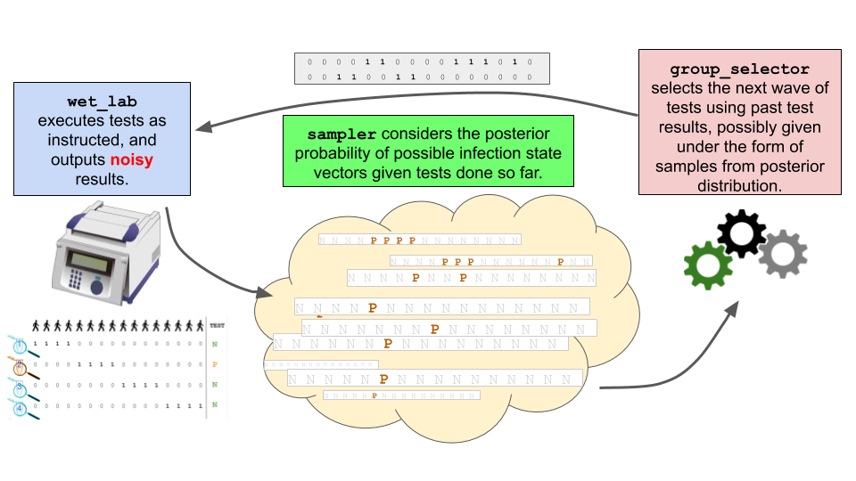

## Group Testing: screening more individuals with less tests

This folder contains the implementation of our [recent work on group testing](https://arxiv.org/abs/2004.12508).

In this work we revisit the [group testing problem](https://en.wikipedia.org/wiki/Group_testing), in which one can take advantage of testing pooled samples from individuals (rather than testing each of them), to accelerate the detection of infectious individuals in a large population. It is well known that the noisiness of tests (*i.e.* when there is a non-zero probability of seeing the test return as negative when the tested person is in fact infected, or vice-versa) can significantly degrade the performance of [classic Dorfman splitting](https://en.wikipedia.org/wiki/Group_testing#Invention_and_initial_progress) and more generally of [combinatorial approaches](https://en.wikipedia.org/wiki/Group_testing#Combinatorial_group_testing). We consider here a new strategy that can be used in such a noisy regime.

In this work, we take noise in tests into account by switching to a Bayesian approach. Our contribution comes from the use of modern statistical techniques ([sequential Monte carlo samplers](https://en.wikipedia.org/wiki/Particle_filter) (SMCS), greedy optimization of a [mutual information](https://en.wikipedia.org/wiki/Mutual_information) criterion) to propose a cost-effective sequential approach to test individuals. Our contribution is benchmarked against other baselines in several experiments. These experiments can be replicated using this code, which includes the following elements:

- A `simulator` object that can evaluate, through one or multiple runs, the performance of a group testing algorithm given a testing environment (size of population to be screened, prior of infection within that population, sensitivity/specificity of tests, maximum number of tests that can be run simultaneously, etc...).

- A `state` object that stores all relevant information observed so far in a simulation, and coordinates calls between testing actions carried out by a `wet_lab`, posterior sampling as carried out by `samplers` and group optimization as carried out by a `policy`:
  -  a `wet_lab` is tasked with computing the testing results from pooled samples. This can be either simulated (in which case the `wet_lab` also sets arbitrarily the ground truth of who is infected or not, typically randomly) or describes a *real* wet lab that will produce actual test results using pooled samples and a testing machine.
  - a `samplers` object is loosely defined as an algorithm able to produce relevant information on the posterior probability distribution (given a prior and past test results) of the infected binary status vector of all screened patients. We propose [loopy belief propagation](https://en.wikipedia.org/wiki/Belief_propagation) (LBP) samplers that can compute the marginal distribution of infection given previous tests results, or, alternatively SMC samplers that produce weighted samples (binary vectors) from the exhaustive posterior distribution.
  - `policy` objects contain a sequence of `group_selectors` objects. At each stage, the policy chooses the group selector to be used at that stage to compute, using outputs from `samplers`, the next wave of groups that should be tested.

- Because our contributions build on Bayesian analysis, we provide functions in `bayes` to evaluate prior and posterior probabilities. `metrics` describes which (and how) results should be saved on file.

The overall flow of information between all components, coordinated in the `simulator` object, is described in the figure below.


*Flow of information between the `wet_lab`, tasked with producing test results, communicated next to a `sampler` that can refresh his estimate of the posterior distribution, to inform next the proposal of new groups by the `group_selector` object*

Our code can be run in two different modes.

# Interactive Mode 
In the interactive mode, a user tasked with the problem of finding infectious individuals in a population can use the algorithm to receive instructions on whom to pool with whom next. From the user's point of view, the interaction with the algorithm consists in receiving group testing instructions (an assay matrix), along with a (marginal) infection probability, and use these instructions to send back results.

To interact with a group testing algorithm, the user must describe the experimental setup using a `gin` config file (see `configs/toy.gin` for a blueprint). This file defines hyperparemeters: the number of patients currently screened, priors on their infection, and prior parameters of testing device such as specificity and sensitivity (these can be group size dependent), the maximal size allowed for groups, and the maximal number of tests per stage.

In this mode, the user will receive groups of patients to be pooled and tested, and will be asked to list (using the command line) those that returned positive. Once the user submits these results, the algorithm (possibly ours, G-MIMAX) will compute and return new groups to be tested, as well as the marginal infection probability of each individual, that is to say the current belief that each patient is infectious, as computed using LBP, based on the initial prior and all test results seen so far.

To run this first mode:
```
python3 -m run_experiment --gin_config=configs/toy.gin --interactive_mode
```

The detailed protocol sequence is as follows:

## 1. Acquisition of patients’ samples (user → algorithm) 

The user acquires samples from *n* patients. We recommend settings where *n* is smaller than 80, since this is what we have tested in simulations so far. If the actual number of patients is larger, e.g. 200, we expect the user to split that population in smaller batches (e.g. 3 of ~66 if *n*=200), and run the protocol below in parallel, for as many batches as needed.

The user must provide the following information. In the absence of that information, the algorithm will switch to default values.
- `num_patients`: Number n of patients in the batch 
- `prior_infection_rate`, either shared across the batch, or specified for each individual. This is the prior probability that each of the *n* patients is infected. This value might be individualized (i.e, using covariates, contact tracing, etc.) or global (everybody shares the same risk). This will be therefore either a number between 0 and 1, or an array of *n* numbers between 0 and 1.
- `prior_specificity` and `prior_sensitivity` of tests. This could be for instance provided by the manufacturer of the testing device, or based on more detailed statistics compiled by the user. Each of these parameters can be a number, or an array describing the value as a function of a groups' size. The algorithm will consider that the last value of that array is the one that applies for any group whose size is larger than the size of the array.
- `num_tests_per_cycle`: number of tests available for the batch at the next iteration. The user signals how many tests should be available for the algorithm in the next sequence. 

## 2. Algorithm selects groups, sends them to user (algorithm → user)

In this phase the algorithm collects previous group tests (if any), samples from posterior distribution if needed, and computes candidate groups to output a new group testing sequence. The algorithm also provides an estimate of the probability of infection of each patient. Namely, the algorithm will produce two outputs that the user can use:
- `groups_to_test`: a binary matrix with `num_test_per_cycle` lines (describing as many groups) and `num_patients` columns. Each line describes what set of individual samples should be pooled together to form a group.
- `marginal_distribution`: a vector of `num_patients` values between 0 and 1 summarizing the current belief (or probability) of infection for each patient.

## 3. User stops the interaction, or tests instructed groups and sends back test results (user → algorithm)

At this stage, the wetlab has either two options:
- If the user has no more tests available for the next cycle, the user can use the information contained in the  `marginal_distribution` vector to decide who should be flagged as positive or not, and exit the process.

- Using the instructions described in groups_to_test, the user can choose to carry out as many tests as possible among those instructed, and sends results back to the algorithm. The following information must be provided:
-- `test_results` : indices of the latest wave of instructed groups that have returned positive.
Once these results are sent via command line, we go back to step 2 in which the algorithm will compute new tests using that extra information.


# Simulation Mode 

The second mode is designed to assess the performance of a policy (here understood as sequential experimental design algorithm) in a completely simulated environment. This mode is of interest to researchers who would like to define new policies, or benchmark existing ones.

At each simulation, the infection status of patients is sampled according to the prior that is provided (can be per individual). From then on, the user's tests will be simulated with a configurable sensitivity and specificity (can be per group size), and will be communicated sequentially to the policy. When enough simulations are run, the policy's precision-recall or ROC characteristics can be evaluated in a particular setup.

This mode is of course designed to be launched at large scale, in order to obtain a faithful picture of the performance of difference policies, using notably different infection rate regimes or different level of noises in testing devices for instance.

To run this second mode and assess the performance of a group testing strategy:
```
python3 -m run_experiment --gin_config=configs/toy.gin --nointeractive_mode
```
