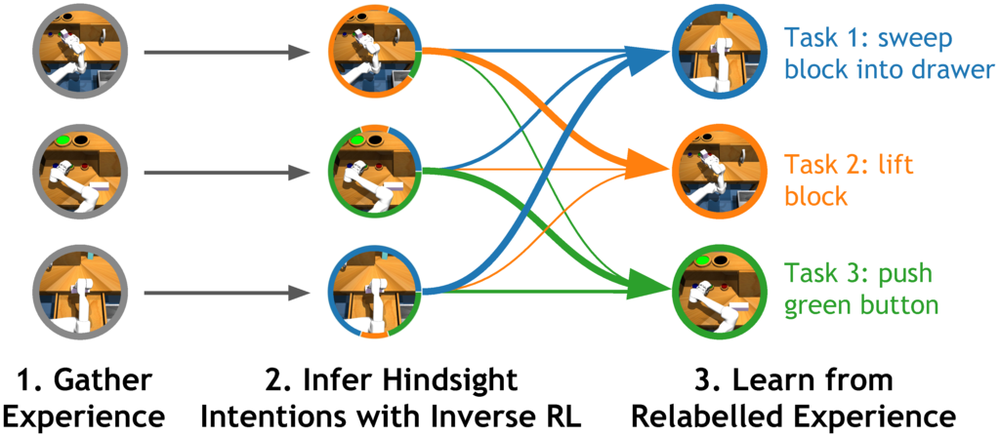

# Rewriting History with Inverse RL: Hindsight Inference for Policy Improvement

<p align="center"> Benjamin Eysenbach, &nbsp; Young Geng, &nbsp; Sergey Levine, &nbsp; Ruslan Salakhutinov </p>

<p align="center">
  <br>
   <a href="https://arxiv.org/abs/2002.11089">paper</a>
</p>

This repository provides an implementation of Hindsight Inference for Policy Improvement [HIPI] from "Rewriting History with Inverse RL: Hindsight Inference for Policy Improvement."

**Abstract**: Multi-task reinforcement learning (RL) aims to simultaneously learn policies for solving many tasks. Several prior works have found that relabeling past experience with different reward functions can improve sample efficiency. Relabeling methods typically pose the question: if, in hindsight, we assume that our experience was optimal for some task, for what task was it optimal? Inverse RL answers this question. In this paper we show that inverse RL is a principled mechanism for reusing experience across tasks. We use this idea to generalize goal-relabeling techniques from prior work to arbitrary types of reward functions. Our experiments confirm that relabeling data using inverse RL outperforms prior relabeling methods on goal-reaching tasks, and accelerates learning on more general multi-task settings where prior methods are not applicable, such as domains with discrete sets of rewards and those with linear reward functions.

If you use this code, please consider adding the corresponding citation:

```
@inproceedings{eysenbach2020hindsight,
  title={Rewriting History with Inverse RL: Hindsight Inference for Policy Improvement},
  author={Eysenbach, Benjamin and Geng, Young and Levine, Sergey and Salakhutinov, Ruslan},
  booktitle={Advances in Neural Information Processing Systems},
  year={2020}
}

```

## Installation
These instructions were tested in Google Cloud Compute with Ubuntu version 18.04.

### 1. Install Mujoco
Copy your mujoco key to `~/.mujoco/mjkey.txt`, then complete the steps below:

```
sudo apt install unzip gcc libosmesa6-dev libgl1-mesa-glx libglfw3 patchelf libglew2.0
sudo ln -s /usr/lib/x86_64-linux-gnu/libGL.so.1 /usr/lib/x86_64-linux-gnu/libGL.so
wget https://www.roboti.us/download/mujoco200_linux.zip -P /tmp
unzip /tmp/mujoco200_linux.zip -d ~/.mujoco
ln -s ~/.mujoco/mujoco200_linux ~/.mujoco/mujoco200
echo "export LD_LIBRARY_PATH=\$LD_LIBRARY_PATH:$HOME/.mujoco/mujoco200/bin" >> ~/.bashrc
```

### 2. Install Anaconda
```
wget https://repo.anaconda.com/miniconda/Miniconda2-latest-Linux-x86_64.sh
chmod +x Miniconda2-latest-Linux-x86_64.sh
chmod +x ./Miniconda2-latest-Linux-x86_64.sh
```
Restart your terminal so the changes take effect.


### 3. Create an Anaconda environment and install the remaining dependencies
```
conda create --name hipi python=3.6
conda activate hipi
pip install tensorflow==2.2.0
pip install tf_agents==0.5.0
pip install gym==0.13.1
pip install mujoco-py==2.0.2.10
pip install tqdm==4.46.1
pip install dm-control==0.0.300771433
pip install git+https://github.com/rlworkgroup/metaworld.git@master#egg=metaworld

```

## Running Experiments

Experiments can be run as follows, replacing `ENVIRONMENT_ARGS` with one of the options specified later in this section.

```
MUJOCO_GL=osmesa python train_eval.py
--gin_bindings='train_eval.relabel_type="soft"' \
--gin_bindings='RelabellingReplayBuffer.relabel_prob=0.5' \  # Only relabel the goal with 50% probability
--gin_bindings='RelabellingReplayBuffer.keep_current_goal=True' \ # Use both the commanded goal and the reached goal for 'last' relabeling
--gin_bindings='train_eval.train_steps_per_iteration=1' \
--gin_bindings='train_eval.batch_size=32' \
--gin_bindings="RelabellingReplayBuffer.candidate_task_type='tasks'"
ENVIRONMENT_ARGS
```

Choose the relabeling strategy by setting `train_eval.relabel_type` to

* 'none' -- no relabelling
* 'soft' -- HIPI (our method)
* 'last' -- HER
* 'future' -- Choose a random future state as the goal

### Environments
Below, we specify the *additional* arguments for using each environment.

#### Goal Reaching Tasks

DM Quadruped:

```
--gin_bindings='train_eval.env_name="quadruped"' --gin_bindings='quadruped_reward.goal_radius=0.3' --gin_bindings='quadruped_reward.goal_distance=1.0' --gin_bindings='quadruped_reward.sparse=True'
```

DM Finger:

```
--gin_bindings='train_eval.env_name="finger"' --gin_bindings='get_py_env.use_neg_rew=True' --gin_bindings='train_eval.clip_critic=(-1000, 0)' --gin_bindings='get_py_env.margin=0.01'
```

2D Reacher:

```
--gin_bindings='train_eval.env_name="reacher"' --gin_bindings='get_py_env.use_neg_rew=True' --gin_bindings='train_eval.clip_critic=(-1000, 0)' --gin_bindings='get_py_env.margin=0.01'
```

Sawyer Reach:

```
--gin_bindings='train_eval.env_name="sawyer-reach"' --gin_bindings='SawyerDynamics.random_init=True' --gin_bindings='SawyerReachTaskDistribution.margin=0.03'
```

2D Navigation:

```
--gin_bindings='train_eval.env_name="point_FourRooms_3"' --gin_bindings='train_eval.max_episode_steps=75' --gin_bindings='PointGoalDistribution.use_neg_rew=True' --gin_bindings='PointGoalDistribution.random_initial_state=False' --gin_bindings='PointGoalDistribution.min_goal_distance=15' --gin_bindings='PointGoalDistribution.at_goal_dist=0.3'
```

#### General Tasks

2D Reacher: Discrete Tasks

```
--gin_bindings='train_eval.env_name="reacher-discrete"' --gin_bindings='ReacherDiscreteTaskDistribution.margin=0.01' --gin_bindings='ReacherDiscreteTaskDistribution.linear=False' --gin_bindings='train_eval.clip_critic=(-1000, 0)'
```

Walker: Linear Rewards

```
--gin_bindings='train_eval.env_name="walker"' --gin_bindings='train_eval.max_episode_steps=100'
```

Sawyer Reach: Goal + Margin:

```
--gin_bindings='train_eval.env_name="sawyer-reach"' --gin_bindings='train_eval.gradient_clipping=True' --gin_bindings='SawyerReachTaskDistribution.margin=True' --gin_bindings='SawyerReachTaskDistribution.max_margin=0.1'
```
