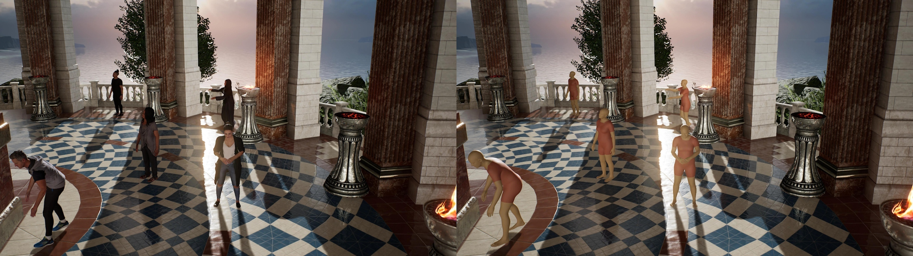
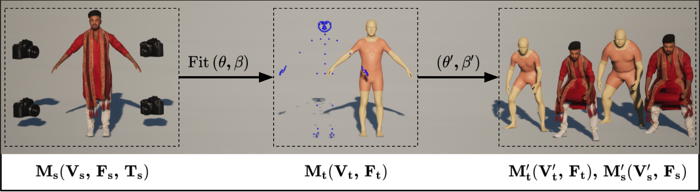
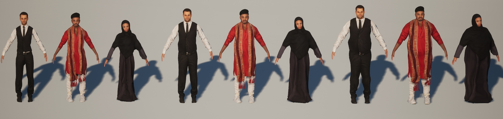
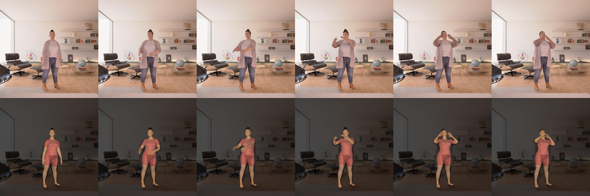
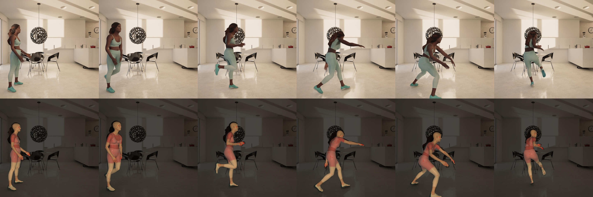
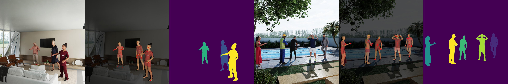

# HSPACE: Synthetic Parametric Humans Animated in Complex Environments
<p align="center"> Eduard Gabriel Bazavan, &nbsp; Andrei Zanfir, &nbsp; Mihai Zanfir, &nbsp;  William T. Freeman,&nbsp;  Rahul Sukthankar, &nbsp; Cristian Sminchisescu </p>
<p align="center"> <strong>Google Research</strong> </p>

<p align="left">
  <a href="https://twitter.com/CSminchisescu"></a>
</p>

## Introduction

Advances in the state of the art for 3d human sensing are currently limited by
 the lack of visual datasets with 3d ground truth, including multiple people,
in motion, operating in real-world environments, with complex illumination or
occlusion, and potentially observed by a moving camera. Sophisticated scene
understanding would require estimating human pose and shape as well as gestures,
towards representations that ultimately combine useful metric and behavioral
signals with free-viewpoint photo-realistic visualisation capabilities. To
sustain progress, we build a largescale photo-realistic dataset,
Human-SPACE (HSPACE), of animated humans placed in complex synthetic indoor and
outdoor environments. We combine a hundred diverse individuals of varying ages,
gender, proportions, and ethnicity, with hundreds of motions and scenes, as well
as parametric variations in body shape (for a total of 1,600 different humans),
in order to generate an initial dataset of over 1 million frames. Human
animations are obtained by fitting an expressive human body model, GHUM, to
single scans of people, followed by novel re-targeting and positioning
procedures that support the realistic animation of dressed humans,
statistical variation of body proportions, and jointly consistent scene
placement of multiple moving people. Assets are generated automatically, at
scale, and are compatible with existing real time rendering and game engines.
The dataset with evaluation server will be made available for research. Our
large-scale analysis of the impact synthetic data, in connection with real data
and weak supervision, underline the considerable potential for continuing
quality improvements and limiting the sim-to-real gap, in this practical
setting, in connection with increased model capacity.</p>

<p align="center">
  
</p>

## Features

### Methodology for Reposing and Reshaping

The first stage in our pipeline is to fit the [GHUM model](http://openaccess.thecvf.com/content_CVPR_2020/papers/Xu_GHUM__GHUML_Generative_3D_Human_Shape_and_Articulated_Pose_CVPR_2020_paper.pdf)
to an initial 3d scan of a person. We build a representation that supports the
plausible animation of both the body and the clothing based on different 3d
 motion capture signals.

<p align="center">
  
</p>

The shape can also be varied obtaining scans with different appearance and body
mass index, reasonable automatic clothing deformations synthesized using GHUM
statistical shape parameters.

<p align="center">
  
</p>

Reposed and reshaped scans are animated with retargetted motion capture data.
Highly dynamic motions work best with characters wearing tight fitted clothing,
the sequences look natural and smooth, but good performance can be achieved for
less tight clothing.

<p align="center">
  
  
</p>

### Multiple Render Passes

Scans are animated and placed in complexly lit 3d scenes. For each
sequence we generate multiple render passes including RGB, segmentation masks
and ground truth GHUM 3D pose and shape information for each character.

<p align="center">
  
</p>

## Paper
More details can be found in the companion [HSPACE paper](https://arxiv.org/abs/2112.12867).

## Citations
If you use this model or code for your publication, please cite the following papers
[1](https://arxiv.org/abs/2112.12867), [2](http://openaccess.thecvf.com/content_CVPR_2020/papers/Xu_GHUM__GHUML_Generative_3D_Human_Shape_and_Articulated_Pose_CVPR_2020_paper.pdf) and
[3](https://openaccess.thecvf.com/content/ICCV2021/html/Zanfir_THUNDR_Transformer-Based_3D_Human_Reconstruction_With_Markers_ICCV_2021_paper.html):

```
@misc{bazavan2021hspace,
      title={HSPACE: Synthetic Parametric Humans Animated in Complex Environments},
      author={Eduard Gabriel Bazavan and Andrei Zanfir and Mihai Zanfir and William T. Freeman and Rahul Sukthankar and Cristian Sminchisescu},
      year={2021},
      eprint={2112.12867},
      archivePrefix={arXiv},
      primaryClass={cs.CV}
}
```

```
@inproceedings{xu2020ghum,
  title={GHUM \& GHUML: Generative 3D Human Shape and Articulated Pose Models},
  author={Xu, Hongyi and Bazavan, Eduard Gabriel and Zanfir, Andrei and Freeman, William T and Sukthankar, Rahul and Sminchisescu, Cristian},
  booktitle={Proceedings of the IEEE/CVF Conference on Computer Vision and Pattern Recognition},
  pages={6184--6193},
  year={2020}
}
```

```
@article{zanfir2021thundr,
  title={THUNDR: Transformer-based 3D HUmaN Reconstruction with Markers},
  author={Zanfir, Mihai and Zanfir, Andrei and Bazavan, Eduard Gabriel and Freeman, William T and Sukthankar, Rahul and Sminchisescu, Cristian},
  booktitle={Proceedings of the IEEE/CVF Conference on Computer Vision and Pattern Recognition},
  year={2021}
}
```

### Team
Eduard Gabriel Bazavan, Andrei Zanfir, Mihai Zanfir, William T. Freeman, Rahul Sukthankar, Cristian Sminchisescu

## Dataset Download
Please fill in the [this form](https://docs.google.com/forms/d/1wEXK5INhOh7BNJfFHu8XevfRKo2gg3xqgi2CdbSYPQs/viewform?edit_requested=true). The dataset is currently in alpha version so there might be upcoming changes. Feedback is welcome!

The data will be available at [https://storage.cloud.google.com/hspace_public](https://storage.cloud.google.com/hspace_public) once access is granted. After downloading this dataset please accept and use it in accordance with the [Google AI Principles](https://ai.google/principles/).

## Contact
Please contact hspace-inquiry@google.com.


