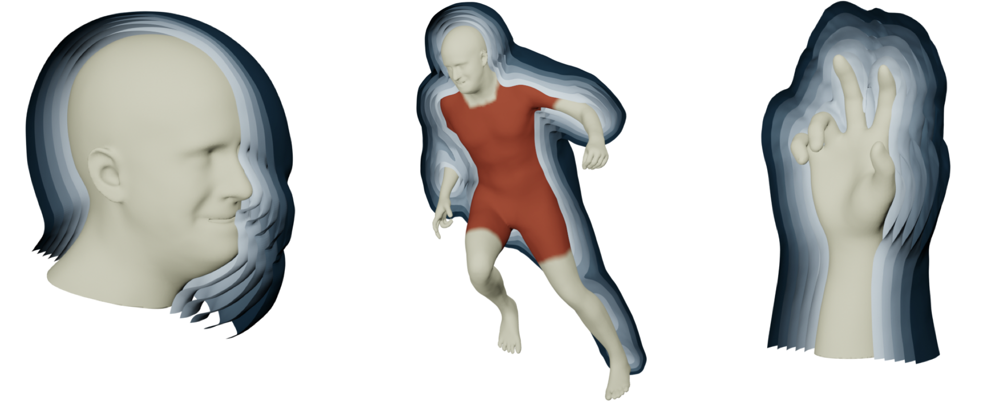
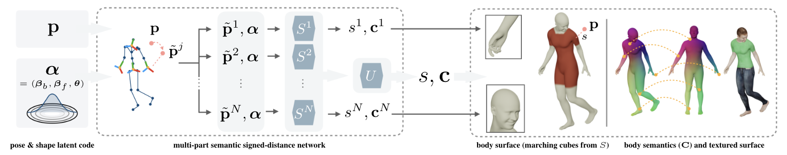
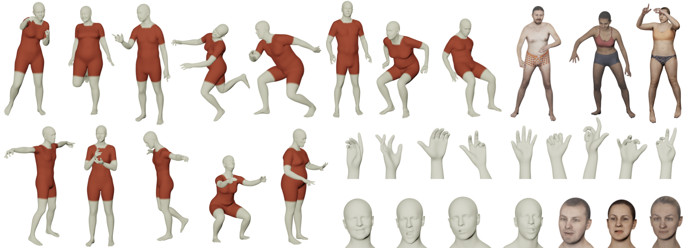
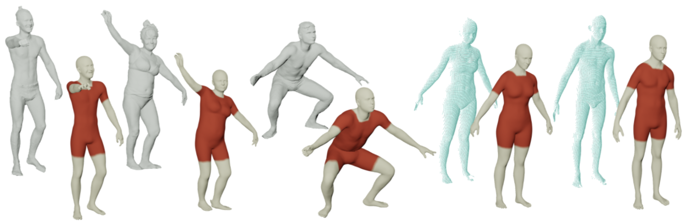
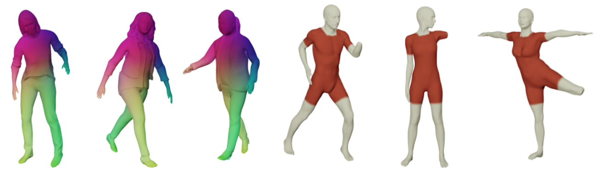

# imGHUM: Implicit Generative Models of 3D Human Shape and Articulated Pose

<p align="center">Thiemo Alldieck*, &nbsp&nbsp&nbsp Hongyi Xu*,&nbsp&nbsp&nbsp Cristian Sminchisescu </p>
<p align="center"> <strong>Google Research</strong> </p>

<p align="left">
  <a href="https://twitter.com/CSminchisescu"></a>
</p>

## Introduction
<p align="justify"> We present **imGHUM**, the first holistic generative model of 3D  human shape and articulated pose, represented as a signed distance function. In contrast to prior work, we model the full human body implicitly as a function zero-level-set and without the use of an explicit template mesh. We propose a novel network architecture and a learning paradigm, which make it possible to learn a detailed implicit generative model of human pose, shape, and semantics, on par with state-of-the-art mesh-based models. Our model features desired detail for human models, such as articulated pose including hand motion and facial expressions, a broad spectrum of shape variations, and can be queried at arbitrary resolutions and spatial locations. Additionally, our model has attached spatial semantics making it straightforward to establish correspondences between different shape instances, thus enabling applications that are difficult to tackle using classical implicit representations. In extensive experiments, we demonstrate the model accuracy and its applicability to current research problems.
  
<p align="center">
  
</p>

## Features and Applications
### Implicit Generative 3D Human Shape, Facial Expression and Articulated Pose
imGHUM generalizes well to novel shapes and poses, sharing the generative latent space with GHUM for 3D human shape, facial expression, articulated body and hand pose. We provide gender-neutral, male and female imGHUM models of the full body, head, left and right hand. The implicit semantics returned by imGHUM allows e.g. for surface coloring or texturing. 
<p align="center">
  
</p>

### Point Cloud Reconstruction and Completion
imGHUM enables differential and fast signed distance query for arbitrary spatial points. 
<p align="center">
  
</p>

### Dressed and Inclusive Human Modeling
imGHUM is topology free which allows us to leverage it as an inner layer for building personalized and animatable human models.  
<p align="center">
  
</p>

## Paper
[Paper and supplementary material](https://drive.google.com/file/d/1p5LQ6jg4Flu8MF122TQe2ASigjxnWq_Q/view?usp=sharing)

[Video](https://drive.google.com/file/d/1FOnjVMYc6abPg39BR7tM6hf3Z4JtgWhn/view?usp=sharing)

## Model Download

[imGHUM request form](https://docs.google.com/forms/d/e/1FAIpQLSduGNoQUQxaIwna944hdgsX7m9bSM4aqh2YDXD02V2VfNnP9g/viewform).

## Citations
If you use this model or code for your publication, please cite the following papers [1](https://drive.google.com/file/d/1p5LQ6jg4Flu8MF122TQe2ASigjxnWq_Q/view?usp=sharing)
, [2](http://openaccess.thecvf.com/content_CVPR_2020/papers/Xu_GHUM__GHUML_Generative_3D_Human_Shape_and_Articulated_Pose_CVPR_2020_paper.pdf):
```
@inproceedings{alldieck2021imghum,
  title={imGHUM: Implicit Generative Models of 3D Human Shape and Articulated Pose},
  author={Alldieck, Thiemo and Xu, Hongyi and Sminchisescu, Cristian},
  booktitle={Proceedings of the IEEE/CVF International Conference on Computer Vision},
  pages={},
  year={2021},
}
```
```
@inproceedings{xu2020ghum,
  title={GHUM \& GHUML: Generative 3D Human Shape and Articulated Pose Models},
  author={Xu, Hongyi and Bazavan, Eduard Gabriel and Zanfir, Andrei and Freeman, William T and Sukthankar, Rahul and Sminchisescu, Cristian},
  booktitle={Proceedings of the IEEE/CVF Conference on Computer Vision and Pattern Recognition},
  pages={6184--6193},
  year={2020}
}
```


### Contact
If you have any questions about our model or code, please email
<ghum-inquiry@google.com>.
