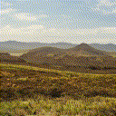
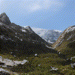
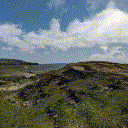

# InfiniteNature-Zero

[Project Page](https://infinite-nature-zero.github.io) |
[Paper](https://arxiv.org/abs/2207.11148)

This code accompanies the paper

**InfiniteNature-Zero: Learning Perpetual View Generation of Natural Scenes from
Single Images** \
Zhengqi Li, Qianqian Wang, Noah Snavely, Angjoo Kanazawa

*Please note that this is not an officially supported Google product.*

## Instructions for installing dependencies

### Python Environment

The following codebase was successfully run with Python 3.8 and Cuda11.3. We
suggest installing the library in a vitual environment such as Anaconda.

To install required libraries, run: \
`conda env create -f enviornment_infinite_nature_zero.yml`

To install softmax splatting for point cloud rendering, clone and pip install
the library from [here](https://github.com/hperrot/splatting).

To install StyleGAN2 backbone, run : \
`git clone https://github.com/rosinality/stylegan2-pytorch`

Apply the patch to update StyleGAN network code: \
`git apply stylegan2_upgrade.patch`

and copy modifed model.py to `models` directory.

Finally, copy the 'op' folder to `models/networks` directory.


### Downloading data and pretrained checkpoint

We include a pretrained checkpoint trained on the LHQ dataset
and input examples that can be accessed by running:

```
wget https://storage.googleapis.com/gresearch/infinite_nature_zero/infinite_nature_zero_ckpts_data.zip
unzip infinite_nature_zero_ckpts_data.zip
```

### Running InfiniteNature-Zero

We provide code for running our pretrained checkpoint. Note that if you modify
the code to run on other nature images, you will need to (1) compute disparity
using MiDasV2 (no DPT). The disparity map should be placed in folder
`test-data/midas-disp`; (2) compute semantic segmentation for sky identification
using [DeepLab](https://github.com/kazuto1011/deeplab-pytorch). The segmentation
should be placed in folder `test-data/sky_mask`; (3) outpaint the input image
using a GAN inversion method such as [SOAT](https://github.com/mchong6/SOAT)
for GAN
generated images, or [InfinityGAN](https://github.com/hubert0527/infinityGAN)
for real photos. In our code, we assume input images are at resolution 256x256
before performing central crop and resizing, and outpainted images are at
resolution 384x384. The outpainted images should be placed in folder
`test-data/images`.

The following command:

`python -m pvg_lhq-test`

will run 100 steps of Infinite Nature Zero using autocruise to control the pose
and save the frames to `release-test-outputs/`. You will get the following
results (note that different runs of
generator will generate different sequences)

  


### Contact

For any questions related to our paper,
please send email to zhengqili@google.com.

### Bibtex

```
@inproceedings{li2022_infinite_nature_zero,
  title     = {InfiniteNature-Zero: Learning Perpetual View Generation of Natural Scenes from Single Images},
  author    = {Li, Zhengqi and Wang, Qianqian and Snavely, Noah and Kanazawa, Angjoo},
  booktitle = {ECCV},
  year      = {2022}
}
```
