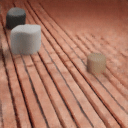
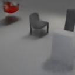

## Invariant Slot Attention

This repository contains the code release for "Spatial Symmetry in Slot Attention".
The code is derived from the [Slot Attention Video codebase](https://github.com/google-research/slot-attention-video).

<br />






Paper:
https://openreview.net/pdf?id=nk_nSogsrZL

## Instructions
> ℹ️ The following instructions assume that you are using JAX on GPUs and have CUDA and CuDNN installed. For more details on how to use JAX with accelerators, including requirements and TPUs, please read the [JAX installation instructions](https://github.com/google/jax#installation).

Get dependencies and run model training via
```sh
./invariant_slot_attention/run.sh
```

Or use
```sh
git clone https://github.com/google-research/scenic.git
cd scenic
pip3 install .
cd ../
pip3 install -r invariant_slot_attention/requirements.txt
```
to install dependencies and
```sh
python -m invariant_slot_attention.main --config invariant_slot_attention/configs/tetrominoes/equiv_transl.py --workdir tmp/
```
to train the smallest Invariant Slot Attention model on 512 examples drawn from [Tetrominoes](https://github.com/deepmind/multi_object_datasets).

We provide configs and data loaders for six datasets: Tetrominoes, Objects Room,
MultiShapeNet-Easy, CLEVR, CLEVRTex and Waymo Open. The first four can be run
without explicit download or preprocessing, whereas CLEVRTex and Waymo Open
have to be manually downloaded a preprocessed. Please see the datasets folder.

For each dataset, we provide a config for a baseline and several invariant
Slot Attention models.

## Cite
For now please cite our workshop paper. We will update this with a full paper arxiv version when available.

```
@inproceedings{
  biza2022spatial,
  title={Spatial Symmetry in Slot Attention},
  author={Ondrej Biza and Sjoerd van Steenkiste and Mehdi S. M. Sajjadi and Gamaleldin Fathy Elsayed and Aravindh Mahendran and Thomas Kipf},
  booktitle={NeurIPS 2022 Workshop on Symmetry and Geometry in Neural Representations},
  year={2022},
  url={https://openreview.net/forum?id=nk_nSogsrZL}
}
```

## Disclaimer
This is not an official Google product.
