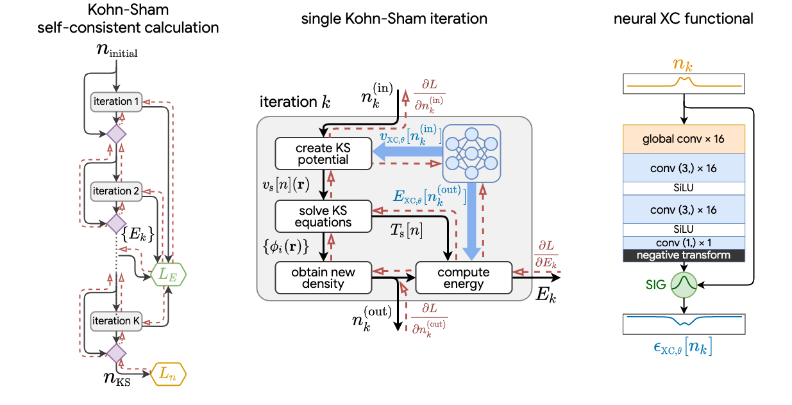

# JAX-DFT

## Overview

JAX-DFT implements one-dimensional density functional theory (DFT) in
[JAX](https://github.com/google/jax). It uses powerful JAX primitives to enable
JIT compilation, automatical differentiation, and high-performance computation
on GPUs.

This library provides basic building blocks that can construct DFT calculations
as a differentiable program. Researchers in DFT and machine learning can use
this library to build hybrid ML-DFT model for electronic structure research.

## Kohn-Sham equations as regularizer: building prior knowledge into machine-learned physics

Li Li, Stephan Hoyer, Ryan Pederson, Ruoxi Sun, Ekin D. Cubuk, Patrick Riley, Kieron Burke

Phys. Rev. Lett. **126**, 036401 (2021)

https://journals.aps.org/prl/abstract/10.1103/PhysRevLett.126.036401



Including prior knowledge is important for effective machine learning models in physics, and is usually achieved by explicitly adding loss terms or constraints on model architectures. Prior knowledge embedded in the physics computation itself rarely draws attention. We show that solving the Kohn-Sham equations when training neural networks for the exchange-correlation functional provides an implicit regularization that greatly improves generalization. Two separations suffice for learning the entire one-dimensional H2 dissociation curve within chemical accuracy, including the strongly correlated region. Our models also generalize to unseen types of molecules and overcome self-interaction error.

DFT calculations and the Kohn-Sham regularier is implemented with JAX-DFT.

You can train a neural XC functional with Kohn-Sham regularier in this colab [demo](https://colab.research.google.com/github/google-research/google-research/blob/master/jax_dft/examples/training_neural_xc_functional.ipynb).


## Installation

Clone this repository and install in-place:

```bash
git clone https://github.com/google-research/google-research.git
pip install -e google-research/jax_dft
```

Please follow the installation for installation on GPU: https://github.com/google/jax#pip-installation

## Citation

If you use the code in a publication, please cite the repo using the .bib,

```
@article{li2020kohn,
  title = {Kohn-Sham Equations as Regularizer: Building Prior Knowledge into Machine-Learned Physics},
  author = {Li, Li and Hoyer, Stephan and Pederson, Ryan and Sun, Ruoxi and Cubuk, Ekin D and Riley, Patrick and Burke, Kieron},
  journal = {Phys. Rev. Lett.},
  volume = {126},
  issue = {3},
  pages = {036401},
  numpages = {7},
  year = {2021},
  month = {Jan},
  publisher = {American Physical Society},
  doi = {10.1103/PhysRevLett.126.036401},
  url = {https://link.aps.org/doi/10.1103/PhysRevLett.126.036401}
}
```
