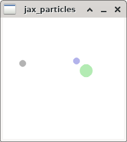

# JAX Particles

This repo contains a 2D physics simulator library for circular objects written
in JAX. Typical simulators require one CPU or one GPU per environment. This
JAX implementation allows for massive parallelization via the `jax.vmap()`
operation. For example, with an environment containing 1 agent, 1 landmark, and
1 collideable object, we were able to run a parallel batch of 300,000
environments on one V100 GPU.

### Installation

```shell
$ pip install .
```

### Demo



The demo makes use of a joystick if present.

```shell
$ python demo.py
```
