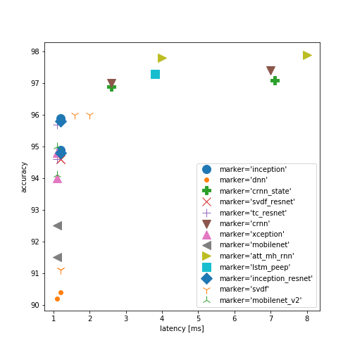
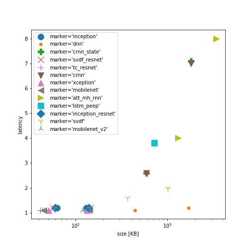
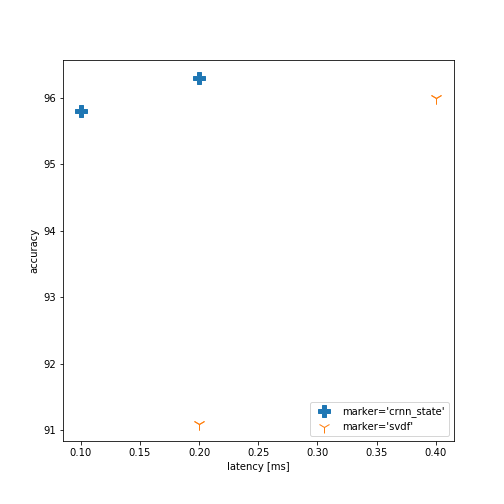
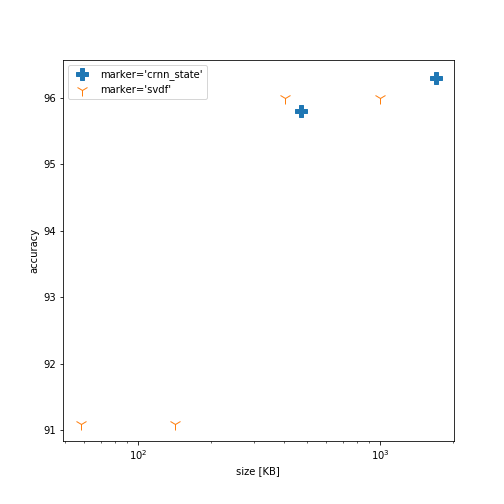

# Streaming Aware neural network models
======================================================================================

Summary about this work is presented at paper [Streaming keyword spotting on mobile devices](https://arxiv.org/abs/2005.06720).
Please cite the paper in your publications if you find the source code useful for your research.

Streaming aware neural network models are important for real time response,
high accuracy and good user experience. In this work we designed keras streaming
wrappers and streaming aware layers. By streaming we mean streaming inference,
where model receives portion of the input sequence (for example 20ms of audio),
process it incrementally and return an output(for example classification result).
Non streaming means that model has to receive the whole sequence
(for example 1 sec of audio) and then return an output.

During training we use one neural network architecture (called non streaming) and during inference we will use another neural network architecture called streaming.
This kind of neural network can be considered dynamic: model topology is different in training and inference modes.
One solution of such problem can be [subclassing](https://www.tensorflow.org/guide/keras/functional#mix-and-match_api_styles), which supports dynamic architectures.
Another option is keras functional API, it has [advantages](https://www.tensorflow.org/guide/keras/functional#it_does_not_support_dynamic_architectures), but it [does not support dynamic architectures](https://www.tensorflow.org/guide/keras/functional#it_does_not_support_dynamic_architectures). We solved it by using a cloning function, which can automatically convert non streamable model to streamable one (if model is based on streaming aware layers).

So we demonstrated streaming aware model with subclassing API in [folder](https://github.com/google-research/google-research/tree/master/kws_streaming/models_sub). In this case developer will have to specify model behavior for both [non streaming](https://github.com/google-research/google-research/blob/master/kws_streaming/models_sub/conv_model.py#L81) and [streaming inference](https://github.com/google-research/google-research/blob/master/kws_streaming/models_sub/conv_model.py#L95). States (which are used for streaming) will have to be propagated manually, as shown in [example](https://github.com/google-research/google-research/blob/master/kws_streaming/models_sub/conv_model.py#L107). This approach works well in eager mode.

Models based on functional API are shown in [folder](https://github.com/google-research/google-research/tree/master/kws_streaming/models). In this case developer will have to specify model once and then cloning utility function will automatically convert it to streaming mode and will help to propagate states (which are used for streaming). The limitation of this approach: it works with session/graph mode only.

We applied this lib for keyword spotting (KWS) problem
and implemented most popular KWS models:

|  Model name      | Description  | Streamable |
| ---------------- | --------------------- | --------------------- |
|[dnn](https://arxiv.org/pdf/1711.07128.pdf) | deep neural network based on combination of fully connected layers      | yes      |
| dnn_raw | an example of [dnn](https://arxiv.org/pdf/1711.07128.pdf) model on raw audio features  |   yes     |
| [gru](https://arxiv.org/pdf/1711.07128.pdf) | gated recurrent unit model  |   yes     |
| [lstm](https://arxiv.org/pdf/1711.07128.pdf) | long short term memory model  |   yes     |
| [cnn](https://arxiv.org/pdf/1711.07128.pdf) | basic convolutional neural network  |   yes     |
| [crnn](https://arxiv.org/pdf/1711.07128.pdf) | combination of convolutional layers with RNNs(GRU or LSTM)  |   yes     |
| [ds_cnn](https://arxiv.org/pdf/1711.07128.pdf) | depth wise convolutional neural network  |   yes     |
| [svdf](https://arxiv.org/pdf/1812.02802.pdf) | singular value decomposition filter neural network (sequence of 1d depthwise conv and 1x1 conv)  |   yes     |
| svdf_resnet | [svdf](https://arxiv.org/pdf/1812.02802.pdf) neural network with residual connections  |   yes     |
| ds_tc_resnet | combination of 1d depthwise convolution in time with residual blocks, based on [MatchboxNet](https://arxiv.org/abs/2004.08531)  |   yes     |
| [att_rnn](https://arxiv.org/pdf/1808.08929.pdf) | combination of cnn, RNN(bi directional LSTM) and attention  |   no     |
| att_mh_rnn | extended version of [att_rnn](https://arxiv.org/pdf/1808.08929.pdf) with multihead attention |   no     |
| [tc_resnet](https://arxiv.org/pdf/1904.03814.pdf) | temporal convolution with sequence of residual blocks  |   not converted     |
| [mobilenet](https://arxiv.org/abs/1704.04861) | reduced version of mobilenet vision/imagenet model, but with 1d temporal conv |   not converted     |
| [mobilenet_v2](https://arxiv.org/abs/1801.04381) | reduced version of mobilenet_v2 vision/imagenet model, but with 1d temporal conv |   not converted     |
| [xception](https://arxiv.org/abs/1610.02357) | reduced version of xception vision/imagenet model |   not converted     |
| [inception](http://arxiv.org/abs/1512.00567) | reduced version of inception vision/imagenet model |   not converted     |
| [inception_resnet](https://arxiv.org/abs/1602.07261) | reduced version of inception_resnet vision/imagenet model |   not converted     |


They all use speech feature extractor, which is easy to configure as MFCC, LFBE
or raw features (so user can train own speech feature extractor).
We explored latency and accuracy of the streaming and non streaming models
on mobile phone and demonstrated that models outperform previously reported accuracy on public data sets.
This lib also can be applied on other sequence problems
such as speech noise reduction, sound detection, text classification...

## Quick onboarding with toy demo:
Step by step demo is shown in [colabs](https://github.com/google-research/google-research/tree/master/kws_streaming/colab):
1. Download the data and check its properties [00_check_data.ipynb](https://github.com/google-research/google-research/blob/master/kws_streaming/colab/00_check_data.ipynb)
2. Train toy svdf or ds_tc_resnet models [01_train.ipynb](https://github.com/google-research/google-research/blob/master/kws_streaming/colab/01_train.ipynb)
3. Run inference in streaming and non streaming modes [02_inference.ipynb](https://github.com/google-research/google-research/blob/master/kws_streaming/colab/02_inference.ipynb)

## Experimentation steps
NN model conversion from non streaming mode (which is frequently
used during training) to streaming can require manual model rewriting.
We address this by designing a Keras based library which allows
automatic conversion of non streaming models to streaming one with no
or minimum efforts. We achieve this in several steps:

1. Train model using non streaming TensorFlow (TF) graph representation.
2. Automatically convert model to streaming and non streaming inference modes.
Conversion to streaming inference mode includes TF/Keras graph traversal and
buffer insertion for the layers which have to be streamed.
3. Convert Keras model to TensorFlow Lite (TFLite) and quantize if needed.
4. Run TFLite inference on phone.

We build this library with the speech feature extractor being a part of the model
and also part of the model conversion to inference mode with TFLite.
It allows to simplify model testing on mobile devices: the developer can simply pass
audio data into the model and receive classification results.

We built streaming wrapper for layers (such as conv,flatten) and
streaming aware layers (for GRU and LSTM).
It allows us to design Keras models, train them and automatically convert them
to streaming mode.

## Experimental results

All experiments are listed in folder "experiments". It contains:
* [kws_experiments_paper_12_labels](https://github.com/google-research/google-research/blob/master/kws_streaming/experiments/kws_experiments_paper_12_labels.md) - experiments presented in [paper](https://arxiv.org/abs/2005.06720): models trained on [data set](https://arxiv.org/pdf/1804.03209.pdf) with 12 labels.
* [kws_experiments_quantized_12_labels](https://github.com/google-research/google-research/blob/master/kws_streaming/experiments/kws_experiments_quantized_12_labels.md) - quantized model presented in [paper](https://arxiv.org/abs/2005.06720): models trained on [data set](https://arxiv.org/pdf/1804.03209.pdf) with 12 labels.
* [kws_experiments_30k_12_labels](https://github.com/google-research/google-research/blob/master/kws_streaming/experiments/kws_experiments_30k_12_labels.md) - models with 30k parameters, trained on [data set](https://arxiv.org/pdf/1804.03209.pdf) with 12 labels.
* [kws_experiments_35_labels](https://github.com/google-research/google-research/blob/master/kws_streaming/experiments/kws_experiments_35_labels.md) - models trained on [data set v2](https://arxiv.org/pdf/1804.03209.pdf) with 35 labels. It is a good example of training models on custom data.
* [kws_experiments_12_labels](https://github.com/google-research/google-research/blob/master/kws_streaming/experiments/kws_experiments_12_labels.md) - models trained on [data set v2](https://arxiv.org/pdf/1804.03209.pdf) with 12 labels (latest experiments with different hyperparameters).

The latest experiments on speech commands V2 with 12 labels are show in below table:
|  Model name      | accuracy [%]  | # parameters |
| ---------------- | --------------------- | --------------------- |
|[ds_tc_resnet](https://github.com/google-research/google-research/blob/master/kws_streaming/experiments/kws_experiments_12_labels.md) with <br> [MatchboxNet](https://arxiv.org/abs/2004.08531) topology | 98.0      | 75K      |
|[att_mh_rnn ](https://github.com/google-research/google-research/blob/master/kws_streaming/experiments/kws_experiments_12_labels.md)| 98.4  |   750K     |

The latest experiments on speech commands V2 with 35 labels are show in below table:
|  Model name      | accuracy [%]  | # parameters |
| ---------------- | --------------------- | --------------------- |
|[ds_tc_resnet](https://github.com/google-research/google-research/blob/master/kws_streaming/experiments/kws_experiments_35_labels.md) with <br> [MatchboxNet](https://arxiv.org/abs/2004.08531) topology | 96.9      | 75K      |
|[att_mh_rnn ](https://github.com/google-research/google-research/blob/master/kws_streaming/experiments/kws_experiments_35_labels.md)| 97.2  |   750K     |


### Streamable and non streamable models

Below we plot performance of models from kws_experiments_paper, kws_experiments_q and kws_experiments_30k. It is only a subset of the models with selected parameters. In the graphs below, model size is a size of TFLite module including both speech feature extractor and neural network.

* Accuracy/Latency[ms]. Latency of processing the whole 1sec audio.



* Accuracy/Model size[KB].


* Latency[ms]/Model size[KB].




### Streaming models

* Accuracy/Latency[ms]. Latency of processing 20ms audio packet (in streaming mode).



* Accuracy/Model size[KB].




## Migration to Streaming Aware neural network models
For migration of existing keras model to streaming one, developer need to
replace RNNs by streaming aware RNNs. Streaming aware LSTM and GRU of this lib
are fully compatible with keras api.
Remaining layers, which are doing data processing in time dimension,
has to be wrapped by Stream wrapper, as it is shown below:

Standard keras model:
```
output = tf.keras.layers.Conv2D(...)(input)
output = tf.keras.layers.Flatten(...)(output)
output = tf.keras.layers.Dense(...)(output)
```

Streaming aware model:
```
output = Stream(cell=tf.keras.layers.Conv2D(...))(input)
output = Stream(cell=tf.keras.layers.Flatten(...))(output)
output = tf.keras.layers.Dense(...)(output)
```

### Limitation:
* Models which require access to the whole input sequence are not streamable, such as bidirectional RNN or attention computed over the whole sequence.
* Any causal models including models with pooling and striding in time dimension can be supported in streaming mode: for example [test_stream_strided_convolution](https://github.com/google-research/google-research/blob/master/kws_streaming/layers/stream_test.py). For causal models we set padding='causal'. If the model is not causal, then the delay layer has to be inserted manually, as it is shown in [residual_model](https://github.com/google-research/google-research/blob/master/kws_streaming/layers/delay_test.py).

### Edge cases:
* Input data length has to be aligned with striding/pooling, for example if total striding=4, input data length has to be 4. It allows us to run convs efficiently.
* pool_size and strides in time dim has to be the same. If they are different it is still streamable but needs to be implemented.
* Conv() in streaming mode can return a sequence, so it can be applied on any aligned sequence, for example if total striding=4, input data length can be 4, 8, etc
* Flatten(), GlobalMaxPooling2D(), GlobalAveragePooling2D() can return only one output, so they can not be applied on any aligned sequence, for example if total striding=4, input data length has to be 4.
* We can run biLSTM after the Flatten() layer. Flatten() can be considered as “unstreaming”.


## Inference
KWS model in streaming mode is executed by steps:

1. Receive sample(packet), for example audio data from microphone.
2. Feed these data into KWS model
3. Process these data and return detection output
4. Go to the next inference iteration to step 1 above.
Most of the layers are streamable by default for example activation layers:
relu, sigmoid; or dense layer. These layers do not have any state.
So we can call them stateless layers. But some layers can have state, we call them stateful layers.

### State management
State is a buffer with data which is going to be reused in the
next iteration of the inference.
Examples of layers with states are LSTM, GRU.

Another example of layers which require state are convolutional and pooling:
To reduce latency of convolutional layer we can avoid recomputation
of the convolution on the same data.
To achieve it, we introduce a state buffer of the input data for a
convolutional layer, so that convolution is recomputed only on updated/new
data sets. We can implement such layer using two approaches:

1. with internal state - conv layer keeps state buffer as internal variable.
It receives input data, updates state buffer inside of the conv layer.
Computes convolution on state buffer and returns convolution output.
2. with external state - conv layer receives input data with state buffer
as input variables. Then it computes convolution on state buffer and
returns convolution output with updated state buffer.
The last one will be fed as input state on the next inference iteration.

A stateful model can be implemented using stateless graph (above example 2.)
because some inference engines do not support updates
of the internal buffer variables.

This lib allow us to do several types of conversions:
1. Non streaming model to stateful KWS models with internal state,
such models receive input speech data and return classification results.
2. Non streaming model to stateful KWS models with external state, such models
receive input speech data and all states buffers required for model's layers
and return classification results with updated states buffers.

Models can run in several modes:

1. Non streaming training 'Modes.TRAINING'.
We receive the whole audio sequence and process it

2. Non streaming inference 'Modes.NON_STREAM_INFERENCE'.
We use the same neural net topology
as in training mode but disable regularizers (dropout etc) for inference.
We receive the whole audio sequence and process it.

3. Streaming inference with internal state
'Modes.STREAM_INTERNAL_STATE_INFERENCE'.
We change neural net topology by introducing additional buffers/states
into layers such as conv, lstm, etc.
We receive audio data in streaming mode: packet by packet.
(so we do not have access to the whole sequence).
Inference graph is stateful, so that graph has internal states which are kept updated 
between inference invocations.

4. Streaming inference with external state
'Modes.STREAM_EXTERNAL_STATE_INFERENCE'.
We change neural net topology by introducing additional
input/output buffers/states into layers such as conv, lstm, etc.
We receive audio data in streaming mode: packet by packet.
(so we do not have access to the whole sequence).
Inference graph is stateless, so that graph has no internal state.
All states are received as inputs and after update are returned as output state

### Further information
Summary about this work is presented at paper [Streaming keyword spotting on mobile devices](https://arxiv.org/abs/2005.06720)
All experiments on KWS models presented in this paper can be reproduced by
following the steps described in [kws_experiments_paper](https://github.com/google-research/google-research/blob/master/kws_streaming/experiments/kws_experiments_paper.md).
Models were trained on a desktop (Ubuntu) and tested on a Pixel4 phone.


Code directory structure:

* `colab` - examples of running KWS models
* `data` - data reading utilities
* `experiments` - examples with description of how to do model training and evaluation
* `layers` - streaming aware layers with speech feature extractor and layer tests
* `models` - KWS model definitions
* `train` - model training and evaluation utilities

Below is an example of evaluation and training DNN model:

## Evaluation and training a DNN model.

Create models folder
```shell
mkdir models1
```

### Set up data sets:

Download and set up path to data set V1 and set it up

```shell
wget http://download.tensorflow.org/data/speech_commands_v0.01.tar.gz
mkdir data1
mv ./speech_commands_v0.01.tar.gz ./data1
cd ./data1
tar -xf ./speech_commands_v0.01.tar.gz
cd ../
```

Download and set up path to data set V2 and set it up

```shell
wget https://storage.googleapis.com/download.tensorflow.org/data/speech_commands_v0.02.tar.gz
mkdir data2
mv ./speech_commands_v0.02.tar.gz ./data2
cd ./data2
tar -xf ./speech_commands_v0.02.tar.gz
cd ../
```

We would suggest to explore training, validation and testing data
in colab 'kws_streaming/colab/check-data.ipynb'


### Re-train dnn model from scratch on data set V1 and run evaluation:

```shell
python3 -m kws_streaming.train.model_train_eval \
--data_url '' \
--data_dir ./data1/ \
--train_dir ./models1/dnn_1/ \
--mel_upper_edge_hertz 7000 \
--how_many_training_steps 100,100,100 \
--learning_rate 0.0005,0.0001,0.00002 \
--window_size_ms 40.0 \
--window_stride_ms 20.0 \
--mel_num_bins 40 \
--dct_num_features 20 \
--resample 0.15 \
--alsologtostderr \
--train 1 \
dnn \
--units1 '64,128' \
--act1 "'relu','relu'" \
--pool_size 2 \
--strides 2 \
--dropout1 0.1 \
--units2 '128,256' \
--act2 "'linear','relu'"
```

### Re-train dnn model from scratch with quantization on data set V1 and run evaluation:

By default we use mfcc_tf option to specify speech feature extractor.
It is based on DFT and DCT, where DFT and DCT are implemented with matrix matrix multiplications. This approach is compatible with any inference engine, but it can increase model size significantly. Post quantization of such model
can reduce its accuracy.
That is why we also introduced mfcc_op option. In this case speech
feature extractor is based on TFLite custom operations. This kind of feature extractor
functionally is the same with mfcc_tf, but all DFT, DCT are executed using FFT,
so it will be faster and model size will be defined by neural net only.
If you specify --feature_type 'mfcc_op', then model will be trained and
evaluated in unquantized and quantized form (only post training quantization is supported). With mfcc_op we observed insignificant accuracy reduction of quantized models.


```shell
python3 -m kws_streaming.train.model_train_eval \
--data_url '' \
--data_dir ./data1/ \
--train_dir ./models1/dnn_1/ \
--mel_upper_edge_hertz 7000 \
--how_many_training_steps 100,100,100 \
--learning_rate 0.0005,0.0001,0.00002 \
--window_size_ms 40.0 \
--window_stride_ms 20.0 \
--mel_num_bins 40 \
--dct_num_features 20 \
--resample 0.15 \
--feature_type 'mfcc_op' \
--alsologtostderr \
--train 1 \
dnn \
--units1 '64,128' \
--act1 "'relu','relu'" \
--pool_size 2 \
--strides 2 \
--dropout1 0.1 \
--units2 '128,256' \
--act2 "'linear','relu'"
```


Some key flags are described below:

* set `"--train 0"` to run only model evaluation
* set `"--train 1"` to run model training and model evaluation
* set `"--train_dir ./models1/dnn_1/"` to a new folder which does not exist, we will create it automatically
* set `"dnn \"` to train the dnn model
* set `"--data_dir ./data1/"` to use data sets v1


If you interested to train or evaluate models on data sets V2 just set:

* set `--data_dir ./data2/` to use the other data set, and
* set `--train_dir ./models2/dnn/` to avoid overwriting previous results.


### Speech feature extraction configs:

Model can be trained with different feature extractors including raw audio. An example of model training on raw audio is presented at models/dnn_raw.py (in this case speech feature extractor will be learned). In models/dnn_raw.py, model does not have speech feature extractor so 'feature_type' will be ignored. All other models have speech feature extractor as a part of the model which can be configured by feature_type: 'mfcc_tf', 'mfcc_op' (in this case 'preprocess' has to be 'raw', so that model receives raw audio and then apply speech feature extractor 'mfcc_tf' or 'mfcc_op'). If you specify 'preprocess' equal 'mfcc' or 'micro', then speech feature extraction is done outside of the model during audio preprocessing (in this case model does not have internal feature extractor and 'feature_type' will be ignored; model receives speech features as input).

This lib supports TFlite speech feature extractors for different hardware: desktop, mobile phone and microcontrollers.

There are several options to run a model on desktop and mobile phone. These options with properties are described below table:


|                  | preprocess 'raw'; <br> feature_type 'mfcc_tf'  | preprocess 'raw'; <br> feature_type 'mfcc_op'  | preprocess 'mfcc'; <br> feature_type is ignored     | preprocess 'micro'; <br> feature_type is ignored    |
| ---------------- | --------------------- | --------------------- | ------------------- | ------------------- |
|**Speech feature <br> extractor:**| part of model      | part of model      |  not part of model|  not part of model|
|**Speech feature <br> based on:**| DFT, DFT weights <br> are part of model  |   FFT     |    FFT    |     FFT         |
|**Model size:**   |   DFT weights + model weights         |      model weights          |        model weights      |         model weights     |
|**Quantization:** |    not implemented    |      post training    |     post training   |     post training   |
|**Can run on:**   |    desktop, <br> mobile    |      desktop, <br> mobile  |     desktop, <br> mobile |   microcontrollers  |

If speech feature extractor is part of the model then it is convenient for deployment, otherwise user will have to manage speech feature extractor and data streams between model and speech feature extractor. Speech feature extractor based on DFT can be a good option for hardware with no FFT support. Combination of FFT with post training quantization can reduce latency by 2x.


### Training on custom data

A detailed example of model training on custom data shown in [link](https://github.com/google-research/google-research/blob/master/kws_streaming/experiments/kws_experiments_35_labels.md) with short overview below.

If you prefer to train on your own data, you'll need to create .wavs with your
recordings, all at a consistent length, and then arrange them into subfolders
organized by label. For example, here's a possible file structure:

```
data >
  up >
    audio_0.wav
    audio_1.wav
  down >
    audio_2.wav
    audio_3.wav
  other>
    audio_4.wav
    audio_5.wav
```

You'll also need to tell the script what labels to look for, using the
"--wanted_words" argument. In this case, 'up,down' might be what you want, and
the audio in the 'other' folder would be used to train an 'unknown' category.

To pull this all together, you'd run:

```shell
python3 -m kws_streaming.train.model_train_eval \
--data_dir ./data \
--wanted_words up,down \
dnn
```

Above script will automatically split data into training/validation and testing.

If you prefer to split the data on your own, then you should set flag
"--split_data 0" and prepare folders with structure:

```
data >
  training >
    up >
      audio_0.wav
      audio_1.wav
    down >
      audio_2.wav
      audio_3.wav
  validation >
    up >
      audio_6.wav
      audio_7.wav
    down >
      audio_8.wav
      audio_9.wav
  testing >
    up >
      audio_12.wav
      audio_13.wav
    down >
      audio_14.wav
      audio_15.wav
  _background_noise_ >
    audio_18.wav
```

To pull this all together, you'd run:

```shell
python3 -m kws_streaming.train.model_train_eval \
--data_dir ./data \
--split_data 0 \
--wanted_words up,down \
dnn
```

Description of the content of the model folder models1/dnn_1:

```
├── accuracy_last.txt - accuracy at the last training iteration (for debugging)
├── best_weights.data-00000-of-00002
├── best_weights.data-00001-of-00002
├── best_weights.index  - best model weights, these weights are used for
|       model evaluation with TF/TFLite for reporting
├── flags.json - flags which were used for model training (include all model parameters settings, paths all of it)
├── flags.txt - the same as flags.json just in txt
├── graph.pbtxt - TF graph non streaming model representation
├── labels.txt - list of labels used for model training
├── last_weights.data-00000-of-00002
├── last_weights.data-00001-of-00002
├── last_weights.index - weights of the model at last training iteration (used for debugging)
├── logs
│   ├── train
│   │   └── events.out.tfevents... - training loss/accuracy on every minibatch
│   └── validation
│       └── events.out.tfevents... - validation loss/accuracy on every eval step
├── model_summary.txt - model topology in non streaming mode
├── non_stream - (optional)TF non streamable model stored in SavedModel format
│   ├── assets
│   ├── model_summary.txt
│   ├── saved_model.pb
│   └── variables
│       ├── variables.data-00000-of-00002
│       ├── variables.data-00001-of-00002
│       └── variables.index
├── quantize_opt_for_size_tflite_non_stream - quantized non stream TFlite model, works with options:
|   |        (preprocess 'raw'; feature_type 'mfcc_op')
|   |        (preprocess 'mfcc')
|   |        (preprocess 'micro')
│   ├── model_summary.txt
│   ├── non_stream.tflite - quantized non streaming TFlite model
│   └── tflite_non_stream_model_accuracy.txt  - accuracy of quantized TFlite model
├── quantize_opt_for_size_tflite_stream_state_external - quantized streaming TFlite model, works with options:
|   |        (preprocess 'raw'; feature_type 'mfcc_op')
|   |        (preprocess 'mfcc')
|   |        (preprocess 'micro')
|   |        Not all models can be streamed (check models description above)
│   ├── model_summary.txt - model topology in streaming mode with external state
│   ├── stream_state_external.tflite - quantized streaming TFlite model
│   ├── tflite_stream_state_external_model_accuracy_reset0.txt - accuracy of TFLite streaming model
|   |       with external state
|   |       State of the model is not reseted before running inference.
|   |       So we can see how internal state is influencing accuracy in long run.
|   |       We report this accuracy in the paper for streaming models
│   └── tflite_stream_state_external_model_accuracy_reset1.txt - accuracy of TFLite streaming model with external
|            state. State of the model is reseted before running inference.
|            So it is equivalent to non streaming inference (state is not kept between testing sequences).
├── stream_state_internal - (optional)TF streaming model stored in SavedModel format
│   ├── assets
│   ├── model_summary.txt - model topology in streaming mode with internal state
│   ├── saved_model.pb
│   └── variables
│       ├── variables.data-00000-of-00002
│       ├── variables.data-00001-of-00002
│       └── variables.index
├── tf - evaluation of tf float model in both streaming and non streaming modes
│   ├── model_summary_non_stream.png - non streaming model graph (picture)
│   ├── model_summary_non_stream.txt - - non streaming model graph (txt)
│   ├── model_summary_stream_state_external.png - streaming model graph with external states (picture)
│   ├── model_summary_stream_state_external.txt - streaming model graph with external states (txt)
│   ├── model_summary_stream_state_internal.png - streaming model graph with internal states (picture)
│   ├── model_summary_stream_state_internal.txt - streaming model graph with internal states (txt)
│   ├── stream_state_external_model_accuracy_sub_set_reset0.txt - accuracy of streaming model with external state
|   |       on subset of testing data (it is used to validate that TF and TFLite inference gives the same result).
|   |       Do not use this accuracy for reporting because it is computed 
|   |       on subset of testing data (on 1000 samples)
|   |       State of the model is not reseted before running inference.
|   |       So we can see how internal state is influencing accuracy in long run.
│   ├── stream_state_external_model_accuracy_sub_set_reset1.txt - accuracy of streaming model with external state
|   |       on subset of testing data (it is used to validate that TF and TFLite inference gives the same result).
|   |       Do not use this accuracy for reporting because it is computed 
|   |       on subset of testing data (on 1000 samples)
|   |       State of the model is reseted before running inference.
|   |       So it is equivalent to non streaming inference (state is not kept between testing sequences).
│   ├── tf_non_stream_model_accuracy.txt - accuracy of non streaming model tested with TF
│   ├── tf_non_stream_model_sampling_stream_accuracy.txt - accuracy of non streaming model tested with TF
|   |       Input testing data are shifted randomly in range: -time_shift_ms ... time_shift_ms (for debugging)
│   └── tf_stream_state_internal_model_accuracy_sub_set.txt - accuracy of streaming model with internal state
|           on subset of testing data.
|           Do not use this accuracy for reporting because it is computed
|           on subset of testing data (on 1000 samples)
|           State of the model is not reseted before running inference.
|           So we can see how internal state is influencing accuracy in long run.
├── tflite_non_stream - TF non streaming model is converted to TFLite and stored here
│   ├── model_summary.txt - model topology in non streaming mode
│   ├── non_stream.tflite - TFLite non streaming model
│   └── tflite_non_stream_model_accuracy.txt - accuracy of TFLite non streaming model (reported in paper)
├── tflite_stream_state_external - TF streaming model with external state is converted to TFLite and stored here
│   ├── model_summary.txt - model topology in streaming mode with external state
│   ├── stream_state_external.tflite - TFLite streaming model with external state
│   ├── tflite_stream_state_external_model_accuracy_reset0.txt - accuracy of TFLite streaming model
|   |       with external state
|   |       State of the model is not reseted before running inference.
|   |       So we can see how internal state is influencing accuracy in long run.
|   |       We report this accuracy in the paper for streaming models
│   └── tflite_stream_state_external_model_accuracy_reset1.txt - accuracy of TFLite streaming model
|           with external state. State of the model is reseted before running inference.
|           So it is equivalent to non streaming inference (state is not kept between testing sequences).
└── train - check points of tf.keras model weights after every evaluation step
    ├── 0weights_400.data-00000-of-00002
    ├── 0weights_400.data-00001-of-00002
    ├── 0weights_400.index
    ├── ...
    ├── 9027weights_....data-00000-of-00002
    ├── 9027weights_....data-00001-of-00002
    ├── 9027weights_....index
    └── checkpoint
```
