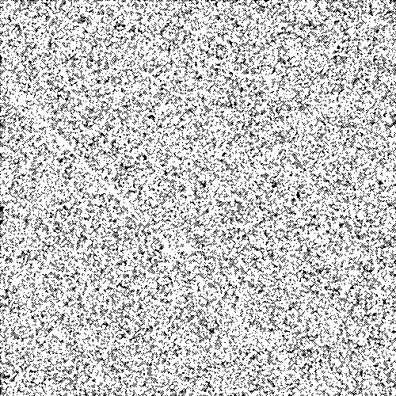
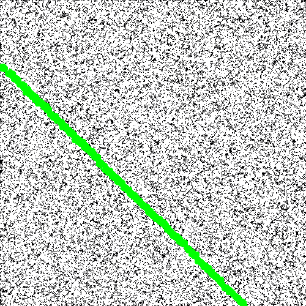
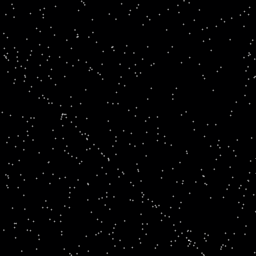
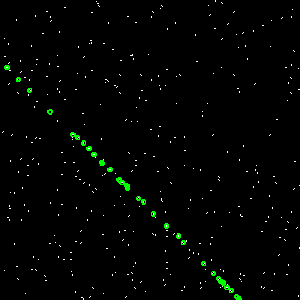
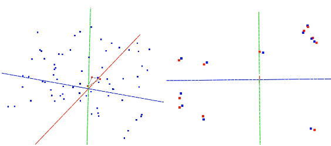

# Efficient Large Scale Inlier Voting for Geometric Vision Problems

Dror Aiger, Simon Lynen, Jan Hosang, Bernhard Zeisl. ICCV 2021.
[pdf](https://openaccess.thecvf.com/content/ICCV2021/papers/Aiger_Efficient_Large_Scale_Inlier_Voting_for_Geometric_Vision_Problems_ICCV_2021_paper.pdf)

```
@string{iccv="International Conference on Computer Vision (ICCV)"}
@inproceedings{general_voting,
  title = {Efficient Large Scale Generalized Voting for Geometric Vision Problems},
  author = {Dror Aiger and Simon Lynen and Jan Hosang and Bernhard Zeisl},
  year = {2021}
  booktitle = iccv,
}
```

## Instructions

Dependencies:

*   bazel
*   opencv3 installed (example on debian: libopencv-dev). Might need to update
    path in the file WORKSPACE.

Extract data by running `tar xf data.tar.xz`.

Build all binaries by running `bazel build -c opt --cxxopt='-std=c++17' //:all`.
Or use the provided shell scripts, which include the steps to build the
binaries.

## Files

*   general_voter.h: The core algorithm for general voting (independent of any
    specific application).
*   general_voter_6dof.cc,h: An example where the general voter is used to solve
    a 6dof posing problem (calibrated camera).
*   general_voter_6dof_main.cc: The main for the 6dof example.
*   general_voter_2d_lines_main.cc: An example of the use of the general voter
    in 2d line fitting (Figure 2 in the paper).
*   Other utilities.
    *   create_table_2.sh: A bash script to reproduce table2 from the paper.
    *   create_table_3.sh: A bash script to reproduce table3 from the paper.
    *   random_data_6dof.sh: A bash script to run 6dof on random data.
    *   Scene_1_Data61_2D3D, area3_2D-3D-S folders ([1,2]): Datasets from the
        paper (used in GOPAC[2]) for comparison with GOPAC in 6dof posing
        problems.

## General Comments

The code is slightly different from the one used in our internal version. We
previously had an internal multi-threaded code while this open source version is
only single-threaded. This creates some minor differences from the results in
the paper, mentioned specifically below.

The only code needed for a new general problem is general_voter.h. The rest are
just examples of how to create a new problem instance.

## Toy Example: Fitting Lines in 2d

```shell
bazel run -c opt --cxxopt='-std=c++17' //:general_voter_2d_lines_main
```

This fits the best line to a set of points in 2d (100k points, inlier
fraction=0.01). Two images are being written to `/tmp/points.png` (input) and
`/tmp/points_line.png` (green points lying on the found line) and some
information and timing is output to stdout.

The results with this version of the code are better than in the paper.

Example output:

```
true line: 1 0.2
time: 2.37663 line: 1364 0.993164 0.198242 errors: 0.00683594 0.00175781
```

One can change all parameters from the command line (see the code) and Figure 2
from the paper can be reproduced.

`-use_ransac` to run ransac instead of general voting.

```shell
bazel run -c opt --cxxopt='-std=c++17' //:general_voter_2d_lines_main -- -use_ransac
true line: 1 0.2
time: 5.54796 line: 919  1.00138 0.198318 errors: 0.00137651 0.00168228
```

`-use_canon` for canonization (default) and no canonization.

```shell
bazel run -c opt --cxxopt='-std=c++17' //:general_voter_2d_lines_main -- -nouse_canon
true line: 1 0.2
time: 21.9148 line: 1247 0.999023 0.200195 errors: 0.000976562 0.000195312
```

Debug data with 10k points: 


500 points and inlier_fraction 0.1:

```shell
bazel run -c opt --cxxopt='-std=c++17' //:general_voter_2d_lines_main -- -inlier_fraction 0.1 -num_points 500
```




## 6DOF for Random Data

Run:

```shell
./random_data_6dof.sh
```

Output:

```
file:  num matches: 70
num results: 1
found pose:  0.0122718 -0.0122718 -0.0122718  0.0588775  0.0848775 -0.0543811 11
pose matrices:
  0.999849    0.01212 -0.0124203
-0.0122706   0.999851   -0.01212
 0.0122715  0.0122706   0.999849

 0.0588775  0.0848775 -0.0543811

gt location: 0 0 0
pose location:  0.0588775  0.0848775 -0.0543811
errors: 0.116739 0.703125 overall_time: 73.9846
```

In `/tmp/pose_debug.obj` and `/tmp/pose_debug_proj.obj`, one can find debug
files that can be viewed with meshlab, showing the camera in the scene of points
and the projection of inliers and input in the camera plan.



## 6DOF for Outdoor Data (table 2 from the paper)

Run:

```shell
./create_table_2.sh
```

Output (medians):

```
translation error: 2.5754 11
rotation error: 0.351562 11
overall time: 13.2487 11
```

The overall time for all 11 cases depends on the number of cores you have but
the time per run should be independent of that.

In `/tmp/pose_debug_???.obj` and `/tmp/pose_debug_???_proj.obj`, one can find
debug files as in the random case.

## 6DOF for Outdoor Data (table 3 from the paper)

Since we have only single-threaded implementation (in contrast to our internal
implementation for the paper), we set a maximum time (per case) of 180 seconds
(the results are sub optimal). The results are better than the ones we reported
in the paper for this number of threads and this time frame.

Run:

```shell
./create_table_3.sh
```

Output (medians):

```
translation error: 1.26217 26
rotation error: 2.8125 26
overall time: 180.048 26
```

In `/tmp/pose_debug_???.obj` and `/tmp/pose_debug_???_proj.obj`, one can find
debug files as in the random case.

## Bibliography

[1] A. R. Zamir I. Armeni, A. Sax and S. Savarese. Joint 2d-3d semantic data for
indoor scene understanding. 2017. \
[2] M. Salzmann S. T. Namin, M. Najafi and L. Petersson. A multimodal graphical
model for scene analysis. In Winter Conf. Appl. Comput. Vis., 2015. \
[3] D. Campbell, L. Petersson, L. Kneip, and H. Li. Globally-optimal inlier set
maximisation for camera pose and correspondence estimation. PAMI 2020.
