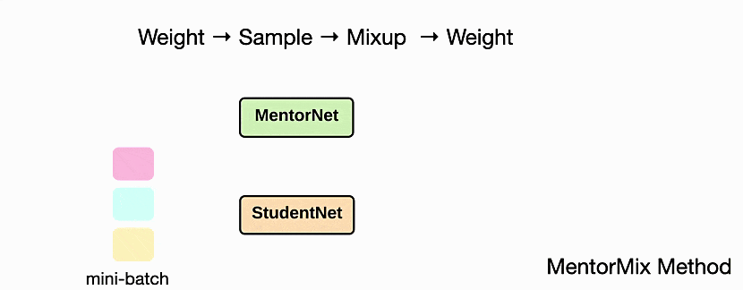

# Beyond Synthetic Noise: Deep Learning on Controlled Noisy Labels

This is the code for the paper:

**<a href="https://arxiv.org/abs/1911.09781">Beyond Synthetic Noise: Deep Learning on Controlled Noisy Labels
</a>**
<br>
Lu Jiang, Di Huang, Mason Liu, Weilong Yang
<br>
Presented at [ICML 2020](https://icml.cc/Conferences/2020),
[Slides](http://www.lujiang.info/resources/icml20_slides.pdf)


*Please note that this is not an officially supported Google product. This is the reproduced, not the original code.*

If you find this code useful in your research then please cite

```
@inproceedings{jiang2020beyond,
  title={Beyond Synthetic Noise: Deep Learning on Controlled Noisy Labels},
  author={Jiang, Lu and Huang, Di and Liu, Mason and Yang, Weilong},
  booktitle={ICML},
  year={2020}
}
```

## Introduction

Given a noisy dataset of some unknown noise level, our goal is to train a
robust model that can generalize well on the clean test data.
We introduce a simple yet effective method called MentorMix.
While existing methods that perform well on synthetic noise may not work as well on the real-world noisy labels,
we show our method overcomes both synthetic and real-world noisy labels.


We also release the first benchmark of controlled real-world label noise from
the web. Please check out this dataset at [this link](). Leave your questions about
the dataset or the method in the issue tab.

## Algorithm

MentorMix is inspired by [MentorNet](https://github.com/google/mentornet)
(for curriculum learning) and [Mixup](https://github.com/hongyi-zhang/mixup)
(for vicinal risk minimization).

MentorMix comprises four steps: weight, sample, mixup, and weight again.
The animation below illustrates these steps. Note, the MentorNet is used to
compute example weight and in the simplest case, MentorNet can be replaced
by a simple thresholding function comparing the example loss to a loss moving
average (`loss p percentile`).
See the `loss_thresholding_function` in `utils.py`.
Besides, We found the second weighting is useful for high noise levels.





We test MentorMix on five datasets including CIFAR 10/100 with synthetic
label noise, and WebVision 1.0. We achieve the best published result on the
full WebVision dataset, improving the previous best method by a
significant ~3% in terms of precision@1 on the ImageNet ILSVRC12 validation set.


## Setups
All code was developed and tested on Nvidia V100 (16GB) the following
environment.

- Ubuntu 18.04
- Python 2.7.15
- TensorFlow 1.15.0
- numpy 1.13.3


Next we need to download the CIFAR datasets.
Put them into the same directory as the `code` directory:
[data](https://storage.googleapis.com/cnlw/cifar.zip).


## Running MentorMix on CIFAR


Cifar100 40% noise:

```bash
nohup python code/cifar_train_mentormix.py \
--batch_size=128 \
--dataset_name=cifar100 \
--trained_mentornet_dir=mentornet_models/mentornet_pd \
--loss_p_percentile=0.5 \
--burn_in_epoch=10 \
--data_dir=data/cifar100/0.4 \
--train_log_dir=cifar100_models/resnet32/0.4/mentormix_p05_a8/train \
--studentnet=resnet32 \
--max_number_of_steps=200000 \
--device_id=0 \
--num_epochs_per_decay=30 \
--mixup_alpha=8.0 > train_mentormix_p05_a8.txt &
```

The training script has two very important command-line flags for you to
configure the hyperparameters:

- `--mixup_alpha`: Hyperparameter used in the Beta distribution.
- `--loss_p_percentile`: Hyperparameter p-percentile used to compute the loss moving average.

For eval, run:

```bash

EXPDIR="cifar100_models/resnet32/0.4/mentormix_p05_a8"

nohup python code/cifar_eval.py \
  --dataset_name=cifar100 \
  --data_dir=data/cifar100/val/ \
  --checkpoint_dir="${EXPDIR}/train" \
  --eval_dir="${EXPDIR}/eval_val" \
  --studentnet=resnet32 \
  --device_id=1 > $(basename "$EXPDIR" .txt) &
```

## Performance on CIFAR 10 and CIFAR 100

*This is a re-implementation of our asynchronized multi-GPU training on
a single GPU using third-party libraries.
The number might be slightly different from our internal numbers reported
in the paper as it trains for fewer steps.*


**CIFAR-100 ResNet-32**

noise_fraction | mentormix
-------------: | --------:
0.2            | 0.778
0.4            | 0.704
0.6            | 0.660
0.8            | 0.392

**CIFAR-10 ResNet-32**

noise_fraction | mentormix
-------------: | --------:
0.2            | 0.962
0.4            | 0.944
0.6            | 0.890
0.8            | 0.820


## Practical recommendations

Based on the findings in [our papers](https://arxiv.org/abs/1911.09781),
we have the following practical recommendations for training deep neural
networks on noisy data:

- A simple way to deal with noisy labels is fine-tuning a pretrained model. The better the pretrained model is, the better it may generalize on the downstream noisy training task.
- [Early stopping](https://en.wikipedia.org/wiki/Early_stopping) may not be effective on the real-world label noise from the web.
- The real-world label noise from the web appears to be less harmful, yet it is more difficult to tackle.
- Methods that perform well on synthetic noise may not work as well on the real-world noisy labels from the web.
- The proposed MentorMix overcomes both synthetic and real-world noisy labels.

