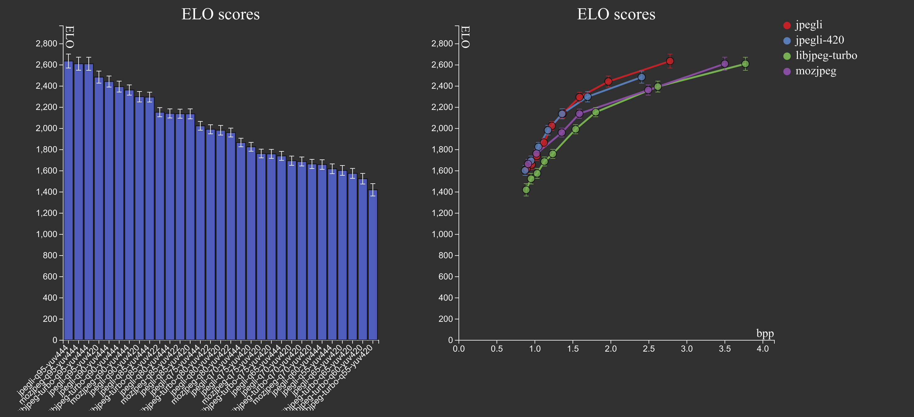

# Multi-bitrate JPEG compression perceptual evaluation dataset 2023

mucped23: A compression distortion image quality assessment (IQA) database.

_Authors: Luca Versari, Zoltan Szabadka, Martin Bruse, Jyrki Alakuijala_

## Background

The JPEG image compression format is, despite being far from the most efficient
compression format (see [The Case for JPEG
XL](https://cloudinary.com/blog/the-case-for-jpeg-xl)), one of the most widely
used (see [Usage statistics of image file formats for
websites](https://w3techs.com/technologies/overview/image_format)).

The [jpegli](https://github.com/libjxl/libjxl/tree/main/lib/jpegli) JPEG encoder
library is an improved JPEG encoder that applies many of the insights from
related projects like [guetzli](https://github.com/google/guetzli),
[butteraugli](https://github.com/google/butteraugli), and [JPEG
XL](https://github.com/libjxl/libjxl) to achieve a higher quality-per-byte for
JPEG images.

The mucped23 dataset was created to study human perception of the quality of
images compressed using [MozJPEG](https://github.com/mozilla/mozjpeg),
[libjpeg-turbo](https://github.com/libjpeg-turbo/libjpeg-turbo), and
[jpegli](https://github.com/libjxl/libjxl/tree/main/lib/jpegli).

## mucped23 evaluations

The mucped23 evaluations were performed using an internal Google perceptual
evaluation tool, designed based on insights from the
[CLIC](https://www.compression.cc/) Challenge on Learned Image Compression.

### Source images

The evaluations comprise 49 512x512 pixel images taken from the [CID22
validation
set](https://cloudinary-marketing-res.cloudinary.com/raw/upload/v1682006242/CID22_validation_set.zip)
of the [Cloudinary Image Dataset ’22](https://cloudinary.com/labs/cid22), and
are composed of a mixture of people, objects, scenery, and graphical elements.

The images are licensed under the [Creative Commons Attribution-ShareAlike 4.0
International License](http://creativecommons.org/licenses/by-sa/4.0/).

The exact images used can be downloaded at
[https://cloudinary.com/labs/cid22/mucped23.zip](https://cloudinary.com/labs/cid22/mucped23.zip).

### Methodology

The evaluations use the same methodology as [CLIC](http://compression.cc/).

It consists of the rater being shown an original image and two distortions, and
asked to choose the distortion that is closest to the original. The test subject
is able to flip between the two distortions, and has the original image
available on the side for comparison at all times.

We then compute an [Elo](https://en.wikipedia.org/wiki/Elo_rating_system)
ranking (an estimate of the probability of each method being considered closer
to the original by the raters) of distortions based on that. Compared to
traditional Opinion Score methods, it avoids having to calibrate scores between
questions or subjects.

The distortions used are encoding and decoding using
[MozJPEG](https://github.com/mozilla/mozjpeg),
[libjpeg-turbo](https://github.com/libjpeg-turbo/libjpeg-turbo), and
[jpegli](https://github.com/libjxl/libjxl/tree/main/lib/jpegli) at various
settings.

The selection of distortions is based on selecting the pair of distortions which
would provide the most informative update to the rankings.

The algorithm is executed until the credible intervals of the estimated
probabilities are considered acceptable.

## Results

The results of the evaluations can be found in [answers.csv](answers.csv), and
the computed [Elo](https://en.wikipedia.org/wiki/Elo_rating_system) scores
including rater agreement and golden question response of the methods can be
found in [elo.csv](elo.csv).

Each row in [answers.csv](answers.csv) contains a single question where the two
distortions `/mucped23/[methodA]/[originalName].png` and
`/mucped23/[methodB]/[originalName].png` are compared to the original
`/mucped23/originals/[originalName].png` inside
[mucped23.zip](https://cloudinary.com/labs/cid22/mucped23.zip).

### Analysis

An analysis of the results can be found at [Users prefer Jpegli over same-sized
libjpeg-turbo or MozJPEG](report/jpegli.pdf).

## Computing the Elo scores

`compute_elo.ipynb` contains a notebook with naive example code of how to
compute the Elo scores based on [answers.csv](answers.csv). This code does not
contain the complete algorithm to compute the
[Elo](https://en.wikipedia.org/wiki/Elo_rating_system) including rater agreement
and golden question response.

Complete code to compute the Elo scores, including credible intervals and rater
reliability, can be found in
[elo_rater_model](https://github.com/google-research/google-research/tree/master/elo_rater_model).
